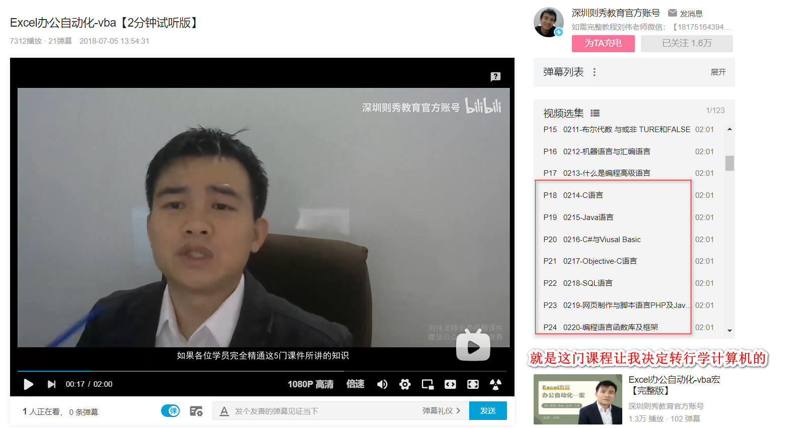

(注1：等自己的前端基础知识复习的差不多了之后，就利用HTML+CSS+JS做一份属于自己的简历。先做上题，待日后再补充内容。)

(注2：哇，时间真的是过得好快啊，这篇博文是19年11月份新建的，建完后也是一直没有动笔写。而今已是2020年9月14日了，时间啊时间，无可言说。)

(注3：在网上找了一个[简历模版](https://github.com/StartBootstrap/startbootstrap-resume),准备刚开始就用这个模版来修改，先弄出一个大体的简历出来。这个模版用的是Bootstrap框架，感觉也挺简洁好看的，就先用它了。)

(注4：现在是2020年12月26日，我真的要动手开始准备了呢)

(注5：现在是2021年1月9日，正式开始制作简历)

# 制作简历的前期准备

* 制作简历前，需要仔细梳理一下其中内容，包括自己的基本信息，毕业以来的职业轨迹，自己的学习经历，技术栈，因为是非科班出生，而且还要阐述自己转行的理由等。
* 正式开始搜集自己的目标公司及以下的招聘需求(PR)，根据招聘需求对比自己的技术栈，进行相关的查漏补缺及面试题的准备。

# 大体目标

* 前端工程师，岗位级别：初级+。
* 目标薪资：税前10k/月(996的公司必须要10k/月，965的公司可以适当降低薪资。)
* 工作要求：缴纳五险一金、加班有加班费/加班补贴。

# 自己的基本信息

* 姓名：李*
* 年龄：27岁(1994.05)
* 学位：本科(金融学)
* 毕业院校：**学院(2017年毕业)
* 职业轨迹：毕业后分别做过审计、会计等财务工作
* 转行历程：2018年8月份花了300元买了刘伟的Excel全套课程，其中学习VBA的时候听老师大体讲了一些编程语言的知识，又看了一遍讲述艾伦·图灵的电影《模仿游戏》，又看了一些书籍，比如冯·诺依曼的《计算机与人脑》，慢慢的开始对计算机产生了兴趣，开始在B站上搜集一些视频看，刚开始学的是郝斌的C语言，学了大概一个月，一直学到指针那里就出现了卡壳，就没有学下去了。

# 搜集的符合目标企业的招聘需求

