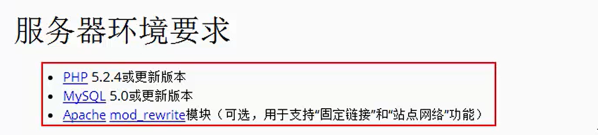
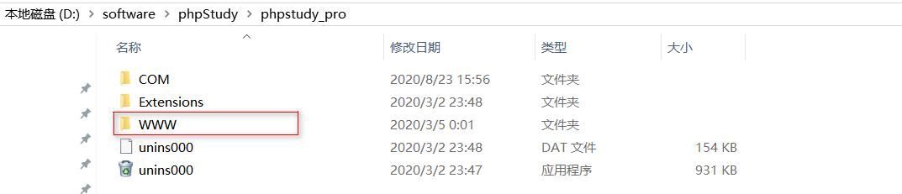
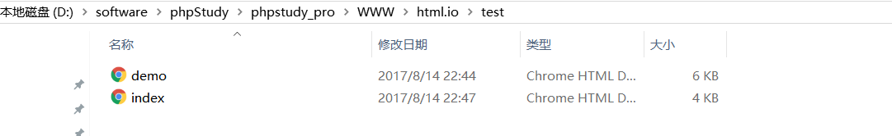

(注1：为了自己搭建网站，非常有必要单独学习一下WordPress)

(注2：视频来自于[WordPress大学-WordPress快速入门篇](<https://www.bilibili.com/video/BV1St411s7VL?from=search&seid=12466557073089506891>))

(注3：下面的置顶评论：这教程详细到就差教人怎么开机关机了。我看了几集，这个确实是太详细了。)

(注4：不行，我觉得要弃写这篇博文了，我现在要做的是把我Hexo博文转到WordPress中，并且前端框架用Vue,后端用Node.js，这个教程感觉不太适合我了。)

# WordPress运行环境

## WordPress运行，需要怎样的环境

## 如何搭建WordPress的本地运行环境

WordPress运行环境，可以分为：**本地运行环境**和**真实运行环境**。

**本地运行环境**：

在你自己的电脑上搭建出一个可以让wordPress正常运行的环境，这样的话你就能在自己的电脑上安装和使用wordPress了。

在本地运行环境中搭建的wordress站点，只有你自己能看到，互联网上的其他人无法看到。

之所以搭建本地运行环境，目的是方便你学习和测试Wordpress.

**真实运行环境**：

在真实运行环境中搭建的wprdPress站点，互联网的所有人，都可以看到。

**如何搭建本地环境**：

PHP、MySQL和Apache，简单来说，就是三款软件。只要你在自己的电脑上，安装这三款软件，就能成功搭建本地运行环境。

但是，这三款软件安装起来很简单，但是配置起来很复杂，所以不建议新手手动分别安装。建议新手使用所谓的集成环境，也就是安装一款集成软件，就相当于安装了上述的三款软件，而且不需要你进行复杂的配置。

集成环境其实也是一款软件，所以具有相似功能的软件也有很多，比如说：Appserv，xampp，phpstudy等等。

因为phpstudy是非常简单的，非常适合新手和老手。

## 使用phpstudy来搭建运行环境

### 下载phpstudy

官方网站：<https://www.xp.cn/>

### 安装phpstudy

略

### 使用phpstudy

**①网页文件和网站资源的存放位置**

所有的网页文件和网站资源，都要放到phpstudy_pro/www这个目录下

网页文件：.thml文件，.php文件都可以理解为网页文件。

网站资源：图片、视频等资源，就叫做网站资源。

**②如何访问存储在WWW目录下的网页文件和网站资源**

**对应关系**：

localhost(你可以理解为一个域名)，和WWW目录是一一对应的关系

127.0.0.1和WWW目录是一一对应的关系

> 在浏览器中输入127.0.0.1或者localhost效果是一样的，都代表着WWW目录

**例1：**

假如要在浏览器中访问本地电脑中的WWW/demo.html文件,那么就可以使用localhost替换WWW,变成localhost/demo.html即可在浏览器中显示出这个文件中的内容。

**例2：**

假如要在浏览器中访问本地电脑中的WWW/demo.html文件,那么就可以使用127.0.0.1替换WWW,变成127.0.0.1/demo.html即可在浏览器中显示出这个文件中的内容。

**③默认首页**

**例子：**

在test目录下，有2个网页文件

而在访问的时候，是使用localhost/test/这个网址来访问，看到的结果如下：

**概念：**

当访问某个目录时，并且没有指定要访问该目录下哪个文件的时候，默认情况下会将该目录下的index.html/index.php/index.htm的内容显示出来，而index.html/index.php/index.htm就称为**默认首页**。

默认首页的作用就是简化访问。

特别说明：可以人为去修改默认的首页的文件名称。