(注1：现在是2021年2月28日，离职后的第5天，时间过得太快了，我这几天也是在间歇性准备找工作，准备面试题了。)

(注2：截止到目前为止，我的简历还没有写好，因为GitHub Pages只能部署静态页面，所以我做的一些项目还没法直接部署到GitHub Pages上直接预览，想到自己的腾讯云服务器还有6个月才到期，就想着为什么不去利用起来呢？结果昨天搞了半天，没弄好，然后自己就心态炸裂了，今天是2月28日，2月的最后一天，也是周日，我今天起了个大早，就打算什么也不干了，就把自己的项目给部署到腾讯云服务器上。今天一定要成功啊！)

(注3：我昨天把自己的服务器给重装系统了，今天就从0开始吧。)

[8分钟快速弄懂如何将自己做的网页部署到服务器](https://www.bilibili.com/video/BV1HT4y1774Y?from=search&seid=9864901227654323292)

# 基本情况

这个就是自己的腾讯云服务器了：

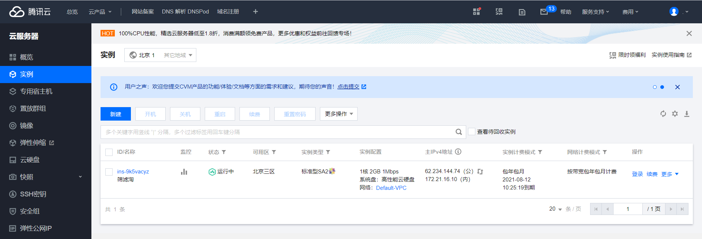

这里面干干净净，是什么也没有的。不过里面的安全组里面已经开过端口了，我看过相关的教程，第一步还是安装一下宝塔面板。宝塔面板的网址是：[宝塔面板](<https://www.bt.cn/>)

我的系统镜像是CentOS的，所以安装以下这个就可以了。

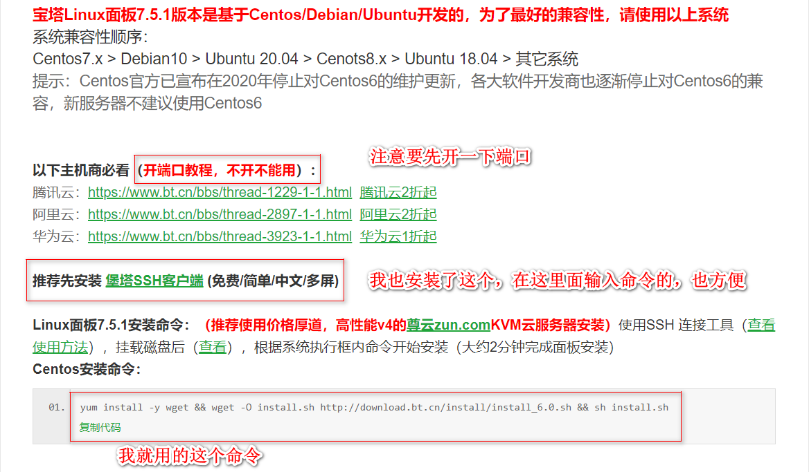

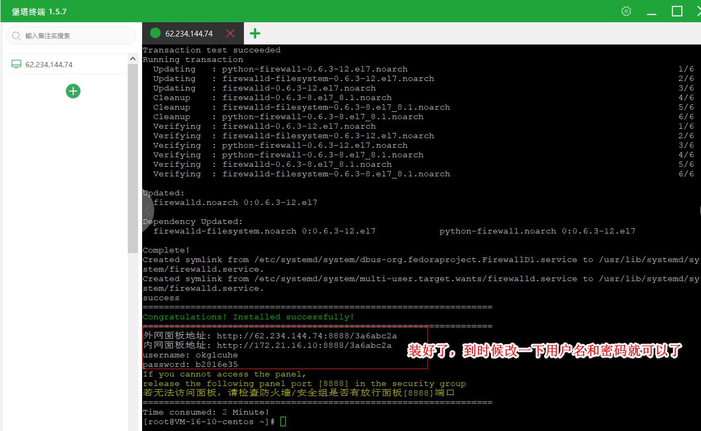

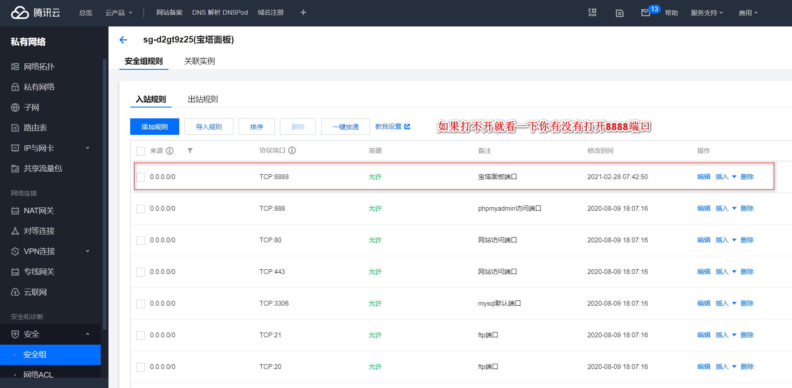

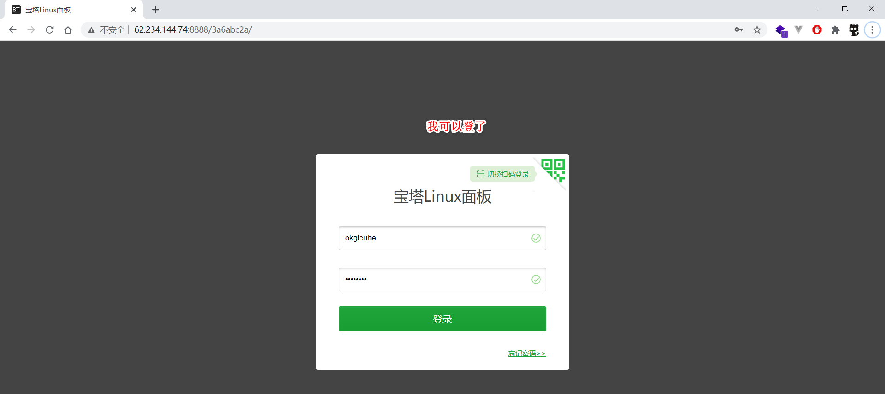

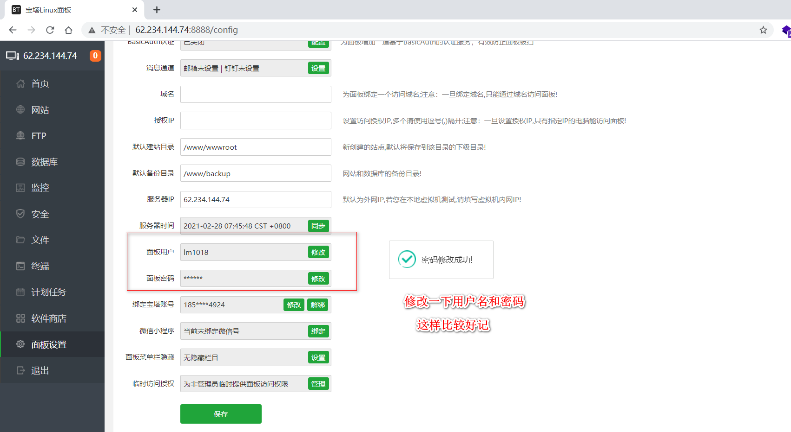

# 注册免费域名

打开域名注册网站：[Freenom.com](https://www.freenom.com/)，注册一个免费域名，并且将它绑定到服务器上。具体操作可以看我前面给的[8分钟快速弄懂如何将自己做的网页部署到服务器](https://www.bilibili.com/video/BV1HT4y1774Y?from=search&seid=9864901227654323292)链接。

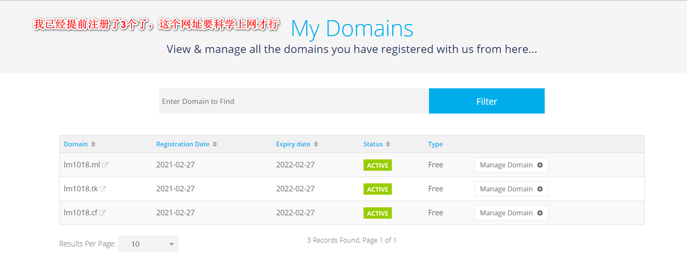

接着ping一下自己的这个域名，发现ping不通，我又ping服务器，发现也ping不通。

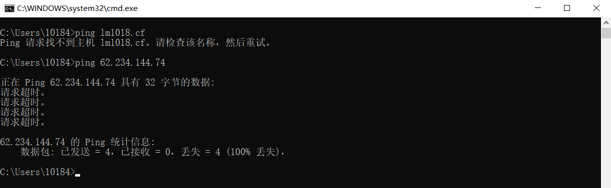

去问了腾讯云客服，告诉我：在服务器中的安全组中添加一条ICMP协议放通的规则，然后再尝试ping一下。

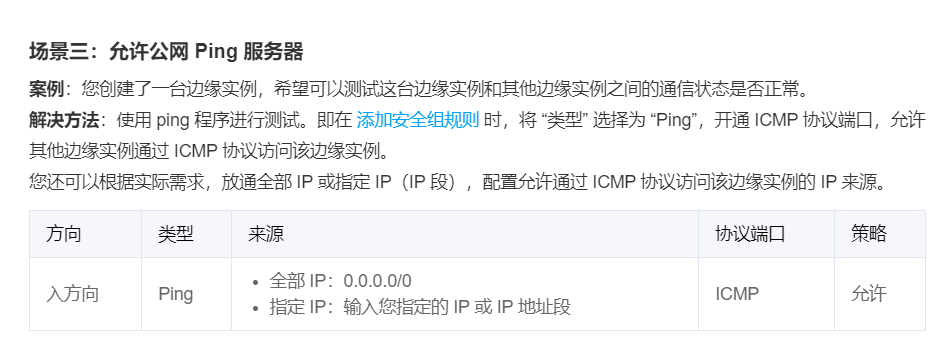

# WinSCR传输文件到服务器

[使用远程登录软件登录 Linux 实例](https://cloud.tencent.com/document/product/213/35699#.E4.BD.BF.E7.94.A8.E5.AF.86.E9.92.A5.E7.99.BB.E5.BD.95)

[使用标准登录方式登录 Linux 实例（推荐）](https://cloud.tencent.com/document/product/213/5436)

[Winscp 密钥登录服务器配置过程 提高 SFTP 连接安全性](https://cloud.tencent.com/developer/article/1158263?from=information.detail.winscp%E6%80%8E%E4%B9%88%E8%BF%9E%E6%8E%A5%E8%85%BE%E8%AE%AF%E4%BA%91)

[SSH 密钥](https://cloud.tencent.com/document/product/213/6092)

因为我使用了密钥登陆，所以就无法使用密码登陆了，需要在WinSCR软件上设置一下使用密钥登陆。

我真实服了，搞了半天终于搞好了。

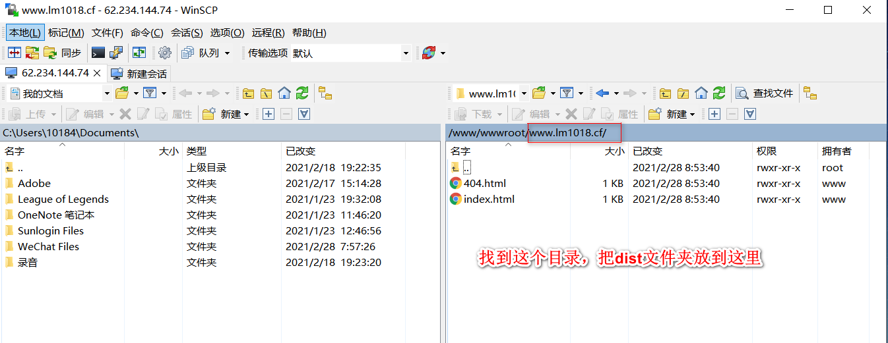

不行啊，它不显示。

# 部署项目

[linux nginx配置多个网站](https://www.cnblogs.com/wesky/p/9053853.html)

[nginx.conf 配置文件详解](https://juejin.cn/post/6844903741678698510)

[如何用一台服务器，部署多个不同的 WEB 项目 (use nginx in docker)](https://zhuanlan.zhihu.com/p/69555541)

[vuejs怎么在服务器部署？](https://www.zhihu.com/question/46630687)

[解决 vue-cli index.js dev 配置中 assetsPublicPath 的值不能填 "./" 的问题](https://blog.csdn.net/isyoungboy/article/details/84350256)

我查了一大堆东西，然后试着自己去弄，成功了！！！！！哈哈哈哈哈哈哈哈！！！！！！！！

# 域名问题

我这个域名:`lm1018.top`不知道怎么了一直打不开，我索性不然再买一个域名，一个用于服务器，一个用于自己的Hexo博客吧。花了7块钱买了一个一年的`lm1024.top`的域名，先用着吧。

# 子域名

[已有域名 怎麼添加子网域名？](https://cloud.tencent.com/developer/ask/231882?from=information.detail.%E5%8D%8F%E4%BD%9C%E5%AD%90%E5%9F%9F%E5%90%8D)

[请问一下宝塔新建多个网站可以一个用域名多个端口吗？](https://www.bt.cn/bbs/thread-3992-1-1.html)

[子域名分项目管理](https://cloud.tencent.com/document/product/302/7800)

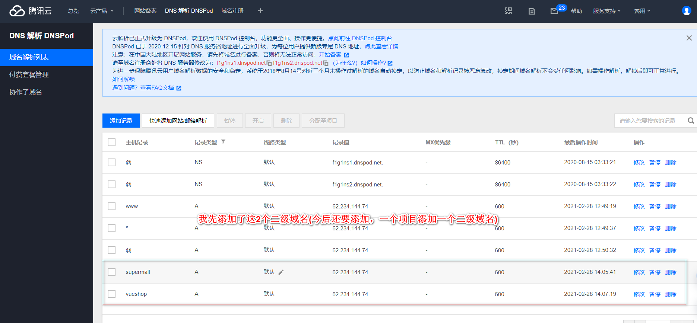

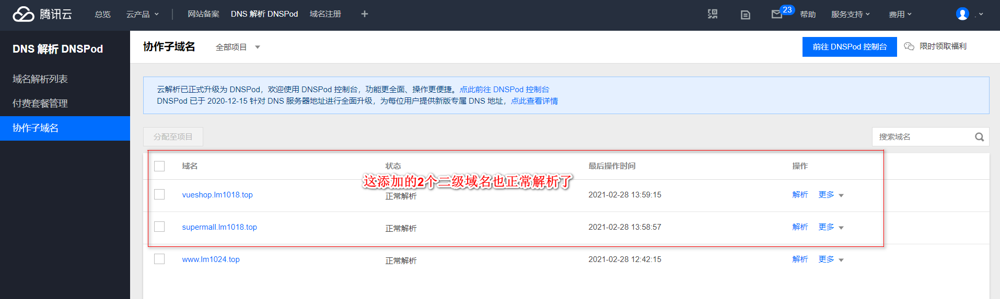

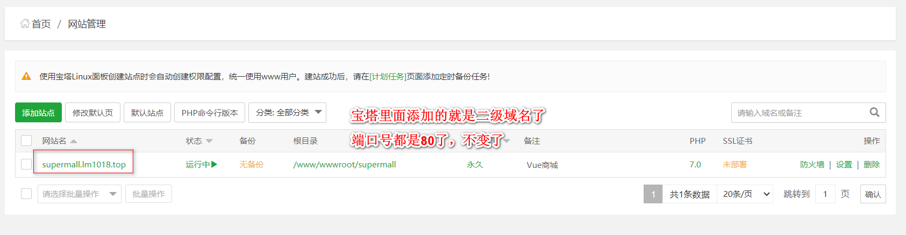

# 带有数据库的Vue后台管理系统部署项目

也是直接把dist文件夹放到里面，数据库我没有放，但是发现也没有什么问题。神奇。

# 报错信息

[Mixed Content: The page at 'xxx' was loaded over HTTPS, but requested an insecure resource 'xxx'.](https://blog.csdn.net/haibo0668/article/details/82947917)

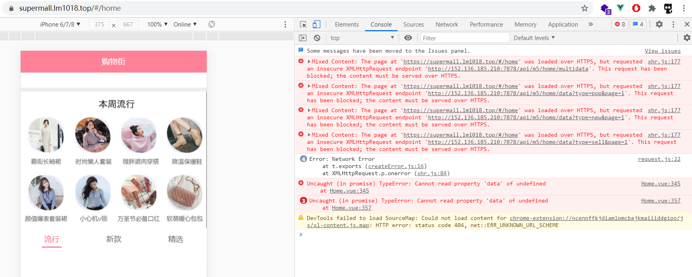

这个没办法，我只好把SSL证书关闭了，不适用`https`访问了，用`http`访问就没有问题，可以请求到数据了。