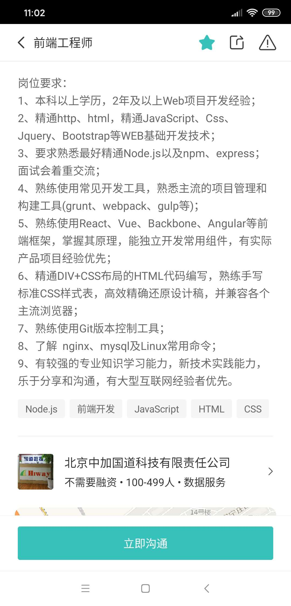
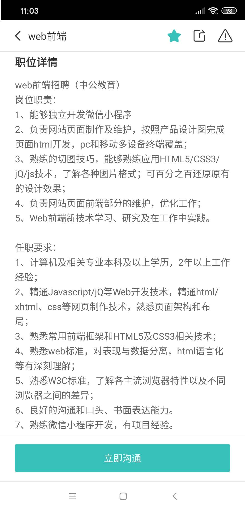

# 2020年上半年学习计划

## 重点学习

1. 《JavaScript高级程序设计（第3版）》笔记认真做完，做完后再回头重看一遍，修改一下格式，错别字等。一些重点章节，例如第6、7章需要重新再看一遍，一些重要概念，例如this，闭包，原型链，对象，AJAX，JS内存调度，事件处理等需要理解透彻，这本书弄透了，大概JavaScript水平就是中级了。这是一本重点书，书贵精不贵多，我还下载了《Head First Javascript》,但想了想还是不能两头作战，不能因为一些概念难就转而去看其他书，JavaScript主要就是概念上的理解，理解了以后水平会有指数型上升的。

   这本书一定要好好看，概念一定要深刻理解，基础一定要扎实。

2. 框架方面学习Vue.js，三大框架由于时间和精力的缘故只能先学习一个了，JavaScript和框架同时进行学习，没办法，因为时间有限，我不能把JavaScript学完了后再学框架，这样时间肯定不够了。原生框架jQuery也暂时搁置，也是时间紧急，等下半年，Vue.js学的差不多了，一定第一个学jQuery，书籍选择是《锋利的jQuery  第2版 》。

   如果说JavaScript是地基的话，那么Vue.js就是实操了，这个是立身之本，工作也是在框架的基础上进行开发的，所以花的时间甚至会比JavaScript更多，并且今后做一些作品，我的想法是先用JavaScript做一个，再用Vue.js重构一个，最终的作品反应了框架学习的好坏。

3. CSS需要复习一下，已经很久没有看CSS了，上次看到了浮动，今后要接着进行基础复习，但是不作为重点了，CSS能写页面即可，别研究什么奇技淫巧，浪费时间啊。JS+框架研究6了，工作不愁的。CSS屌顶多是个切图的。但是CSS是基础的基础，我现在基础并不牢固，还需要巩固，最终要达到的效果为：精通DIV+CSS布局的HTML代码编写，熟练手写标准CSS样式表，高效精确还原设计稿。其实这个并不容易啊。而且自己如果求职成功，估计刚开始也肯定是干这个，所以这个也必须要学好才行啊！！！

## 工具学习

1. 学会git基本操作

   视频每天看2节，大概只有10天的量了，有时间再把《progit2》和《GitHub入门与实践》看完。或者再找一些别的视频大体看一下

2. 学会MySQL基本命令操作

   视频每天看2节，大概20天看完

3. 学会开发工具Webpack基本操作-先不急着学这个吧

   现在还完全没接触过，对这个词有印象还是在昨天，下载了《深入浅出Webpack》，准备看一下，然后再找一些视频看，感觉挺重要的。看到一段话：建议把JS原生玩透，写功能无压力，代码耦合性可读性，结构模块有自己的见解在弄这些，毕竟这些工具是死的，百度谷歌上有教程webpack，但是代码思想结构设计可是不容易找到，这需要项目经验依托，还是把原生js玩好，最好理解底层原理。

4. 学会PS基本操作

   还有30集没看完，先暂缓一下吧。

5. Node.js了解一下-现在没时间学

6. Linux基本命令了解-现在没时间学

## 自己的作品规划

1. 简历用HTML+CSS写
2. 作品弄2-3个
2. 微信小程序？
3. 用Vue.js写一个作品

## 其他

1. 《读书笔记：数据库系统概论（第5版）》-暂停

2. 《读书笔记：计算机组成原理（唐朔飞）》-暂停

3. 《读书笔记：计算机网络自顶向下方法（第4版）》-暂停

4. 《读书笔记：锋利的jQuery（第2版）》-暂停

5.  《Linux操作系统入门》-暂停

6. 《读书笔记：深入浅出Node.js》-暂停

   时间有限，先暂停。

## 随便找的一些招聘能力要求

## 杂感

王者荣耀从去年12月玩到今年12月，也玩了一年了，别再玩了罢，没时间了。

B站除了学习视频也别再看了罢，没时间了。

保重一下身体，年纪也不小了，按时吃饭，别再熬夜了罢，花的1200办的半年的健身卡，一周起码去3次罢，最近严重腹泻，稍微吃些清淡的罢。

不做具体计划，因为无数次的过往告诉我，没有用，坦然些的面对自己罢。

2020年上半年的学习进度如何会直接影响到我下半年转行找工作，但也别过于焦虑和紧张罢，因为不但没用反而会让事情变得更糟。不论结果，就一天一天的去做罢，无所谓了，船到桥头自然直了。

毕竟，未来实在是无法预期会发生什么，而人的想法又是一天一变。

不知未来会怎样，但我终究会死去，虽然无法看到2100年以后的地球，但我依然很好奇，昨天看了一篇遐想文，感觉很有意思，摘录如下做个结尾吧：

2900年，人类平均寿命为300岁。

由于医疗水平的大幅提高，人类对各种疾病的治疗和衰老的防治已经达到了登峰造极的地步，每个人类都可以做到“无疾而终”，因为他们大都是器官衰竭而死。

而此时，对人类生命延长的研究已经停滞50年，因为人类可以治疗几乎一切疾病，但仍然无法阻止自然衰老。作为有机体的人类终有一死。

此时，为了再度延长寿命，社会正在掀起另一股风潮：人体再造

人体再造派认为：为了治疗病人，人造肾、人造肝等已经广泛用于医疗当中，使用人造器官已经成为了社会普遍现象，那么为什么就不能在健康的时候就提前预防可见的疾病，把器官替换为更为耐用的人造器官？

在人体再造派的积极推动下，很多研究所和医院投入到对各种人造器官的研究当中，人造脾、人造胃、人造肺的研究纷纷取得重大突破，许多人开始偷偷给自己装上各种人造器官，引起了社会极大的争议。

有人甚至把这次人体再造风潮称为“富人的续命游戏”，面对高昂的人体改造费用，更多的平民选择走上街头，开启了一场声势浩大的反对浪潮。

各国总统纷纷发表讲话：鼓励正常的学术研究，但对人造器官的使用将严格审批监督，禁止各种人造器官的非医疗用途，反对浪潮才渐渐平息。

此时的人类社会，机器人已经得到广泛使用，各种人造机器人几乎可以以假乱真。习惯生活在机器人一代的人类，对人体改造的接纳度已经大大提高。面对着延长寿命的诱惑，部分人仍然会私下给自己安装各种人造器官，或者买通医院的医生，或伪造各种急需器官的证明等等。人造器官移植成为一条蓬勃发展的地下产业链。

3377年，事情出现了重大转机，中科大科学家浩叶带领的团队宣布研制出人造子宫，可在完全独立的条件下孕育出婴儿，减轻女性的生育痛苦。

随后20年，人造子宫风靡世界各地。3400年，人造子宫孕育的婴儿占到当年新生儿的97%。人口出生率从3377年的不到0.29%猛增到3400年的1.52%。3402年浩叶因为对人类的巨大贡献被授予当年的诺贝尔医学奖和诺贝尔和平奖两项大奖，成为了人类历史上第一个同一年获得两项诺贝尔奖的科学家。

随着人造子宫的广泛使用，世界各国看到了人造器官的巨大益处，社会舆论逐渐开始变化。3411年，新西兰第7次全民公投，特别是由于广大女性的票数支持，新西兰成为世界上第一个全民人造器官移植合法化的国家。随后20年，又有37个国家（此时世界上只剩50多个国家）投票通过人造器官移植合法化法案。

4717年，地球上最后一个完全自然人（没有进行过任何人体改造）死亡，享年370岁。

5000年，人类平均寿命达1800岁

▼

8000年，改造人已经取代自然人类变成了银河系新的物种，而自然人类就像北京猿人一样，成为了人类发展历史当中的一页，被遗忘在历史的长河里。

此时人类对身体的改造几乎是全方位的，除了少数几个身体器官始终无法改造外，人类已经和自己原始样貌大相径庭：有的人装上了翅膀，有的人脚上安装了推进器，有的身体里装上了武器，还有的人借助辅助芯片提高了自己的脑力……

人类在各个方面摆脱了原有身体的各种限制和不便，某种意义上真正实现了全面发展，走向了自我解放的道路。人类早已经冲出太阳系，走向银河级文明。

但是人类始终无法完成对身体的完全改造，科学技术的突破，需要另一位天才科学家的诞生和引领。

终于，天才科学家莫蒂从神经元直接提取了遗传物质，人类依赖染色体繁衍后代的历史成为了过去。生殖系统的存在失去意义。

8230年，除人脑以外其他部分全是无机体的人类诞生。

人类通过自我改造的方式，淘汰了生殖系统。

此时的人类，对自我实现的需求和求知欲的追求，取代了原来对食欲和性欲的追求。纷纷进行了改造，性爱成为了穷人的“特权”。

无机人类携带着脆弱的大脑，在茫茫宇宙中直接穿梭，仿佛一颗颗水滴。

▼

16000，无机人瑞克通过高维展开的方式，在一个质子上雕刻出了神经元

16691，完全无机人类诞生，人类完全摆脱碳基生命形式

180000，无机人发现物质和能量的转化方法

188000，无机人成功把自己转化为能量体，能量体接近永生。能量体没有形状，没有情绪

N年后，宇宙膨胀，星辰死灭，物质衰变分解，黑洞蒸发殆尽。所有能量体聚合，开始重启宇宙

宇宙聚合为奇点爆炸重启，宇宙开始下一轮螺旋进化之路

而能量体在宇宙重启中脱离宇宙，摆脱了时间和空间的限制，进化到无法理解的层次