(注1：今天我突然产生一个想法，我这一年来一直在学习前端的有关基础知识，但是对于这个行业并无了解，顶多加了几个微信群，看着他们讨论，只对这个职业产生了一些朦朦胧胧的印象，但是，这还远远不够，于是我决定写这篇文章。大概搜集一些工作1-3年的初中级前端工程师的日常记录，让我对这个行业有更加的代入感，不会那么陌生，我想，这个对我是有好处的。)

(注2：选择的样本不要太狭小，大厂小厂都找一些，俗话说"聆听他人的故事，感悟自己的人生"，也算是通过他人的经历可以让自己以后有个目标，然后少走些弯路吧。 )

(注3：这篇博文顺便也加一些前端工程师关于前端的思考之类的文章吧。)

(注4：现在是2020年12月12日，这篇博文由《搜集的前端工程师日常》改为了《前端视野拓展》，我觉得比较合适。)

# 1.一个前端妹子的阿里p7成长之路

[一个前端妹子的阿里p7成长之路](https://mp.weixin.qq.com/s?__biz=MzI3NTM5NDgzOA==&mid=2247485221&idx=1&sn=763b0aeccae4171ce6852ea33a68896e&chksm=eb043f5cdc73b64a83c3e03d13fb2bd7db79db996473c429c44636e5a7dcfc09a1cd383b8001&mpshare=1&srcid=1012PrISCt9sCSwk9nCHVSBX&sharer_sharetime=1602506246392&sharer_shareid=82384198865aad802052fa45394cd852&scene=1&subscene=10000&clicktime=1602508491&enterid=1602508491&ascene=1&devicetype=android-29&version=2700123b&nettype=WIFI&abtest_cookie=AAACAA%3D%3D&lang=zh_CN&exportkey=A4ePJLqzTXzYvttT%2FUmuCbs%3D&pass_ticket=HzDWScKlFkb9bniy2Xoe5ZPyShdsHtXTvcJ1S8RRq16zpkwiZQXdcjPvTjNOsjIr&wx_header=1)

人物：来自淘宝的前端技术专家 — 珑晴 (计算机系)

## 自我介绍

我先介绍下我自己，我是 16 年校招实习转正进入的阿里，当时是在聚划算前端团队，随着业务变化一路从聚划算到天猫再到现在的淘宝，负责日常活动营销的同时，也多次参与大促会场&互动的研发，在支持业务的过程中不断挖掘提炼创新，最终完成从前端小白到前端技术专家的蜕变。

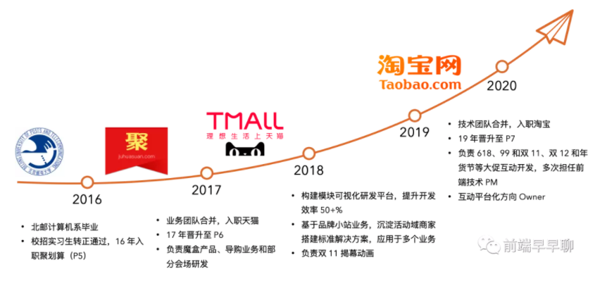

## 职业经历

接下来，我将结合这 4 年，具体谈谈我的前端成长之路。

### 职场初探-实习的那几个月

首先是实习期，当时是北邮的一个师兄内推来的杭州这边。实习期间呢，我主要是负责 2 块东西， **XList 和周末淘宝**， XList 是聚划算之前的一个解决无尽滚动的框架，当时主要还是在熟悉团队的工具链、看源码，顺便给其他业务打打杂。

**这个时期的重点**是**团队融入**和**兴趣探索**，对实习生本身能力要求并不高，所以这个阶段的同学们不要过于焦虑，重点还是看自己的**个人意愿与团队的匹配度**来进一步决定是否要继续待在这样的团队。

### 新人菜鸟-入职第1年

然后是入职第 1 年，我的菜鸟时期。我入职的时候，刚好赶上聚划算整个在做品牌升级，当时存在一个商家素材不规范的问题，亟需解决以提升用户体验。

我就在师兄的指导下，设计了这么一个基于 PSD 解析的规范化合图方案，这是技术方案的简图

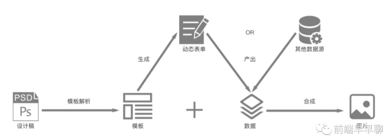

在 PSD 解析的基础上，我还提供了一个**可视化界面**给**设计师**调控实现配置生成图片，界面是参考 **sketch** 实现的

这个方案在聚划算整个实施之后，也取得了很好的业务结果，覆盖了 90% 的业务线，平均每天合图超过 1w 张。而这个工具，也是当时团队内部第一个完整的 **node 应用**，我也依靠 TA 成功晋升到了 **P6**

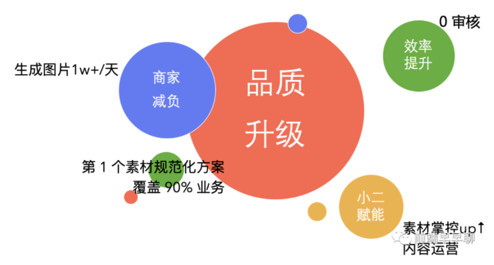

总的来说，第 1 年是**新人时期**，在这段时间，要开始学习识别业务需求，能进行方案设计，推动**个人技术栈的成型**。这个时期，我们完成的是从学生到社会人身份上的转变，在做业务的同时，一定要时不时的**抬抬头**，把自己做的东西拿出来跟大家**分享**，既增进了团队对自己的了解，也促进了自己对知识的进一步总结概括。

### 独当一面-升级打怪

接下来，就是作为新人成功 landing 之后的升级打怪了。这个时期，我给自己的定义是独当一面。这里主要结合我个人做的另一个工具阐述。

坑位研发，是我们电商前端工程师日常开发过程中绕不开的事情，这是一些常见的商品坑位。

受之前做的配置生成图片工具的启发，我萌生了用编辑器产出布局的想法。

然后，我就做了一个坑位可视化开发工具，左边是编辑器界面，右边是消费者侧渲染的 demo。通过这个工具，设计人员简单复制粘贴、拖拖拽拽就可以生成一个新坑位，极大地降低了 UI 的开发成本。

这是当时在会场上的应用情况，做到了业务变化的分钟级响应。

但是，工具在推广过程中，也遇到了一些问题，包括如下

* 不支持存在事件交互、数据处理等逻辑的场景
* 运行时解析方式在端上性能不佳
* 脱离正常的研发流程
* ······

当然，这些问题也正好给了我独立 owner 且重构产品的机会。于是，我结合了当时天猫的研发体系，推出了融入开发体系的模块可视化研发方案，即 2.0 版本。这是 2.0 版本的完整链路图。

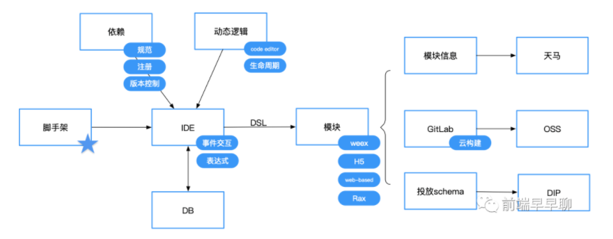

这是 2.0 版本上线之后取得的结果，我也在**那一年拿到了年度 3.75，并晋升到了 P7**。

从我个人角度，独当一面**这个时期的重点**是在能游刃有余的完成分发到自己的工作之外，**建设核心能力**、寻求突破。这个时期，已经对业务有了较为深刻的了解，可以**从零到无设计一块东西**，技术上能够对接业务方，技术之外要能做项目管理，**协同**多方有效完成任务。

## 关键技能

接下来，我将重点介绍下我过去 3 年多解锁的一些关键技能。

### 技能一：跳出技术视角

第 1 个关键技能是跳出技术视角。不少开发都有类似【我只是一个技术，不应该参与 QA、PM 的工作】的想法，实际上也确实有人在技术路线越走越精深，并得到了认可。然而，凡事都有个但是，很多人技术水平非常高，但一直得不到认可，这种现象更为常见。尤其对于我们前端来说，很难彻底脱离上下游、脱离业务方来完成工作，甚至除了 QA 和 PM 的工作之外，还需要向业务方 “推销” 自己的工具。一个更加 “全面” 的前端才能更加顺风顺水。那么，怎么做到更加全面呢？可以从以下几个方面入手，比如从 why 出发做事情，做业务的同学，关注业务数据、跟进线上问题，做技术产品的同学，提供出色的产品服务文档。

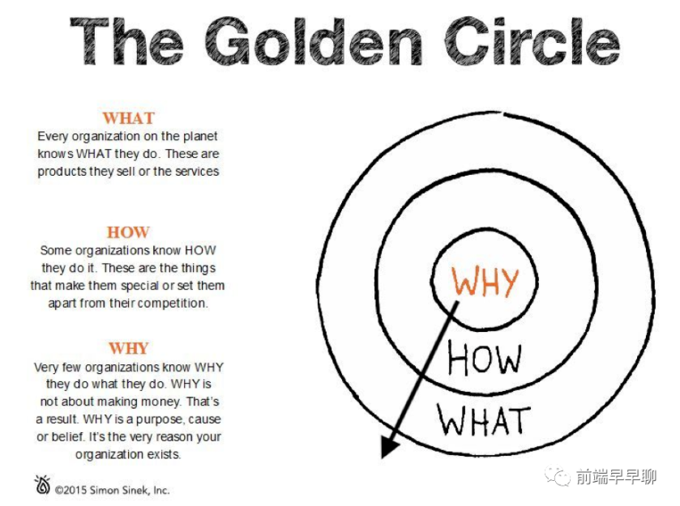

### 技能二：追求极致

第 2 个关键技能是追求极致，也可以理解为我们常常称赞的匠人精神。以我为例，我入职第一年就做了个在线编辑器，在完成基础功能的同时，还增加了快捷键、辅助线、自动吸附等功能，不断打磨编辑器的产品体验，因此也吸引了很多小伙伴的加入，共同把这个产品推广到更多的业务域。

### 技能三：结构化的表达

第 3 个关键技能是结构化的表达。俗话说的好，酒香也怕巷子深，结构化的表达，是我们在完成事情的前提下，更好地让别人（比如你的老板）get 到你的产出及价值。结构化的表达离不开结构化的思维方式，大家可以看看金字塔原理这本书。除此之外，在建立结构化思维的过程中，好的画图工具也能实现事半功倍的效果。

# 2.前端工程师每天的日常工作

[作为一名前端开发工程师，每天日常工作是什么样的？](https://www.zhihu.com/question/339380936)

前端开发五年经验，目前是一个前端开发组长

日常的工作大概可以划分成三部分

- 前端业务开发
- 前端团队建设
- 前端团队管理

1. 前端业务开发

首先作为前端组长首先是目前前端组技术水平有一定能力的角色，要承担前端开发工作。

日常的工作第一步是需求评审，分为正式评审和非正式评审，大部分需求只有正式评审，正式评审确定的的是需求的细节、交互逻辑，和后端开发人员简要讨论开发方案及排期，非正式评审适用于一些大规模需求或者创新性的想法，需要前期研发人员参与判断需求是否能实现以及实现成本，产品经理会依据开发人员的建议决定是否继续这个项目或者调整方向。 需求正式评审不通过，修改后再次评审，通过了按照评审结果输出最新的文档产品原型给设计人员进行设计。

然后在ui设计的过程中需要做一些前置的工作，一些插件的选择，以及与后端协商接口协议，ui出来之后，前端进入页面还原阶段，这部分主要是结合功能，以及产品的发展方向，还原成既要符合产品需求又要具有较强的扩展性的页面。按照目前的发展在一定粒度上对页面进行模块化，最大程度提高页面的复用性。

页面还原成功后开始做交互开发，包含一些动效以及数据校验以及页面之间的跳转弹窗或路由等逻辑，这部分尽量保持整个产品功能的统一性，

这些都ok了开始对接后台接口，通过事先定义好的文档以及mock数据模拟进行调试，开发完成后，在本地或者开发环境上开始联调，联调通过后就可以提测。

测试人员进行功能测试，空余时间用来review一下代码，适当的做一些小改动提高代码的维护性，并修改测试问题。

测试完成后产品验收，这是基本已经定型，需要修改的就是文案和交互的体验问题了。

验收通过后就上线发布了。

2. 前端团队建设

前端团队建设主要是团队内部的事情，

①定制一些前端开发的规范，比如代码规范，目录规范，框架的使用规范，前端文档的规范等

②引入一些新的技术

③提出一些技术改进方案，收集大家的技术需求，进行评估

④组织一些分享会，分享一些前端开发的经验包括自己的经验以及在网上或者书本上学习的经验

3. 团队管理

团队的组织架构大概是前端开发>组长>研发经理>研发总监，每个项目组也有细节的小组长负责统筹前后端的开发工作，所以作为前端组长团队管理的工作反而不算是重点。

这部分主要需要做的是合理调配前端资源，保证大家工作量差不多，不要忙的忙死，闲的人闲死，另外就是要监控大家的工作进度，避免延期风险，在有困难时及时给与协助。

还有就是前端新人的招聘和新员工的培训，这部分属于偶尔的工作不算日常。

这既是一个小团队的前端组长的日常工作。

# 3.前端开发的难点到底在什么地方

[前端开发的难点到底在什么地方?](https://www.zhihu.com/question/275915023/answer/1432900344)

你要问前端开发难不难，我就得说计算机领域里常说的一句话，这句话就是『**难的不会，会的不难**』，对于不熟悉某领域技术的人来说，因为不了解所以产生神秘感，神秘感就会让人感觉很难，也就是『难的不会』；当学会这项技术之后，知道什么什么技术能做到什么做不到，只是做起来花多少时间的问题而已，没啥难的，所以就是『会的不难』。

但是，对于前端开发这个方向，即使『会了』……依然感觉很难，唉，说多了都是泪呀，我用三个亲身经历的怪现象来说明吧。

**第一个怪现象：谁都可以指手画脚的前端开发**

我职业生涯很长一段时间都在做前端开发，我也做过后端开发，两者一对比，给我影响最深的不是技术差异，而是——前端开发者听到的『需求修改意见』要比后端多得多。

后端这东西，毕竟是藏在后面的，外行不懂就是不懂，装不出来，他们也不好自取其辱乱比划，但是，前端嘛……谁都能看得见，没吃过猪肉还没见过猪跑，所以，谁都可以指手画脚提一点意见。

只看得见界面的产品经理可以提一些意见。

项目经理可以有一些意见。

啥也不懂的老板也可以提一些意见。

甚至连后端都可以来提一些意见。

……

正因为前端的产出是看得见摸得着的，所以造成了谁都可以『提一些意见』的现象。

前端开发最大的痛啊！

**第二个怪现象：被鄙视但又十分抢手的前端**

前端开发者，你懂的，居于开发者鄙视链的低端，业务逻辑大多都居于后端，超大并发量是后端实现的，超牛逼的AI、大数据分析、商业逻辑都在后端，前端要做的只是一个功能展示，所以，后端开发普遍看不上前端开发的工作，直到……到了公司举办黑客马拉松活动的时候。

黑客马拉松，就是让程序员自行结队，在几天之内快速开发出来一个小型项目，到活动结束的时候，每个队要演示自己的产品，于是，问题来了，平时你可以鄙视前端开发者，你可以把前端开发贬得一文不值，但是，到了黑客马拉松的时候，才知道前端开发的必不可少，因为没有前端你无法『演示』你的想法。

这时候，后端开发者也会发现，平时觉得前端开发很简单，但是自己写一个最简单的AJAX form表单提交也要学半天，不管你的后端想法多么牛，如果最后没有熟练的前端开发者，最后到了演示环节也要抓瞎。

所以，每到黑客马拉松时，平时居于鄙视链最低端的前端开发者，突然就变成了最炙手可热的红人。

谁都觉得前端开发不重要，但是又离不开前端开发。

是不是很讽刺？

**第三个怪现象：苦不堪言的多端开发**

一个正经的产品，为了满足用户不同设备上使用的要求，需要提供多客户端，最起码要有网页端、iOS端和安卓端，现在大部分产品还要考虑小程序端，这还没算iOS要分iPhone和iPad，安卓也要考虑手机和平板，甚至要考虑机顶盒设备的界面……

各种设备、各种安卓版本、各种浏览器都有各自的特（bu）点（g），每个前端开发者都有体会，很多精力都消耗在处理某个特定平台/版本/浏览器的bug上，唉，说到这里真想流泪……

因为要支持这么多不同的客户端，一个产品的前端开发者种类也不止一个，要有网页开发者、iOS开发者和安卓开发者，大一点的项目，靠一个人支撑一种客户端就不行了，需要的是网页开发团队、iOS开发团队和安卓开发团队。

其实，**不同客户端实现的都是同一种功能**，完全是因为这个世界存在这么多种客户端，所以我们才被迫为各个客户端写一套代码。

虽然多端的存在，增加了不少程序员的就业机会，但是，干过实际项目的都知道，这其实很麻烦，很麻烦很麻烦！为了给用户最好的体验，肯定希望各端提供一致的功能界面，如果有新功能，要上一起发布上线，但是，不同团队之间开发周期肯定不同，很难保证同时完成任务，最后，花费开发时间最长的那一端的开发团队就成为整个产品的短板。

每每想到这里，就缅怀秦始皇，秦始皇你要是不光把度量衡统一，把所有客户端也统一了多好:-)

## 前端开发难在哪里?

好了，看完上面这三种行业怪现象，不难看出，前端开发很真的很有难度，我这里只列出最关键的三点：

第一，当需求发生变化的时候，第一线中枪的往往就是前端，而且很多需求变化和后端无关，单纯就是前端的改变。这些需求改变有的是不合理的瞎折腾，但是，客观来说，也有不少是有必要的需求改变，应该用户是上帝，用户的喜好会变化，用户的喜好我们也要反复揣摩，必须要伺候好用户，也就是要适应需求变化，所以，难点就成了——**如何让前端开发适应快速变化的需求？**

第二，平台、浏览器生态复杂，要考虑的场景太多，不同平台上实现同一界面功能的重复劳动严重，这个难点在于——**如何消除前端开发的重复劳动？**

第三，前端的学习曲线其实挺陡，很多后端开发者以为前端只是玩一玩HTML，到了自己上手的时候发现其实要学很多，下面只是一个简化了的网页前端学习路线图。

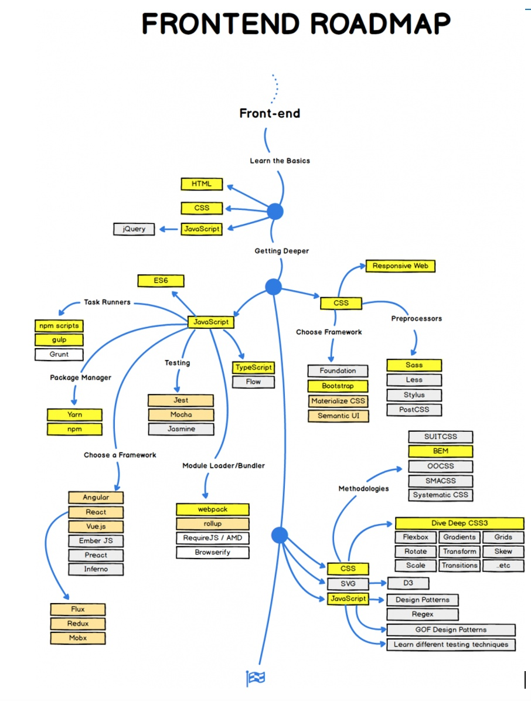

上面这么多知识点学会，只能算入门，更不要说：

- 如果要做到高性能，要考虑CDN优化、JavaScript Profiling、打包策略……
- 如果要做到安全，要防止注入攻击，要防止XSS攻击，要防止CSRF攻击……

这说的还只是网页前端，没说安卓和iOS开发、小程序开发，如果把这些都带上，需要学习的知识量又要翻倍。

而且，前端也不是说读几本书就可以上手做真实项目的，如果没有对这个领域长时间的浸淫，做出来的东西很可能就是漏洞百出，这个难点就是——**如何让前端学习曲线变得不陡？**

总结一下：

- **如何让前端开发适应快速变化的需求？**
- **如何消除前端开发的重复劳动？**
- **如何让前端学习曲线变得不陡？**

长期以来，虽然无数仁人志士想要解决这些问题，也取得了一些成果，但是，**前端是个被普遍低估了难度的开发活动！**

## 前端开发的出路在何方?

请注意，我现在说『前端开发的出路在何方』，并不只是要解决『前端开发工程师35岁之后怎么找工作』的问题，我想说的是整个行业如何定位前端开发的问题，或者说开发团队整体应该怎么解决前面说过的前端开发困难的问题，反过来，如果我们认清了整个行业对于前端开发的定位，你作为前端开发工程师也就清楚35岁之后如何找到合适的工作。

在我看来，问题的关键点就是——**现在很多前端开发的工作都是在重复劳动**。

难道不是吗？

你去问一个网页前端开发工程师，他们在前一个项目里做的功能，和后一个项目里做得功能，本质有多大区别？

你去让一个网页工程师、安卓工程师和iOS工程师一起讨论一下实现的功能，难道差不多就是一样的，只不过用不同语言、部署在不同的平台吗？

你去问一下这个公司的前端，再去问一下另一个公司的前端，他们要考虑的性能、安全性问题，解决方法难道不都是很雷同吗？

我不敢说所有前端开发工作都是重复劳动，对于一些极具开创新的界面和功能，是开拓一片新的天地，需要前端开发工程师开发全新的应用，但是，让我们承认吧，对于大部分应用，尤其是对于一些工具类应用，历史上已经被开发过无数回了，实在没有必要再重复造轮子了。

只是，每一个应用的开发团队，都很容易以为，自己的应用是『独一无二』的，这种想法也可以理解，毕竟，世界上每一个应用都有自己的独特一面，但是，**这不表示所有的工作都应该从零开始**。

这个行业已经这么成熟了，应该有一种尽量通用的框架来抽象可重复使用的功能，从而避免重复劳动，避免了重复劳动，也就解决了前端开发的最大难题。

像React、Vue和Angular这样的前端框架，就是一种程度上的抽象，也很通用，但我认为并非是前面结论中指向的最佳答案，事实上，行业发展多年，也不乏很多平台在为了前端开发的轻量化、功能模块化而不懈努力着，最近看到APICloud发布了一些新的前端能力，也验证了我前面说的观点。

了解[APICloud新产品特性](https://link.zhihu.com/?target=http%3A//www.apicloud.com/conference20200818)

[2020年，做前端开发app，选择ApiCloud还是DCloud？](https://www.zhihu.com/question/401912657/answer/1382402822)

> 下面的内容好像是打广告了，暂且看看吧。——证实了，后面确实是广告，APICloud风评不好。

## 低代码+高性能移动开发(广告)

> 这个是广告，想了想还是没删，暂且看看。

低代码虽然早在海外应用多年，但直到这两年才逐渐被国内所关注，其倡导代码复用，以及通过模型或翻译引擎自动生成大量代码，这些都是很好解决前端开发重复性工作和高效迭代的方向；我对于APICloud的认可，也是建立在他们原有的跨平台开发技术上进而实现了向低代码开发平台的转变。

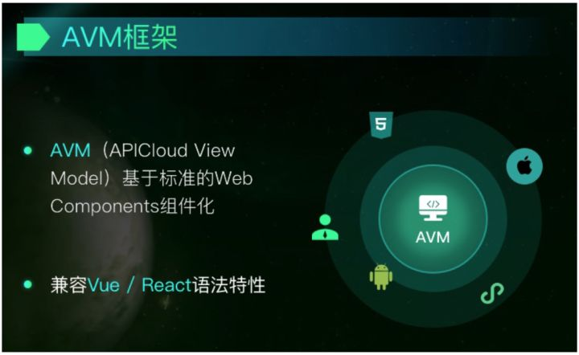

这次APICloud的产品迭代方向再次指向了前端，当然，我们都知道，现实中的开发，不可能一步跨入共产主义，历史上拖泥带水的代码依然存在，开发人员也不大可能一下子换到另一种语言，这一点在AVM这个框架上得到了解决，同时支持React和Vue，无论来自于什么开发框架背景，都可以在APICloud上快速上手。

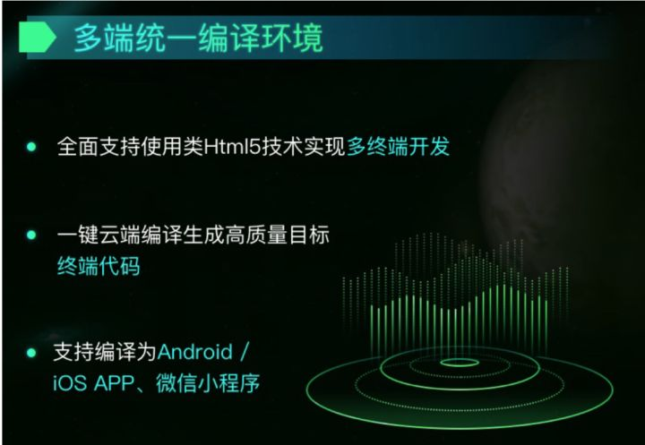

上文我也说到，前端开发最大的痛苦，就是多端支持，这一点在APICloud新发布的产品上得到进一步补充，一套代码开发，自动生成适合安卓、iOS、微信小程序、HTML5的引用，所有跨平台浏览器的问题得到解决，当然，市面上很多技术都在吹嘘类似的『多端支持框架』，但依然要写很多很多代码，这一点可以参考APICloud的做法，就是在功能层实现最大的复用， 其实一款应用中的功能大部分已经由成熟的云厂商提供了，比如你写个应用，最常用的IM、支付、统计、地图等等，但我们集成到自己的应用中还需要编写代码的工作量，这点APICloud则通过统一的标准，封装到自己的平台，开发者一键集成确实省了不少的事，不用苦逼地重复写fetch了！

其实现在所有的云服务都有一个趋势，那就是简单易用化，原因也很简单，既然是『云服务』了，意味着可以很快用上，也可以很容易换另一家『云服务』，如果某个云服务的学习曲线很陡，那么很快就会让用户流失，因为用户会选择其他服务，从这一点上来说，可以相信APICloud这样的低代码开发平台学习曲线相对更加平缓。

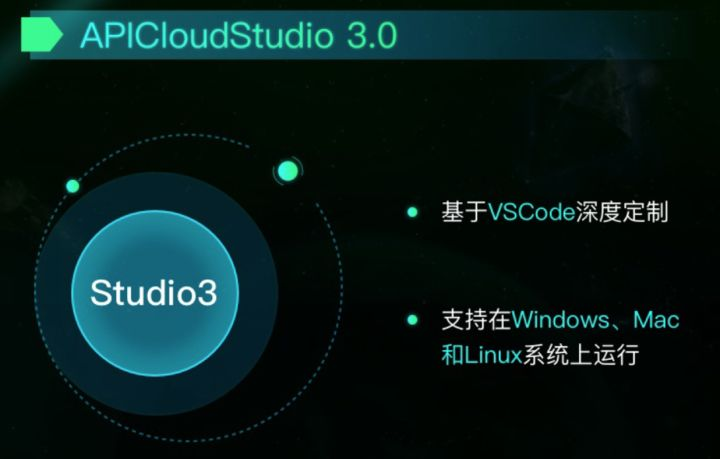

我更认可APICloud的方面，是APICloud不只是一个框架，还提供SDK支持，官方的开发工具SDK就包含APICloud Studio、Sublime APICloud Plugins、WebStormAPICloud Plugins，你可以选择用官方Studio，并且新版本基于VSCode定制了，也可以使用Sublime或者WebStorm这样已经用惯了的IDE插件来开发。

了解[更多前端开发文档](https://link.zhihu.com/?target=https%3A//docs.apicloud.com/%3Fuzchannel%3D263)

最后来说说，什么人会喜欢APICloud。

从应用开发的角度（也就是从管钱管资源的领导角度），APICloud这样的低代码开发平台模式，能够真正解决前端开发的三个大痛苦；但是，从前端开发者角度（也就是出劳力拿工资的打工仔角度），是不是感觉到了一丝丝威胁，如果像APICloud这样进一步将前端开发者的工作量简化，那么岂不是前端开发者都要丢掉工作了？

非也非也！

首先，低代码平台不是无代码平台，该写的还是要写，前端开发这个工种并不会消失，只是工作方式和内容发生了变化。

而且，大家要以清醒认识到，几十年前根本没有程序员这个职位，更不要说前端开发职位，同样，再过几十年，有一些职业也会消亡或者改变，与其哀嚎世界变化快，还不如主动拥抱变化，APICloud主导的这种高性能移动开发+低代码开发的模式，是一种趋势，既然改变不了，还不如主动接受。

不光是接受代码开发的方式，以及这些平台所提供的商业众包资源也在成为很多平台用户获得额外收入的一个主要来源。

如果不想一直996，或者不想35岁之后找不到工作，好好考虑一下吧:-)

# 4.中国互联网发展史

[后端真的有这么难吗？](https://www.zhihu.com/question/399644775/answer/1531558207)

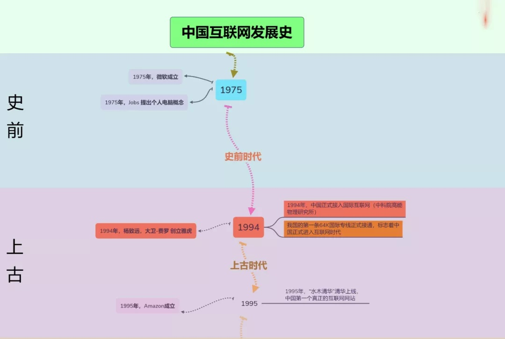

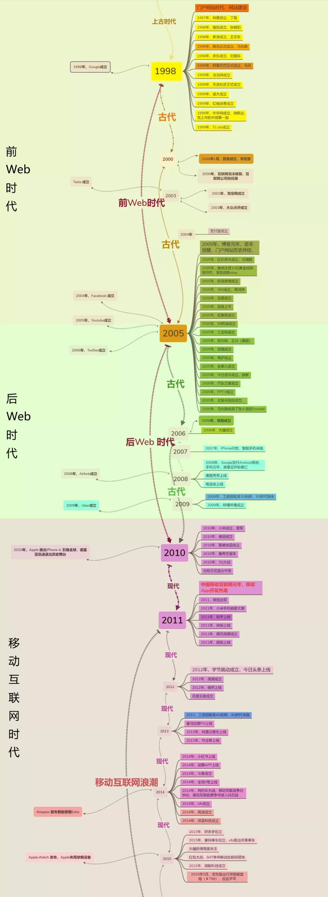

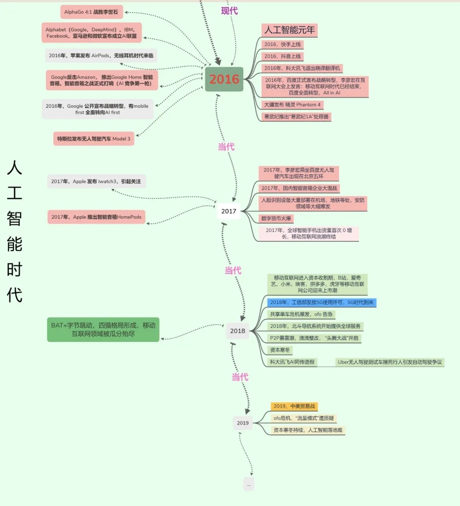

# 5.如果进阿里前端，代码能力得达到什么程度？

> 我再过一年时间，再来看一下这篇博文啊，看看自己的水平到底达到哪里了，现在对我来说这个能力要求确实是太高了，React我现在都没开始学。接下来的一年我稳定下来了，肯定是要学习React的了。

[如果进阿里前端，代码能力得达到什么程度？](https://www.zhihu.com/question/29191974/answer/1620274467)

> 淘宝主要用的是React框架。

不同公司，不同岗位，不同业务背景对优秀前端的要求可能会有差异，这里并不能统一回答出大家的代码能力标准，或者 demo 标准。

我们以阿里巴巴淘系技术部的一则实际招聘的 JD(Job Description，我去，我搜了一下才知道JD是什么意思) 为例，来拆解一下，不同级别的前端工程师应该具备什么样的技能。注意，只针对具体JD。

**JD(职位描述)**

> **业务背景** 
> 淘宝内部最大创新项目之一，大团队已有百人规模，大部分项目处于保密阶段，前景远大  
>
> **职位描述**
>  1.负责组件库与业务页面开发。 
> 2.带领团队完成技术产品实现。 
> 3.负责大型多应用架构设计。 
> 4.利用前端技术与服务端协同完成团队业务目标。  
>
> **职位要求** 
> 0.掌握图形学，webgl或熟练使用threejs框架，熟练canvas相关渲染及动画操作的优先。 
>
> **该业务背景的需求**
> 1.熟练掌握JavaScript。 
> 2.熟悉常用工程化工具，掌握模块化思想和技术实现方案。 
> 3.熟练掌握React前端框架，了解技术底层。同时了解vue以及angular等其他框架者优先。 
> 4.熟练掌握react生态常用工具，redux/react-router等。 
> 5.熟悉各种Web前端技术，包括HTML/XML/CSS等，有基于Ajax的前端应用开发经验。 
> 6.有良好的编码习惯，对前端技术有持续的热情，个性乐观开朗,逻辑性强，善于和各种背景的人合作。 
> 7.具有TS/移动设备上前端开发/NodeJS/服务端开发等经验者优先。

首先，总览全部的要求，会发现这个职位虽然提到了3d相关的技能，但是大部分却是应用开发相关的能力，所以这个职位并不是想找专业的3d领域同学，而是需要一个工程化能力强，对3d有了解的同学。

## **0.掌握图形学，webgl或熟练使用threejs框架，熟练canvas相关渲染及动画操作的优先**

初级：

* 学习过图形学相关知识，知道矩阵等数学原理在动画中的作用，知道三维场景需要的最基础的构成，能用threejs搭3d场景，知道webgl和threejs的关系。
* 知道canvas是干嘛的，聊到旋转能说出canvas的api。
* 知道css动画，css动画属性知道关键字和用法(换句话说，电话面试会当场出题要求口喷css动画，至少能说对大概，而不是回答百度一下就会用)。
* 知道js动画，能说出1~2个社区js动画库，知道js动画和css动画优缺点以及适用场景。
* 知道raf和其他达到60fps的方法。

中级：

* 如果没有threejs，你也能基于webgl自己封装一个简单的threejs出来。
* 聊到原理能说出四元数，聊到鼠标操作能提到节流，聊到性能能提到restore，聊到帧说出raf和timeout的区别，以及各自在优化时候的作用。
* 知道怎样在移动端处理加载问题，渲染性能问题。
* 知道如何结合native能力优化性能。
* 知道如何排查性能问题。对chrome动画、3d、传感器调试十分了解。

高级：

* 搭建过整套资源加载优化方案，能说明白整体方案的各个细节，包括前端、客户端、服务端分别需要实现哪些功能点、依赖哪些基础能力，以及如何配合。
* 设计并实现过前端动画引擎，能说明白一个复杂互动项目的技术架构，知道需要哪些核心模块，以及这些模块间如何配合。
* 有自己实现的动画相关技术方案产出，这套技术方案必须是解决明确的业务或技术难点问题的。为了业务快速落地而封装一个库，不算这里的技术方案。如果有类似社区方案，必须能从原理上说明白和竞品的差异，各自优劣，以及技术选型的原因。

## 1.熟练掌握JavaScript

初级：

* JavaScript各种概念都得了解，**《JavaScript语言精粹》这本书的目录都得有概念**，并且这些核心点都能脱口而出是什么。这里列举一些做参考：
* 知道组合寄生继承，知道class继承。
* 知道怎么创建类function + class。
* 知道闭包在实际场景中怎么用，常见的坑。
* 知道模块是什么，怎么用。
* 知道event loop是什么，能举例说明event loop怎么影响平时的编码。
* 掌握基础数据结构，比如堆、栈、树，并了解这些数据结构计算机基础中的作用。
* 知道ES6数组相关方法，比如forEach，map，reduce。

中级：

* 知道class继承与组合寄生继承的差别，并能举例说明。
* 知道event loop原理，知道宏微任务，并且能从个人理解层面说出为什么要区分。知道node和浏览器在实现loop时候的差别。
* 能将继承、作用域、闭包、模块这些概念融汇贯通，并且结合实际例子说明这几个概念怎样结合在一起。
* 能脱口而出2种以上设计模式的核心思想，并结合js语言特性举例或口喷基础实现。
* 掌握一些基础算法核心思想或简单算法问题，比如排序，大数相加。

## 2.熟悉常用工程化工具，掌握模块化思想和技术实现方案

初级：

* 知道webpack，rollup以及他们适用的场景。
* 知道webpack v4和v3的区别。
* 脱口而出webpack基础配置。
* 知道webpack打包结果的代码结构和执行流程，知道index.js，runtime.js是干嘛的。
* 知道amd，cmd，commonjs，es module分别是什么。
* 知道所有模块化标准定义一个模块怎么写。给出2个文件，能口喷一段代码完成模块打包和执行的核心逻辑。

中级：

* 知道webpack打包链路，知道plugin生命周期，知道怎么写一个plugin和loader。
* 知道常见loader做了什么事情，能几句话说明白，比如babel-loader，vue-loader。
* 能结合性能优化聊webpack配置怎么做，能清楚说明白核心要点有哪些，并说明解决什么问题，需要哪些外部依赖，比如cdn，接入层等。
* 了解异步模块加载的实现原理，能口喷代码实现核心逻辑。

高级：

* 能设计出或具体说明白团队研发基础设施。具体包括但不限于：
* 项目脚手架搭建，及如何以工具形态共享。
* 团队eslint规范如何设计，及如何统一更新。
* 工具化打包发布流程，包括本地调试、云构建、线上发布体系、一键部署能力。同时，方案不仅限于前端工程部分，包含相关服务端基础设施，比如cdn服务搭建，接入层缓存方案设计，域名管控等。
* 客户端缓存及预加载方案。

## 3.熟练掌握React前端框架，了解技术底层。同时了解vue以及angular等其他框架者优先

初级：

* 知道react常见优化方案，脱口而出常用生命周期，知道他们是干什么的。
* 知道react大致实现思路，能对比react和js控制原生dom的差异，能口喷一个简化版的react。
* 知道diff算法大致实现思路。
* 对state和props有自己的使用心得，结合受控组件、hoc等特性描述，需要说明各种方案的适用场景。
* 以上几点react替换为vue或angular同样适用。

中级：

* 能说明白为什么要实现fiber，以及可能带来的坑。
* 能说明白为什么要实现hook。
* 能说明白为什么要用immutable，以及用或者不用的考虑。
* 知道react不常用的特性，比如context，portal。
* 能用自己的理解说明白react like框架的本质，能说明白如何让这些框架共存。

高级：

* 能设计出框架无关的技术架构。包括但不限于：
* 说明如何解决可能存在的冲突问题，需要结合实际案例。
* 能说明架构分层逻辑、各层的核心模块，以及核心模块要解决的问题。能结合实际场景例举一些坑或者优雅的处理方案则更佳。

## 4.熟练掌握react生态常用工具，redux/react-router等

初级：

* 知道react-router，redux，redux-thunk，react-redux，immutable，antd或同级别社区组件库。
* 知道vue和angular对应全家桶分别有哪些。
* 知道浏览器react相关插件有什么，怎么用。
* 知道react-router v3/v4的差异。
* 知道antd组件化设计思路。
* 知道thunk干嘛用的，怎么实现的。

中级：

* 看过全家桶源码，不要求每行都看，但是知道核心实现原理和底层依赖。能口喷几行关键代码把对应类库实现即达标。
* 能从数据驱动角度透彻的说明白redux，能够口喷原生js和redux结合要怎么做。
* 能结合redux，vuex，mobx等数据流谈谈自己对vue和react的异同。

高级：

* 有基于全家桶构建复杂应用的经验，比如最近很火的微前端和这些类库结合的时候要注意什么，会有什么坑，怎么解决

## 5.熟悉各种Web前端技术，包括HTML/XML/CSS等，有基于Ajax的前端应用开发经验。  

初级：

* HTML方面包括但不限于：语义化标签，history api，storage，ajax2.0等。
* CSS方面包括但不限于：文档流，重绘重排，flex，BFC，IFC，before/after，动画，keyframe，画三角，优先级矩阵等。
* 知道axios或同级别网络请求库，知道axios的核心功能。
* 能口喷xhr用法，知道网络请求相关技术和技术底层，包括但不限于：content-type，不同type的作用；restful设计理念；cors处理方案，以及浏览器和服务端执行流程；口喷文件上传实现；
* 知道如何完成登陆模块，包括但不限于：登陆表单如何实现；cookie登录态维护方案；token base登录态方案；session概念；

中级：

* HTML方面能够结合各个浏览器api描述常用类库的实现。
* css方面能够结合各个概念，说明白网上那些hack方案或优化方案的原理。
* 能说明白接口请求的前后端整体架构和流程，包括：业务代码，浏览器原理，http协议，服务端接入层，rpc服务调用，负载均衡。
* 知道websocket用法，包括但不限于：鉴权，房间分配，心跳机制，重连方案等。
* 知道pc端与移动端登录态维护方案，知道token base登录态实现细节，知道服务端session控制实现，关键字：refresh token。
* 知道oauth2.0轻量与完整实现原理。
* 知道移动端api请求与socket如何通过native发送，知道如何与native进行数据交互，知道ios与安卓jsbridge实现原理。

高级：

* 知道移动端webview和基础能力，包括但不限于：iOS端uiwebview与wkwebview差异；webview资源加载优化方案；webview池管理方案；native路由等。
* 登陆抽象层，能够给出完整的前后端对用户体系的整体技术架构设计，满足多业务形态用户体系统一。考虑跨域名、多组织架构、跨端、用户态开放等场景。
* mock方案，能够设计出满足各种场景需要的mock数据方案，同时能说出对前后端分离的理解。考虑mock方案的通用性、场景覆盖度，以及代码或工程侵入程度。
* 埋点方案，能够说明白前端埋点方案技术底层实现，以及技术选型原理。能够设计出基于埋点的数据采集和分析方案，关键字包括：分桶策略，采样率，时序性，数据仓库，数据清洗等。

## **6.有良好的编码习惯，对前端技术有持续的热情，个性乐观开朗，逻辑性强，善于和各种背景的人合作。** 

初级：

* 知道eslint，以及如何与工程配合使用。
* 了解近3年前端较重要的更新事件。
* 面试过程中遇到答不出来的问题，能从逻辑分析上给出大致的思考路径。
* 知道几个热门的国内外前端技术网站，同时能例举几个面试过程中的核心点是从哪里看到的。

高级：

* 在团队内推行eslint，并给出工程化解决方案。
* 面试过程思路清晰，面试官给出关键字，能够快速反应出相关的技术要点，但是也要避免滔滔不绝，说一堆无关紧要的东西。举例来说，当时勾股老师面试我的时候，问了我一个左图右文的布局做法，我的回答是：我自己总结过7种方案，其中比较好用的是基于BFC的，float的以及flex的三种。之后把关键css口喷了一下，然后css就面完了。

## 7.具有TS/移动设备上前端开发/NodeJS/服务端开发等经验者优先。  

* 根据了解的深度分初/中/高级。
* 知道TS是什么，为什么要用TS，有TS工程化实践经验。
* 知道移动端前端常见问题，包括但不限于：rem + 1px方案；预加载；jsbridge原理等。
* 能说出大概的服务端技术，包括但不限于：docker；k8s；rpc原理；中后台架构分层；缓存处理；分布式；响应式编程等。

**JD的要求很难吗？**

 首先，感谢你能看到这里，如果你是仔细看的，那么我更加感动了。而且你已经用实际行动，证明了你的学习能力和耐心。上面那么大篇幅的JD翻译，有一个问题，大家应该都有答案了：为什么职位描述看着简单，面试却这么难呢？然而，有些同学可能会嘲讽起来：写了那么多，我认识的有些阿里P6，P7也不是都会啊，大厂都是螺丝钉，也就面试时候问问，实际工作不还是if else，何况我又遇不到这些场景，我怎么可能知道。  在这里，我想严肃的说明的是：

1. 我所认识的淘宝前端，以及我所在团队的P6同学，上面**初级都能做到**，中级至少覆盖60%，高级覆盖20%；P6+同学，中级覆盖80%以上，高级覆盖50%以上；P7同学高级覆盖80%以上。
2. 我们团队的前端，每一个人都负责多个复杂业务项目(客观数据上：至少对接20+服务端接口，5个以上router配置，涉及多个用户角色的综合业务系统)，以及一些通用能力，比如组件库等。不存在一个人只接一条业务线，只负责维护某几个组件这种螺丝钉式的工作。我不知道大厂都是螺丝钉的言论为什么会被复用到互联网企业，我个人感受是，如果我在阿里的工作是螺丝钉，那么我以前几份工作可能勉强算是螺纹。另外，如果你想要晋升，那么维护好这几个业务系统只是你的本职工作，晋升时请提供一些更高层面的思考和技术产出。
3. if else也分鲜花和牛粪。有的人写的是[].reduce，而有的人写的是var temp = ''; for() { temp += 'xxx' }。另外，如果不知道原理，那么类似webpack这种明星级的技术产品，将永远与你无缘。冷静下来想想，webpack难道也只是if else吗？是，又不全是。

 聪明的你应该看出来了，上面JD翻译里的初级、中级和高级，对应的就是我认为的，阿里p6/p6+/p7的能力标准，同时也是一张知识图谱。

**初级的要求更偏实际应用和基础原理，中级的要求是基于原理的拓展和复杂技术架构的应用，高级的要求是对跨栈、跨端，多领域结合产出综合方案的能力**。而且，我们对技术的要求，都是能够与实际业务场景结合，或者能对提升工作效率有帮助的。空谈和尬想，或者只是百度来的文章，没有经过内化，那么面试过程中将被瞬间拆穿。

 **如果并没有把你劝退的话，那么让我们来点希望的曙光。这里用一句阿里土话来给大家一些安慰：不难，要你干嘛？**

 如果你是面试官，在简历的大海里看一个项目描述，什么最吸引你的眼球呢？是webpack，happypack的关键字吗？还是一句话就让你想到这件事的复杂性，和这个系统带来的巨大价值？ 没有场景怎么办？

 这也是很多同学经常遇到的问题。上面例举了那么多技术点，而我在的环境，前端就我一个，甚至服务端我都要写一点，哪有精力去搞这种大规模团队用到的东西？

 首先，时间靠自己合理规划。我和老婆两个人自己带孩子，有两个娃，每天平均9点下班，我每天回家收拾玩具，孩子睡得晚可能需要再陪玩一下，周末我带孩子为主，但是我去年仍然白金了2个ps4的游戏。

 在时间问题排除之后，我建议分三个阶段：  

1. **毕业3年以内的阶段**：不用着急，你的选择很多，你可以核对上面初级的点，看自己是否都做到了，没做到就去好好学习吧，初级的技术要点对团队规模没有依赖，一个人也能做到极致。如果你所处的环境已经有2个人，可以同时关注中级和高级的点，不要觉得人少就不去尝试，放手去做，过程中会有实打实的收获。
2. **毕业5年以内的阶段**：不论你处的环境团队规模如何，请开始着眼于中级和高级相关能力，人少就不需要研发提效了吗？我在segmentFault上发的第一篇文章，是如何用travis和github做一键部署，那时候我还没有去淘宝，我所在的团队也没有用到这个能力，这篇文章是我自己的个人项目用到的。而整个过程同样涉及到了研发效能的方方面面。
3. 毕业8年以内的阶段：请开始着眼于高级相关的技术方案产出。我以组件动态化为例，我早年维护手机淘宝的整个交易链路H5页面，所有页面的ui部分都是细粒度组件化抽离，通过配置下发页面结构的。即使一个人维护一个页面，也要竭尽所能去思考好的技术方案。这种高度动态的设计，带来的好处是，每年双十一，80%的需求交给pd自己处理就行了，剩下流转到我手上需要开发的需求，都是新增交互，或者之前抽象不足的组件。所以当时我在的团队，3个人在维护了包括手淘首页、商品详情和正逆向交易链路所有H5页面，同时还有额外精力去支持大促会场页。更好的技术思考和设计，一定能给你带来更多的可能性，而系统的优雅程度，一定不是靠业务代码的堆砌，而是作为技术核心的你，如何去思考。

 我相信每个人都是能快速成长的，只是每个人缺少的东西不同。有的人少了些脚踏实地，有的人少了些登高望远的机会，更多的人或许只是没有找到那条正确的路。

 **我希望这篇文章能够帮助到正在前端领域努力的人，也希望这一篇文章就能成为指路明灯之一。**

# 6.如何运营一个开源项目并取得较大影响力？

[如何运营一个开源项目并取得较大影响力？](https://www.zhihu.com/question/65431146/answer/231630692)

> 最近了解到已经逝去的司徒正美之前也开发过一个和Vue类似的前端框架，只是没有很好的营销，就没有火。这也让我对Vue这个框架有了更新的认识。慢慢的也不觉得它有多么难了，但是人家尤雨溪花了这么多年完善这个框架，你就花几个月的时间，而且还是前端新手，势必只能学个皮毛，所以我现在Vue的水平一般般也就可以理解了，还需要再花时间去深刻钻研啊，起码Vue的每个API都要用熟吧，基本原理也要弄懂吧。

除了擅长编写md电子书来攒star，我还写了一系列的开源软件，也掌握了一些项目运营的技巧。

开源并不是你把软件、README写好就行了，还有详细的文档、示例程序等等。

开源也不是你的项目好了，就会有一堆人参与进来。

开源还要你帮助别人解决Bug....

人们做事都是有原因的，即动机。再举例一下，如果你的项目不够火，别人都没听过，那么写到简历上可能没啥用。

## Marketing First

开源需要一些营销的技巧，这些技巧可以帮你吸引关注。举个简单的例子，司徒正美的avalon框架出身得很早，MV*方面也做得很不错，但是在marketing上就......至于国内的很多前端，都不了解这个框架，要不今天在国内可能就是AAVR四大框架了。

Vue不是因为好用，而一下子火了。这一点我印象特别深，当时在GitHub Trending上看到了这个项目，发现它还不能很好地work。

而如文章《FIRST WEEK OF LAUNCHING VUE.JS》所说，项目刚开始的时候作者做了一系列的营销计划：

* HackerNews
* Reddit /r/javascript
* EchoJS
* The DailyJS blog
* JavaScript Weekly
* Maintain a project Twitter account（维护项目的 Vue 账户）

除此，文中还提到了一篇文章《How to Spread The Word About Your Code》 。

这一点相当的有意思，如果你的想法好的话，那么大家都会肯定，点下链接，为你来个 star。那么，你就获得更好的动力去做这件事。项目也在开头的时候，获得了相当多的关注。而如果大家觉得你的项目没有新意的话，那么你懂的~。

除此，还有一种可能是，你的 ID 不够 fancy，即你在社区的影响上比较少。此时，就需要一点点慢慢积累人气了。当你积累了一些人气，你就能和松本行弘一样，在创建 mRuby 的时候就有 1000+ 的 star。并且，在社区上还有一些相关的文章介绍，各个头条也由他的粉丝发了上去。如，一年多以前，我创建了 mole 项目。

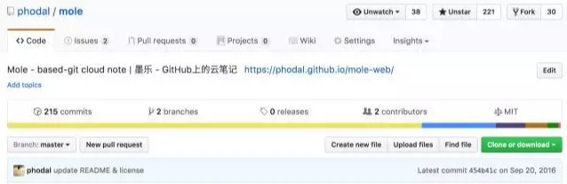

当时，是为了给自己做一个基于 GitHub 云笔记的工具，在完成度到一定程度的时候。我在我的微信公从号上发了相关的介绍，第二天就有 100+ 的 star 了，还接收至最一些鼓舞的话语。对应于国内则有：

* 极客头条
* 掘金
* 开发者头条
* v2ex
* 知乎
* 不成器的微博

所以，你觉得呢？

## 编写一个好的 README

在一个开源项目里，README 是最重要的内容。它快速地介绍了这个项目，并决定了它能不能吸引用户：

* **这个项目做什么？**
* **它解决了什么问题**
* **它有什么特性 — hello, world 示例**

## 这个项目做什么：一句话文案

GitHub 的 Description 是我们在 Hacking News、GitHub Trneding 等等，第一时间看到的介绍。也是我们能快速介绍给别人的东西，如下图所示：

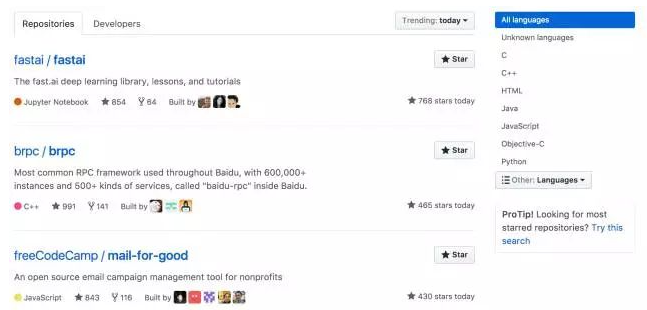

这一句话，必须简单明了也介绍，它是干什么的。

如 Angular 的一句话方案是：**One framework. Mobile & desktop.**

而 React 是：**A declarative, efficient, and flexible JavaScript library for building user interfaces.**

Vue 则是：**A progressive, incrementally-adoptable JavaScript framework for building UI on the web.**

## 它解决了什么问题

上面的一句话描述，它不能很好地说明，它能解决什么问题。

如下是今天在 GitHub Trending 上榜的 RPC 项目的简介：

> Most machines on internet communicate with each other via TCP/IP. However TCP/IP only guarantees reliable data transmissions, we need to abstract more to build services:

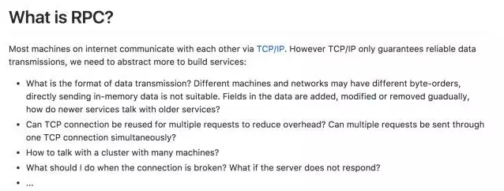

以上便是这个项目能解决的问题，不过这个项目能解决的问题倒是比较长，哈哈哈。

## 它有什么特性

当我们有 A、B、C 几个不同的框架的时候，作为一个开发人员，就需要对比他们的特性，。如下是 Go 语言实现的 MQTT 示例：

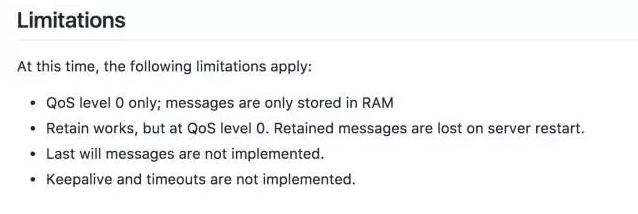

这个项目只支持的 Qos 级别为 0。如果我们需要的级别是 1，那么就不能用这个项目了。

又比如 lodash 项目：

> Lodash makes JavaScript easier by taking the hassle out of working with arrays, numbers, objects, strings, etc. Lodash’s modular methods are great for:

* Iterating arrays, objects, & strings
* Manipulating & testing values
* Creating composite functions

你会怎么写？脸皮够厚的话，可以直接写一下，与其它项目的对比，blabla：

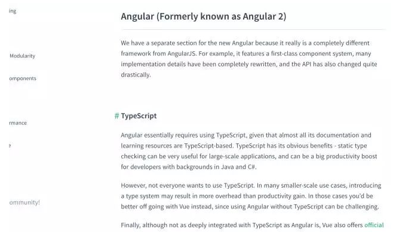

当然了，这种事不能太过，要不是会招来一堆黑。

## 安装及hello, world 示例

在我们看完了上面的介绍之后，紧接着接一个 hello, world 的示例。在运行 hello, world 之前，我们可能需要一些额外的安装工作，如：

~~~shell
npm install koa
~~~

如 Koa 的示例：

~~~shell
const Koa = require('koa');
const app = new Koa();

// response
app.use(ctx => {
 ctx.body = 'Hello Koa';
});

app.listen(3000);
~~~

作为一个程序员，你应该懂得它的重要性。

好在这里的安装工作只有两步，而不是：

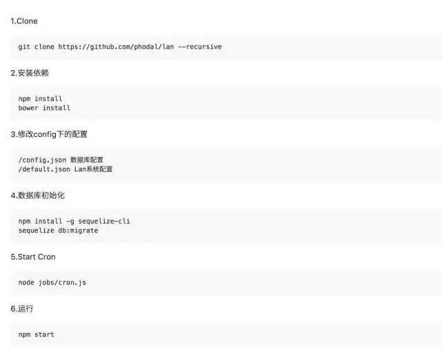

对于那些需要复杂的安装过程的软件，应该简化安装过程，如提供 Docker 镜像，或者直接提供一个可运行的 Demo 环境。以免用户在看完 README 之后，直接放弃了使用该库。

## 技术文档

好了，依一个开发人员的角度，如果上面的步骤一切顺利的话，接下来，便是使用这个开源项目来完成我们的功能。这个时候，我们开始转移注意力到文档上了。

由于，之前在某一个项目，经历过一个第三方 API 文档的大坑——文档中只罗列了 API 的用法。如下 Intellij Idea 生成的结构图：

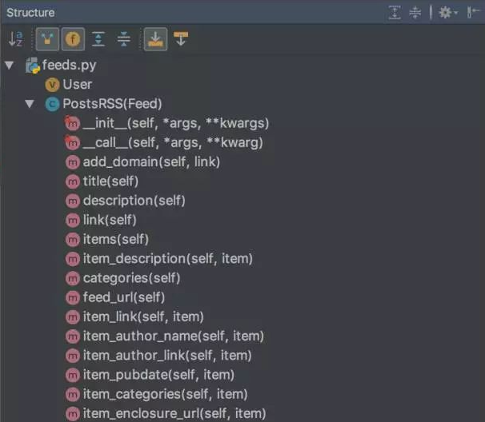

文档中上，罗列了每个函数，以及每个函数需要的参数。我使用 Intellij Idea 直接反编译 jar 包，看到的信息都比文档多多了。文档上，没有任务示例，甚至连怎么初始化这个库的代码都没有。

WTF！

对于一个复杂的开源项目来说，文档上要写明安装、编译、配置等等的过程。如下图所示：

并且在我们发布包的时候，就要不断地去重复这个过程——如果你使用了自动化测试，那么这个过程便自动完成了。

如果我们的项目使用起来相当的简单，那么我们就可以只写一些示例代码即可。

并且，我们可以将文档直接入到代码里。它可以有效地减少文档不同步，带来的一些问题。

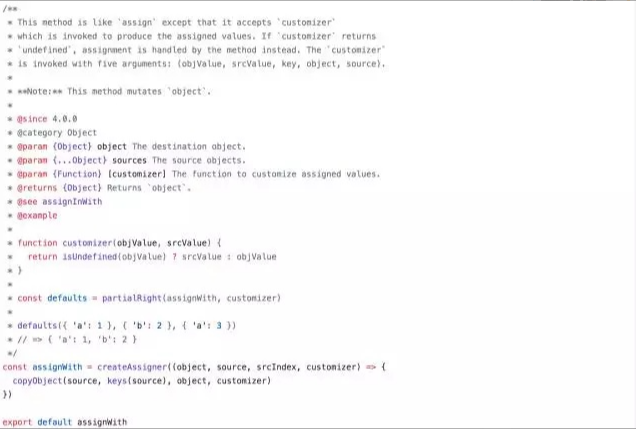

上图是使用了 jsdoc 的 Lodash 示例。

除了上面的示例，我们还可以录制一些视频，写一些文章说明项目的思考、架构等等。

## 更多的示例程序

示例代码本身也是文档的一部分，不要问我为什么~~。

反正，除了一个 hello, world，你还要有各种场景下的示例：

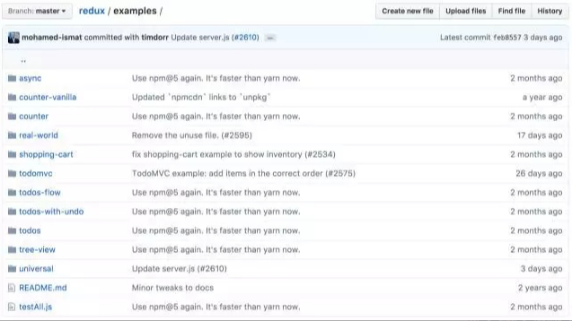

没有这么多示例，敢说自己是好用的开源项目？

## 编写技术文章、书籍

到目前为止，我们做了一系列 markdown 相关的工作，却也还没有结束。要知道只有真正写过一系列开源项目的人，才能体会到什么是 markdown 程序员~~。

官方文档，一般要以比较正式的口吻来描述过程，这种写法相当的压抑。如果要用轻松诙谐的口气，那么就可以写一系列的技术文章。假如这是一个前端框架，那么我们可以介绍它如何与某个后端框架配合使用；又或者是，它与某个框架的对比等等。

好了，一切顺利了，那么下一步就是吸引更多的人参与到项目上来了。

## 鼓励、吸引贡献者

要吸引其它开发人员来到你的项目，不是一件容易的事。

你需要不断地鼓励他/她们，并适时地帮他/她们解决问题，以避免他/她们在提 pull request 的过程中放弃了。这一点特别的有意思，当有一个开发人员发现了项目中的 bug，那么他/她会尝试去解决这个问题。与此同时，他/她还会为你的项目带来 pull request，但是在这个过程中，因为测试等等的问题，可能会阻碍他的 PR。这个时候，就需要我们主要去提示/教他们怎么做，又或者是帮他/她们解决完剩下的问题。那么，下次他/她提一个 PR 的时候，他/她就能解决问题了。

这一点可以在 README，以及介绍上体现：

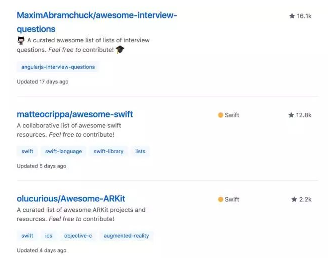

哪怕只是一个错误字的 PR，那么你也可以 merge，啊哈哈~。然后，就有人帮你宣传了，『我给 xxx 项目一个 PR 了』。刚毕业的时候，我也是从这种类型的 PR 做起的~~。

# 7.前端开发的瓶颈与未来之路

[前端开发的瓶颈与未来之路](https://zhuanlan.zhihu.com/p/139731168)

> 前端开发的瓶颈到底在哪里，前端技术是否已经走到一个十字路口，全栈化的系统架构是否能改变目前的窘境？本文将根据我自己的开发经历谈谈当下前端开发中遇到的一些问题和想法。

## 引子

近两年我一直在思考的一个问题：

> 如果前端不用考虑性能问题、不用考虑终端兼容性、不用考虑历史遗留问题，甚至不用考虑具体技术实现...

如果我们假设自己有丰富的技术储备，同时不用考虑上面的问题，那么前端究竟 **能** 做出什么样有价值的东西？

我们把时间拉到 5 年前...

如果你「那时」还是前端开发的话。上面的问题肯定是你不得不面临的典型问题。甚至是当时前端开发的意义所在。

- 你会为了精确还原设计稿熬夜加班，从而练就一双像素眼；
- 你会为了解决几个字节的性能问题研究优化方案，以至看懂了每一个 HTTP 请求头；
- 你也会因为某些技术问题和同事理论，最终到达到与产品谈笑风声的境界；
- ...

但是随着时间的推移，前端技术的更新迭代，以及互联网的发展。你会发现这些曾经的问题似乎已经不再是问题，或者说在能预见的未来 *可能* 不再是问题。

页面加载性能可能不再是问题，技术上有了 HTTP2，基建上有了 5G，硬盘也越来越快。

兼容性问题慢慢淡出大家的视角，Chrome 一家独大，微软也不得不向它靠拢。

很多前端开发已经具备了后端（或者说多端）的技术能力，技术储备也可能不是问题，当然前提是你能招到人。

## 定义

到底什么是前端开发，前端与后端的界限在哪里？我在三年前对它的定义是：

> 前端为 界面、交互展示负责； 后端为 数据、业务逻辑负责;

不过现在看来似乎已经过时了，我越来越觉得不应该有这样一个清晰的界限把前后端分割开来，尤其是技术层面（除了职能层面的界限有利于协作以外）。这就好比说：如果你不能打破规则，那就必将被规则束缚。

我一直认为程序员应该对新的技术、工具、理念有比平常人更快的适应能力。举个简单的例子，我以前写代码通常使用 tab 缩进，后来大家都建议使用空格，刚开始尝试换成空格肯定是拒绝的，因为让人改变习惯是一件很难的事情。但是当你真正为了改变做出实践的时候，往往就会发现一条新大路。同样还有加不加分号的问题。

现在回过头来再看，前端在整个系统层面担任的角色至少应该是整个视图 View 层面的。视图层面的技术更接近软件系统的上层，更感性。感性的东西就是说一个颜色，我觉得好看，他觉得不好看，完全属于个人情感诉求。所以前端更注重与UI、交互 以及整个产品层面需要解决的问题。优秀的前端必然要具备敏锐的产品洞察能力。

当然这还只是前端最基础的职责所在。同时前端做为最接近产品的技术角色，技术才是前端真正的硬实力。

大约在去年一年的时间，我的岗位从前端转向了后端 Java 程序员的角色。虽然只做了一年的 Java 程序员，但是对我自身的技术提升而言是最多的一年。大家可能普遍的认为后端转前端比较容易，前端转后端会有门槛，实际上根据我自己的体验来讲并非如此。

Java 这门语言是商业化、成熟度特别高的语言。无论是语言本身，还是周边框架、工具都有一套非常成熟且层次分明的系统化抽象。如果你有两、三年的编程经验，突然让你上转写 Java 是非常容易的一件事情，尤其是写 Java web。Spring 框架已经为程序员屏蔽了很多复杂问题，而且已经事实上成为了各大互联网公司的主流框架选型。

我特意按我自己的学习线路绘制了一张 Java 版的程序员学习线路，仅供参考：

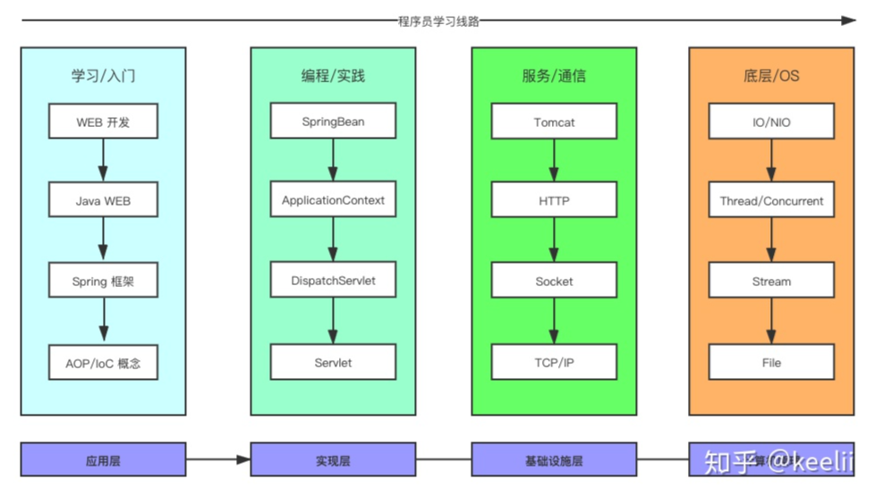

我们可以清楚的看出来 Java 构建的整个体系最大的特点：它是渐进式的，一步一步地给开发者建立正向的引导。

当我处在在**应用层**阶段的时候，我需要关心的只是一些概念，方法，具备基础了以后就可以借助 Spring 框架入门，入门后就可以研究源码，你会发现 Spring 的本质核心类 DispatchServlet，从此 Servlet 就出现在了你的视野。我以前上学时理解不了 java 中 Servlet 的概念，后来参加了工作又学些了 Python，再次看到 Java 中的 Servlet 的时候瞬间就明白了它就是 Python 中的 uwsgi，就是一种接口，将编程语言和服务器网关链接起来的一种规范。

然后你就可以顺利进入下一环节，服务器/通信。这里你会发现整个网络编程的核心 Socket，同样以前上学的时候没理解 Socket 的概念，继续学习后你就会明白 Socket 其实就是操作系统提供给编程语言的一种能力，有了它就可以建立服务器与客户端之间的通信。在这一环节中你会学习到网络层 TCP/IP 协议，明白了 TCP/UDP 的区别，`while (true) { socket.listen() }` 建立 Socket 监听会有性能问题，此时你便进入下一个抽象层次，操作系统和计算机原理。

为了解决「while true」监听连接的性能问题，你会去学习多线程技术，了解并发的概念。你可能总会听到别人讨论并发和并行的区别。继续学习后，慢慢的你就会明白：并发多用来解决网络IO（硬盘）的效率问题，而并行则是为了更好的利用多/核处理器（CPU）的问题。这时你会发现这个阶段涉及到了很多的计算机硬件知识。内存分配、CPU计算、IO 复用等等。

像 Spring 这种框架才能真正意义上被称做 **框架**，因为它不仅仅解决了软件开发的问题，更重要的是 AOP/IoC 这类概念可以完全改变编程的一些理念。使用 Spring 开发 web 应用，联合 Java 构建出来的生态，整个开发流程就像呼吸一样自然。

Java 构建出来的软件开发体系就像是把程序员放进了一个一个的层次分明的小柜子里面，进去了以后你根本不需要关注外界是怎么样的，做好自己那部分工作就可以了。如果你对外界有兴趣可以一点点的顺藤摸瓜，跳出你原来的小柜子。即保证精力专注的同时又建立起一套有秩序的提升曲线。这一点是别的语言体系没有的。

实际上我在转 Java 之前对 Java 有着不小的误解，甚至转 Java 本身也不是我自己的想法。但当你真正转型成 Java 程序员后。看懂了数以百万行记的代码仓库、维护过每秒好几十万的 QPS 项目、见识过百行的 SQL 的时候，你才会对 Java 和软件开发产生一种敬畏之心，才会对技术才有了更深层次的理解。

这时候再回过头来看前端，看 JavaScript，才会发现它们之间的区别与特点。很多之前争论的东西也就有了结论。

## 瓶颈

我相信从事前端工作稍微长一点（5年以上）的人近两年都会有一种感觉：前端似乎没什么东西可以玩出花样了。这是因为很多东西都已经成为了前端事实上的主流，以前前端没有的基建慢慢的被完善。语言、框架、可视化、跨端、游戏、工具/自动化/工程化 这些领域都在发展。

语言方面 TypeScript 必然是主流，无论你愿意与否，你都将不得不使用它来写前端。框架方面 React 已经是事实上的主流了，没必要再做选择题。打包工具 Webpack 也是一家独大，虽然被很多人诟病，但是社区生态起来了，想改变就很难。跨端应用 Electron 也不用想了，VSCode 能做好你做不好那就不是选型的问题了。2D 游戏/绘图方面 PixiJS 6 已经在设计中了，3D 我个人认为就先别玩了。

这些看似成熟的体系实际上还是有很多可以挖掘的东西。如果你不深入研究，或许会认为过两年这些技术就稳定了前端就可以做到大一统的状态。这个想法可能就过于天真了，我举例解释下它们各自的瓶颈：

### 前/客户端框架的瓶颈

React（并不特指 React）虽然现在看起来是主流，但是它本身有很多问题是没解决的，甚至可以说是无解的。React 的本质只是一个 UI Library，并不是框架 Framework。框架要解决的问题是系统层面的不是某个抽象层面的。用 React 写过几个项目以后你就会认识到用 React 去写大型项目是非常麻烦的事情，React 本身并不解决 SPA 应用中数据流的问题，甚至没解决状态管理的问题（或者说状态管理本来就是个伪命题？）。一个很简单的父子组件之间状态共享的问题一直没有成熟的解决方案，hooks 这种方案更像是拆了东墙补西墙。

而且现在 React 社区弥漫着一种崇尚函数式编程的邪气，hooks 更像是一块遮羞布。多数人用 hooks 的原因仅仅是不想使用 Class，因为 Class 很臃肿，function 更简单。当然这个逻辑是没问题的。函数确实简单，但是如果你把一个函数里面写上几百行的代码，各种 hooks 用到飞起的时候，你才会回过头来反思如何组织代码。如果 Class 能以一种更好/更易于理解的方式去抽象那为什么不用呢？

### 后/服务端框架的瓶颈

前端框架如此，基于 Node.JS 的后端框架也好不到哪儿去，难道你真的想用 Express/Koa.js 去写大型的后端应用？这种量级的框架连 web 开发最简单的三层模型（ 模型、视图、控制器）支持都不完整。当然你可能会说小型框架本来就只关注某一方面嘛，视图和模型层的东西可以用其它三方库解决。是的，确实可以这样，不过你不觉得 Node.JS 的第三方库有点太多了吗。正如 NestJS 在文档中提到的一个问题一样「很多 JavaScript 类库都没有高效地解决一个问题 **架构**。」React/Vue/Express/Koa 这些都是相对独立的点，没有一个东西能把他们连接起来形成一个面，形成一种框架级别的体系。这就是架构的问题。

这里多说一点，结合上面 Java 构建出来的生态，对比 Node.JS 的话。我借用自己打过的比喻：如果你低头看到的是 Node.JS，那么你抬头未必能看见 Java。假如你从事前端开发 2，3 年遇到瓶颈，想转学 Node.JS，你会学习 Exporess/Koa 这类框架，但是很快你就会发现一个严重的问题：没办法深入下去了。因为当你用 Express 写完一个页面后就面临着各种技术上的盲点，会让你无所适从。

我也尝试绘制一张我对 JavaScript/Node.JS 或者说大前端体系理解的一张图:

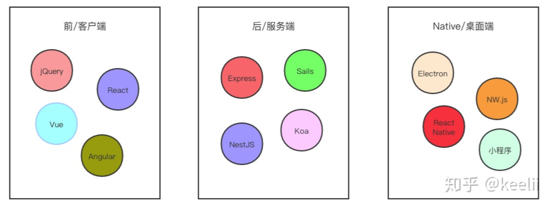

JavaScript 体系看似前后端通吃，客户端、 服务端甚至桌面端皆有。但是最大的问题在于：没有一个东西能给他们建立起关系并发展成为一种体系。

插播一条娱乐看点，前两天写 Ruby on rails 框架的作者 DHH 发推并配图：

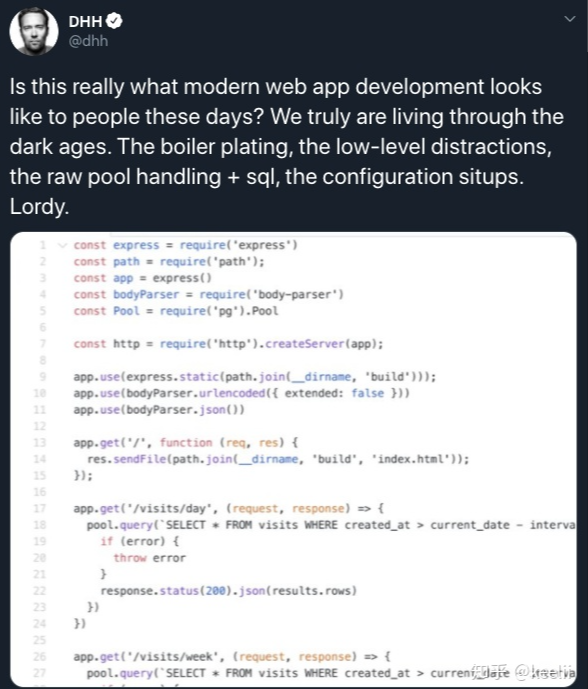

大意如下：

> 现在的年轻人在 web 开发的时候是这样的嘛？底层逻辑、纯手写连接池 + 纯手工 SQL、配置文件都放在了一起。天哪！（截图中使用的式TJ大神写的 Express 框架）

然后 TJ 大神也回复了：

> TJ这个人是真的厉害，以前好像是学艺术的，后来自学成才的，GitHub不知道贡献了多少框架。好像他学习计算机的方法就是看别人写的代码，我对他的了解也只有这点了。

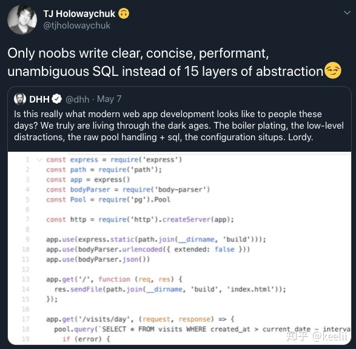

大意如下：

> 只有菜鸟玩家才能写出干净、简洁、高性能（黑 Ruby 性能）、见名知意的 SQL，而不是去写一个有15层的抽象。

两者的推特对话挺有意思，大家娱乐一下。

### TypeScript 语言的瓶颈

TypeScript 也主流，但是持续关注 TS 到现在，我发现 TS 也遇到了瓶颈，这个瓶颈不仅来自于 TS 的设计目标与理念，更多的还是社区及 TC39。TS 的设计初衷是 JavaScript 的超集，由于本身要编译成 JS，这一点本质上限制了 TypeScript 的方向，设计者对于添加一个新特性会非常谨慎，一者怕与 TC39 ES proposal 冲突，二者要考编译到不同版本 JavaScript 的兼容性问题。以至于现在 TS 新的语言特性只会跟进 TC 39 发布的最新 ES proposal。但是我个人对于 TC 39 的效率及未来持怀疑态度，decorator 的提案一直还处于 Stage 2 的阶段，像这种其它语言都成为标配好几年的事情，现在 JavaScript 社区还在草案（stage-2）阶段。

> 普及下 ECMA 的标准的流程：

1. stage-1：前期设想
2. stage-2：正式提案（装饰器所在的阶段）
3. stage-3：实现候选
4. Stage-4：完成测试
5. 各个浏览器 JS 引擎实现；TypeScript 实现

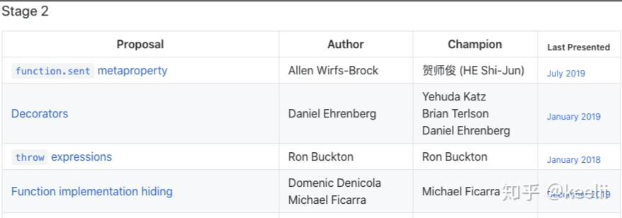

在这个问题上我认为其实也很好解决，开个脑洞：如果微软想借助编程语言一统浏览器和客户端是没有什么不可能的。并入 TC39 组织，开发真正属于 TypeScript 的原生引擎，奉天子以令不臣的方式也未尝不可。

近几年 Microsoft 对于开源的投入是肉眼可见的，微软要发力我相信很多东西都会有翻天覆地的变化。

### 打包工具的瓶颈

Webpack/Babel 就更不用说了，主流中的主流。但是也是问题最严重的一个。Webpack/Babel 的流行恰恰从反面证明了前端的基础设施有多么的烂。现在国外网友老天天叫喊着 Webpack/Babel is eval 也是挺值得深思的。我们引入了一个新工具来解决问题，却又在不经意之间产生了新问题。

前端构建工具问题的本质还是在于 Node.JS 的包管理工具的设计。这一点在 Node.JS 的作者 Ryan Dahl 关于 Deno 演讲《10 Things I Regret About Node.js》中也有过「官方」的承认。我相信任何一个实现过构建工具的人都被 Node gyp 打败过。node-sass, fsevent 的痛不必细说。更不用说万年被黑的 node_modules 了，你根本不知道一个简单的 npm install 命令会导致安装成千上万个 npm 包被安装到你的机器上。

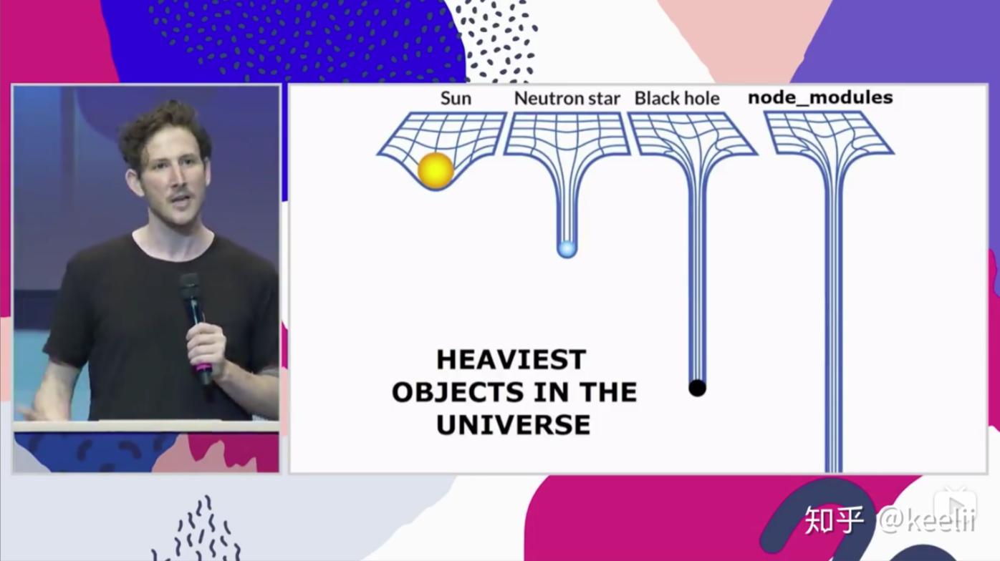

当然每种编程语言对应的包管理工具都要解决依赖问题，而且这是一个普遍的问题，脚本/解释型编程语言尤为突出，Python/Ruby/PHP 都有这些类似的问题。或许 Go/Rust 这种把源代码编译打包成单个可执行文件的方式才是好的解决方式。

## 未来

从前人们总是抱怨 JavaScript 这门语言，黑它、讽刺它。但是我看到的是它在一点点变好。不仅是语言层面逐步完善，工具链生态日趋成熟，使用它的也人越来越多。大家对它的关注程度也在提高，整个 JavaScript 开发者的水平也在向更高更强的方向发展。生存环境只会淘汰那些老旧不再进化的事物，能适应变化的才会永存。

JavaScript 这门语言有两个其它 **任何** 编程语言都不具备的优点：

1. 几乎 **无所不在** 且不用安装，有浏览器就有 JavaScript。脚本语言意味着它能被嵌入到任何宿主环境中去：Nginx、Native应用、硬件编程、物连网、嵌入式 都有它的身影
2. 这门语言对于技术的更新迭代有着强大的 **适应能力**。JavaScript 本身的更新迭代速度导致它进化速度很多，语言上的新特性会很快被运用到生产环境。相比 Python 而言，这简直是做梦，Python 2 到 3 的转换没人能看到真正的时间表。

当下的前端开发状况不由得让我我想起苏东坡《晁错论》中的一段话：

> 天下之患，最不可为者，名为治平无事，而其实有不测之忧...

最大的问题在于，有些事物，从表面上看着平淡无奇，但实际上底层暗流涌动，似乎每一时刻都有着巨变的可能性。这也是前端开发最有趣也最有潜力的地方。

作为一名新时代的前端开发者，就是要在这看似风平浪静的表面之下，找到一些真正的突破点，兴许只是一个简单的想法，顺应时势然后造就出不斐的成就也说不定呢。

无论是前端还是后端、国内还是国外，技术才是真正的核心竞争力，只有技术革新才能提高生产力，而对于我们程序员来讲，编程则是唯一能提升硬实力的方法。只要你心中充满了热情，坚持下去总会走出一条自己的路子。

**分享一段小经历**

我在 2018 年有幸参加了 TypeScirpt 的推广大会，TypeScript 的作者 Anders Hejlsberg 亲自主讲。一位将近 60 岁的程序员在讲台上滔滔不绝的讲技术方案，TS 的设计理念。你真的很难想像这样一位处于「知天命」阶段的老头子（实际上很年轻）讲的东西。

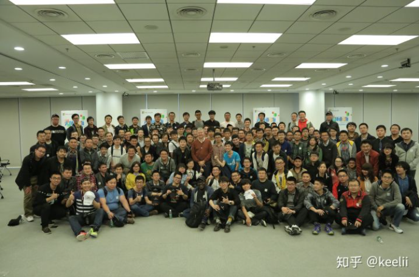

QA 环节有个年轻小伙问到 Anders「在中国做程序员很累、很难应该怎么坚持下去（类似这样的描述，细节记不清楚了）」的问题。

Anders 几乎毫不犹豫的说出了「Passion」这个单词。我瞬间就被打动了。因为在此之前我对于「激情」这个词的认识还停留在成功人士的演讲说辞层面，当 Anders 亲口说出 Passion 一词的时候，让人感觉真的是一字千金。

直到现在 Anders 还做为 TypeScript 的核心贡献者为它提交代码，到处奔走为 TypeScript 宣传。

我们再回到前端，那么未来的前端到底会发展成什么样？长期而言充满了未知数，谁也没法预测，但是短期来讲我比较关注几个东西：

- **ESBuild** ：一个极快的 JavaScript bundler。这个工具可以说是真正的「Game changer」。同样是一个打包任务，它快到让你没反应过来就完成任务了。ESBuild 使用 Go 语言编写，实现了整套 **并行的** ES 解析器、代码生成器，作者是 Figma 的 CTO（是的国外的 CTO 是要写代码的）。最近更新很频繁，Vue 新的构建工具也会基于它来做 TS 部分的打包功能。
- **Deno** ：一个安全的 JavaScript & TypeScript 运行时。Deno 的方向充满了可能性，未来 deno 不仅仅可以做 JS 后端，还能和 Rust 打通，给JS注入一些原生 native 的能力，然后 Webassembly, webGL 之类的技术都变成了可能，1.0 正式版发布日期也快到了。
- **Figma**：一个在线版的 Sketch，虽然功能还没有 Sketch 强大，但是已经有了设计界面的基本能力。关键还在于它的整个实现都是基于 web 技术，底层 C++ 实现图形的渲染、绘制，前端通过 Webasmbly 与浏览器 Canvas 交互，做到了让用户在浏览器端体验到了 Native 软件能力。像 AutoLayout 这种功能在用户体验上就是颠覆式的，使用的时候它很自然，没有什么存在感。但是用了就回不去了。

如果你仔细研究一番，上面的这些新鲜东西，都是起源于前端，但又不把视野局限在前端。或许这就是前端未来的发展方向吧。

# 8.三年前端路：分享我的工作经验与学习经历

[三年前端路：分享我的工作经验与学习经历](https://github.com/woai3c/Front-end-articles/blob/master/front%20end%20summary.md)

## 前言

今天写下这篇文章，是为了对这三年的工作和学习做一个总结。

本文的所有观点均出自作者这三年经历所得，如有不足或错误之处，敬请谅解。

## 工作经验

* 通常情况下，技术和薪资成正比。
* 技术好的人比较自信，脾气也比一般人暴躁。
* 不要裸辞，找好下家再辞职。
* 涨薪基本靠跳槽。
* 同事有可能会成为朋友，但最终都是过客。
* 戒掉王者，忍一时之痛，换终生荣耀。
* 熬夜基本不可能戒掉。
* 都是出来打工的，没人欠着你，不要耍性子。
* 要有职业规划，没有就去想，直到想出来为止。
* 善用 fan qiang 工具，好处多多。
* 面试造航母，工作拧螺丝不是玩笑话。
* 要学会心平气和的跟产品沟通，尤其是不懂技术的产品，虽然很难。
* 越秃越强只是个梗。
* 每天写业务页面不能让你变强，顶多算是比较熟练的流水线工人，要变强还得靠业余时间。
* 喜欢学习的程序员很少，得过且过才是大多数。
* 工作不忙时，尽量利用这段时间学习；技术越好，任务完成得越快，摸鱼的时间就越多。
* 少管闲事，有时间多学习。
* 少关注八卦新闻，多学习。
* 别拍马屁，有那功夫多学习。
* 时刻反省自己，今天有没有学习。

## 学习经历

由于我是高中毕业，并且 28 岁才开始学习编程，所以起点比一般人差很多，完全是零基础，需要学习的知识也特别多。

在找工作前，我花了五个月时间自学编程。

第一个月学的 C 语言，结果发现 C 语言不好找工作。第二个月转学 python，学了一个月发现招聘岗位很少，又放弃了。第三个月，痛定思痛，我决定先去网上搜一下什么语言好找工作再做决定，最后选了前端做为学习的方向。

接下来前端学习了三个月，HTML 和 CSS 是在 w3school 上学的，JavsSciprt 则是看的 《JavaScript 高级程序设计第三版》。在学习的同时，还做了[百度前端技术学院 2016](http://ife.baidu.com/2016/task/all) 的任务来巩固和提升技术。三个月后开始找工作，2017 年 2 月找到了第一份工作，终于转行成功。

接下来的三年学习经历可分为前端和计算机理论知识两个方面来讲。

### 前端

关于前端学习，我的宗旨是：

1. 基础知识为主，库、框架为辅。
2. 理论与实践结合，学习更高效。
3. 时常写文章总结，将学到的知识消化了再写出来（费曼学习法）。

库、框架都是工具，基础打好了，学习第三方工具才能事半功倍。

#### 基础知识（JavaScript、CSS、HTML）

在这三年里，我看了大量的前端书籍，具体如下：

* [你不知道的JavaScript（上）](https://github.com/woai3c/recommended-books/blob/master/%E5%89%8D%E7%AB%AF/%E4%BD%A0%E4%B8%8D%E7%9F%A5%E9%81%93%E7%9A%84JavaScript%EF%BC%88%E4%B8%8A%E5%8D%B7%EF%BC%89.pdf)
* [你不知道的JavaScript（中）](https://github.com/woai3c/recommended-books/blob/master/%E5%89%8D%E7%AB%AF/%E4%BD%A0%E4%B8%8D%E7%9F%A5%E9%81%93%E7%9A%84JavaScript%EF%BC%88%E4%B8%AD%E5%8D%B7%EF%BC%89.pdf)
* [你不知道的JavaScript（下）](https://github.com/woai3c/recommended-books/blob/master/%E5%89%8D%E7%AB%AF/%E4%BD%A0%E4%B8%8D%E7%9F%A5%E9%81%93%E7%9A%84%20JavaScript%EF%BC%88%E4%B8%8B%E5%8D%B7%EF%BC%89.pdf)
* [JavaScript高级程序设计（第三版）](https://github.com/woai3c/recommended-books/blob/master/%E5%89%8D%E7%AB%AF/JavaScript%E9%AB%98%E7%BA%A7%E7%A8%8B%E5%BA%8F%E8%AE%BE%E8%AE%A1%EF%BC%88%E7%AC%AC3%E7%89%88%EF%BC%89.pdf)
* [高性能JavaScript](https://github.com/woai3c/recommended-books/blob/master/%E5%89%8D%E7%AB%AF/%E9%AB%98%E6%80%A7%E8%83%BDJavaScript.pdf)
* [ES6标准入门](http://es6.ruanyifeng.com/)
* [JavaScript语言精粹](https://github.com/woai3c/recommended-books/blob/master/%E5%89%8D%E7%AB%AF/JavaScript%E8%AF%AD%E8%A8%80%E7%B2%BE%E7%B2%B9%2B%2B%E4%BF%AE%E8%AE%A2%E7%89%88.pdf)
* JavaScript DOM编程艺术 第2版
* [CSS揭秘](https://github.com/woai3c/recommended-books/blob/master/%E5%89%8D%E7%AB%AF/css%E6%8F%AD%E7%A7%98.pdf)
* [高性能网站建设指南](https://github.com/woai3c/recommended-books/blob/master/%E5%89%8D%E7%AB%AF/%E9%AB%98%E6%80%A7%E8%83%BD%E7%BD%91%E7%AB%99%E5%BB%BA%E8%AE%BE%E6%8C%87%E5%8D%97.pdf)
* [高性能网站建设进阶指南](https://github.com/woai3c/recommended-books/blob/master/%E5%89%8D%E7%AB%AF/%E9%AB%98%E6%80%A7%E8%83%BD%E7%BD%91%E7%AB%99%E5%BB%BA%E8%AE%BE%E8%BF%9B%E9%98%B6%E6%8C%87%E5%8D%97.pdf)
* [Web性能权威指南](https://github.com/woai3c/recommended-books/blob/master/%E5%89%8D%E7%AB%AF/Web%E6%80%A7%E8%83%BD%E6%9D%83%E5%A8%81%E6%8C%87%E5%8D%97.pdf)

在看书的同时，我还做了[百度前端技术学院 2017](http://ife.baidu.com/2017/course/all) 年的任务。功夫不负有心人，看书和做练习让我的技术水平得到了极大的提升，以至于后面对 Vue 源码的学习起到了很大的作用。

#### 库、框架

关于第三方库的学习，我只对 JQuery 和 Vue 进行了深入学习，其他的库都是看文档按需使用。 深入学习 JQuery 的成果：写了两个组件。 深入学习 Vue 的成果：

1. 写了一个 [Vue 动态表单组件](https://github.com/woai3c/vue-form-maker)，发布到 NPM上。
2. 模仿 Vue1.0 版本写了一个 [MiniVue](https://github.com/woai3c/mini-vue)，这让我对 Vue 的理解达到了源码级别。
3. 写了几篇关于 Vue 的文章。

#### nodejs

学习 nodejs 的时间比较少，主要是工作用不上。成果是写了一个个人博客 [node-blog](https://github.com/woai3c/node-blog)，涉及到服务器和数据库知识。

* [深入浅出node.js](https://github.com/woai3c/recommended-books/blob/master/%E7%BC%96%E7%A8%8B%E8%AF%AD%E8%A8%80/%E6%B7%B1%E5%85%A5%E6%B5%85%E5%87%BANode.js.pdf)

### 计算机理论知识

**计算机理论知识决定了一个程序员的天花板（在国内还得加上英语）。**

#### 数据结构与算法

算法看的是 《算法 4th》这本书，课后习题没做，刷了不到一百道 leetcode 的题。

#### 编译原理、计算机原理

由于编译原理和计算机原理是看的同一本书《计算机系统要素》，所以就放一起说了。

这是本神书，内容通俗易懂，涉及计算机原理、编译原理、部分操作系统知识，每一章后面都有对应的练习，需要你写代码完成。

如果完成了本书所有的项目，你将会获得以下成就：

* 构建出一台计算机（在模拟器上运行）
* 实现一门语言和相应的语言标准库
* 实现一个简单的编译器

而且，这本书的门槛非常低，只要你能熟练运用一门编程语言即可。我已经把这本书所有项目都做完了，答案放在 [github](https://github.com/woai3c/nand2tetris) 上，有兴趣可以看看。

#### 操作系统

操作系统看了《操作系统导论》以及《深入理解计算机系统》（这本书更像是计算机导论），并且做了[MIT6.828](https://github.com/woai3c/MIT6.828) 的项目写了一个简单的操作系统内核。

#### 其他

这是没有做或做了一部分练习的。

* [汇编语言（第三版）](https://github.com/woai3c/recommended-books/blob/master/%E7%BC%96%E7%A8%8B%E8%AF%AD%E8%A8%80/%E3%80%8A%E6%B1%87%E7%BC%96%E8%AF%AD%E8%A8%80(%E7%AC%AC3%E7%89%88)%20%E3%80%8B%E7%8E%8B%E7%88%BD%E8%91%97.pdf)
* [x86汇编语言:从实模式到保护模式](https://github.com/woai3c/recommended-books/blob/master/%E7%BC%96%E7%A8%8B%E8%AF%AD%E8%A8%80/x86%E6%B1%87%E7%BC%96%E8%AF%AD%E8%A8%80%20%20%E4%BB%8E%E5%AE%9E%E6%A8%A1%E5%BC%8F%E5%88%B0%E4%BF%9D%E6%8A%A4%E6%A8%A1%E5%BC%8F%E5%AE%8C%E6%95%B4%E7%89%88.pdf)
* 代码大全2
* [重构](https://github.com/woai3c/recommended-books/blob/master/%E8%BD%AF%E4%BB%B6%E5%B7%A5%E7%A8%8B/%E9%87%8D%E6%9E%84_%E6%94%B9%E5%96%84%E6%97%A2%E6%9C%89%E4%BB%A3%E7%A0%81%E7%9A%84%E8%AE%BE%E8%AE%A1%5B%E9%AB%98%E6%B8%85%E7%89%88%5D.pdf)
* [计算机程序的构造和解释(SICP)](https://github.com/woai3c/recommended-books/blob/master/%E7%BC%96%E8%AF%91%E5%8E%9F%E7%90%86/sicp.pdf)

## 总结

计算机理论知识值得每个程序员都去认真学习。不过，持续学习并不是一件容易的事，需要你有坚定的目标和强大的自驱力。如果不想学习，可以看电影玩游戏放松一下，注重劳逸结合，不过也要警惕玩游戏上瘾，这都是血的教训总结出来的。