(注1:2019年10月末开始弄这个Hexo博客，一直搞了有一个多星期才搞好)

(注2:博客平稳运行一年后误删文件，后来我就重新装了一次，因为版本的更迭，发生了很多小问题，一年后的我又差不多搞了一个多星期才把它搞好。)

(注3：我以后是再也不想动它了，不折腾了，博客建好后好好写文章，做项目才是王道啊。)

(注4：现在是2021年3月3日，最近我发现GitHub是不是出现了问题，我死活打不开我的博客了。于是产生了把自己的Hexo博客再部署到Gitee上的想法。)

# 博客搭建各种坑

[使用git分支保存hexo博客源码到github](https://www.jianshu.com/p/8814ce1da7a4)

[一台电脑部署两个或多个 Hexo 博客（一台电脑使用两个或多个 GitHub 账号）](https://blog.csdn.net/qq_36759224/article/details/86546729)

本文并不是介绍如何一步一步搭建博客的经验贴，只是纯记录自己搭建博客时的经历。如果想学习如何通过GithubPage + Hexo + NexT搭建属于自己的博客，推荐几个链接，我当初主要就是看下面的链接一步一步来的，当然途中遇到了非常多的坑。

[知乎：GitHub+Hexo 搭建个人网站详细教程](<https://zhuanlan.zhihu.com/p/26625249>)

[史上最详细的Hexo博客搭建图文教程](<https://xuanwo.io/2015/03/26/hexo-intor/>)

[超详细Hexo+Github博客搭建小白教程](<https://godweiyang.com/2018/04/13/hexo-blog/>)

博客搭建完后的美化：

[hexo的next主题个性化教程:打造炫酷网站](<https://www.jianshu.com/p/f054333ac9e6>)

[NexT主题的配置和优化指南](<https://juejin.im/post/5a71ab9f518825735300ee6c>)

------

好了，链接介绍完了，接下来开始讲述自己的历程了。

我从上上周的周六开始（2019年10月26日）冒出了这个想法，弄一个自己的博客，目的是为了以后找工作面试的时候可能会有用，还可以对自己学的东西做一个知识点的总结。（本人毕业三年，金融专业，三年至今都从事财务工作，打算学前端，等自己学得差不多了，明年如果顺利的话希望可以转行成功）

刚开始在网上搜，了解了以下信息：

Github Page上可以写博客,也不用买服务器什么的，也方便。后来我就根据搜的信息建立了一个静态页面，后来我看这个页面就是类似下面的一张图，点按钮也点不动，还以为自己是不是弄错了（这个是Jekyll框架，后来我才选了Hexo框架），删除了仓库又重新建，来来回回了几次。

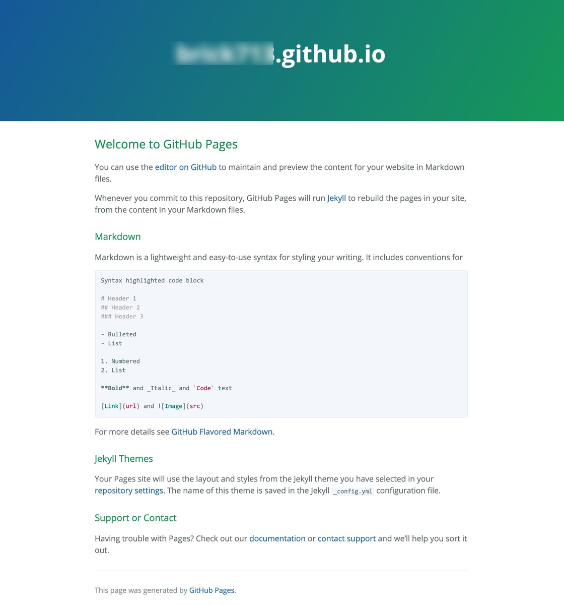

自己又接着搜，最终选择了Hexo框架，安装Hexo的准备工作：Github,Git,Nodejs已经弄好了，还算顺利，于是开始装Hexo,装这个Hexo（命令：npm i hexo-cli -g）还行，但是要等很久，初始化文件夹（hexo init）等的时间更加，还出错了很多次，自己搜了要用淘宝镜像源可以加快速度，安装组件（npm install）又卡了几次，后来终于出现了这个：

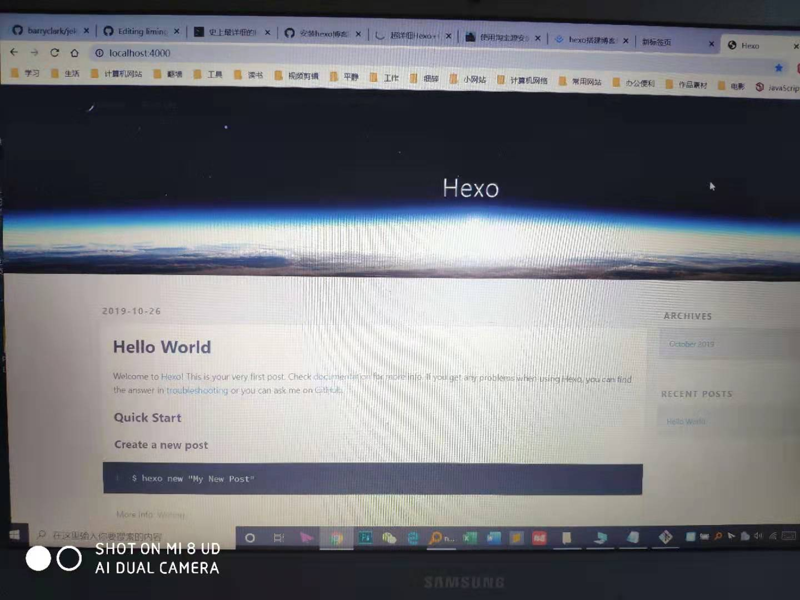

感觉已经成功了一半了，心想再把主题换成NexT就好了。

第二天(星期天)弄博客的时候发现有个文件删掉后开机又出现，搜了很多方法都不行，搞的自己很烦。于是自己索性重装了一下系统，花了很久时间备份文件到移动硬盘上，接着恢复出厂设置，格式化，得到了一个干干净净的电脑，接着重头开始弄博客，又注册了一个新的github账号，又出现了一些错误，比如SSL密钥的问题，又到处查，接着下载NexT主题，下载的很慢，期间经历了全部文件删除，重头再来两三次，终于nexT主题下载好了，最终弄出来了一个轮廓。

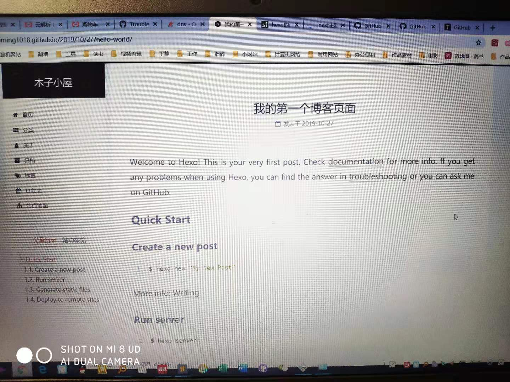

自己感觉弄的差不多了，周一的时候自己又在阿里云上花了38块买了一个top域名，有效期2年，又开始解析域名，搜如何绑定域名，又出现了一些问题（这个问题现在还没弄好，这个域名暂时先没用了），而且发现http://localhost:4000/出现拒绝访问的情况，又是一顿弄。

接着开始配置主题，又开始在网上搜，发现配置的有问题，又开始解决问题，就这样出现问题，搜索问题，解决问题，一直到第二个周六(2019年11月2日)，自己的博客才慢慢的有点样子了，自己也慢慢的了解了如何搭建博客了。

接着学习如何利用markdown写博客，又花了一些时间，加上介绍到目前为止（2019年11月08日）一共写了3篇博客了（其中两篇还未完成），总之，终于慢慢的走上了正轨了，自己的博客搭建之路就是这样了。

------

# 希望进行的博客优化

1. 有一个搜索选项，我那个搜索选项不行

   > 已经根据网上教程弄了一个搜索选项了

2. 未完待续

# 遇到的一些问题

1. 我那个域名按照教程也解析了，也新建了CNAME文件了，不知道为什么每次一刷新就没有了，要重新进行绑定。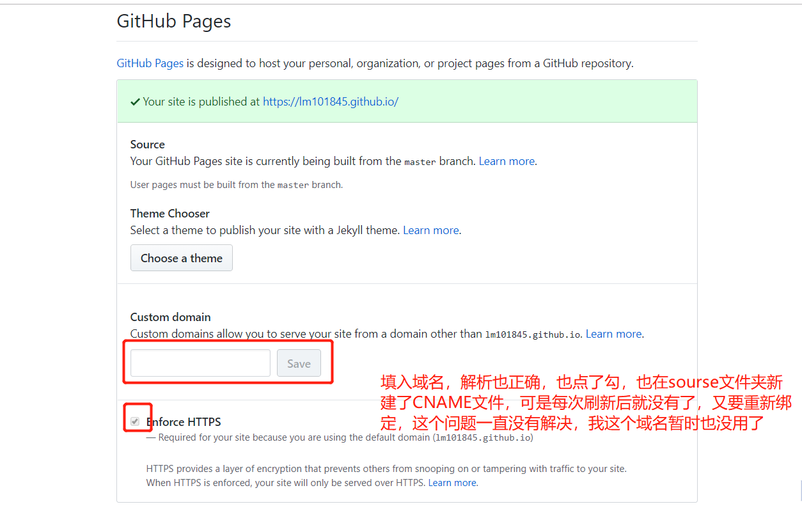

> 现在是2020年1月13号，已经过去了2个多月了，域名一直没弄过。今天心血来潮的在GitHub Page上重新填写了一下域名，其他都没动，也没刷新，突然就好了。
>
> 我稍后再试一下刷新之后还行不行。
>
> 额，刷新后还是不行

> 现在是2020年7月13号，看了上面的文字，发现正好过去了半年了，一部署Hexo博客域名就失效这个问题也是一直搁置着，今天偶然又开始查了一下，发现问题很可能是自己CNAME文件名有后缀(.txt)造成的，我把source里的CNAME文件夹里的后缀删除，再重新部署，问题解决！！！！！！激动，我终于可以用自己的域名了！！！

2.今天是2020年7月20日，突然发现一个问题：我的博客里的文字设置了高亮但是不显示，显示了原始的==，查了一会只查到如何设置代码高亮，没查到如何设置文字如何高亮显示，不知道要不要下载什么插件还是可以直接修改配置文件就可以了。明天再查一下吧。

3.在写一篇博文的时候，因为每个章节字都很多，通常都要占2,3行，显得很拥挤，而左边又有这么大的空隙，有没有什么方法可以让文章目录宽度变宽些。

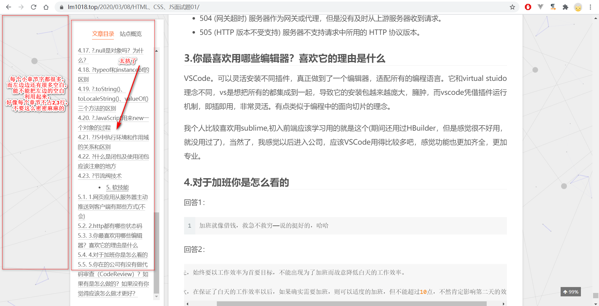

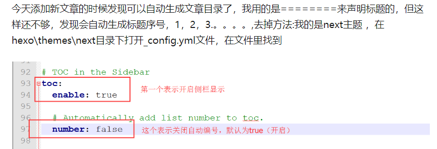

4.现在是2020年9月23日，这段时间在学Vue,博文里面也出现了大量的双大括号,然后就发现出现了一些问题，报错信息如下：

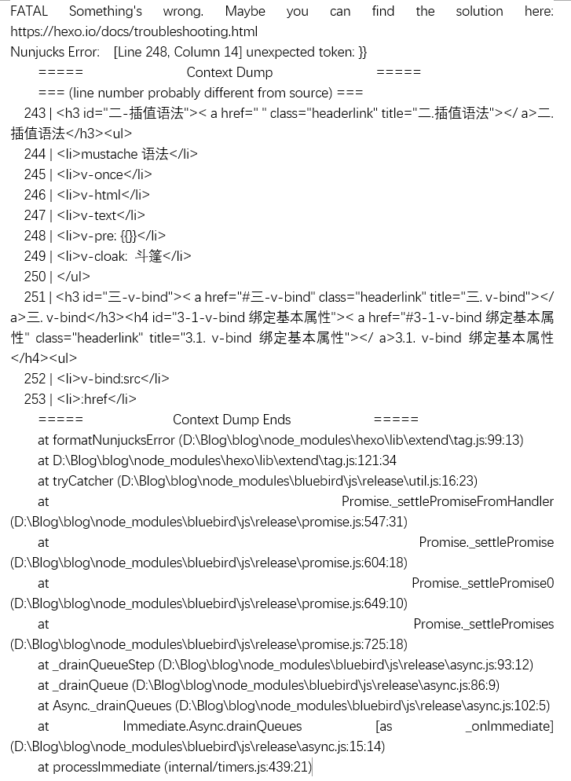

> 这个错误信息特意截的图而不是手写，如果是手写的话这篇博文会报错！！

大体查了一下，原因应该是：我的markdown文件中有标签与`nunjucks`模板引擎的标签冲突了，如果markdown文件中有这些标签，那么在解析的是就会把Markdown中的标签动态解析了。通常情况下是不允许的。

[如何从根本解决hexo不兼容双大括号标签问题](http://xcoding.tech/2020/01/18/hexo/%E5%A6%82%E4%BD%95%E4%BB%8E%E6%A0%B9%E6%9C%AC%E8%A7%A3%E5%86%B3hexo%E4%B8%8D%E5%85%BC%E5%AE%B9%7B%7B%7D%7D%E6%A0%87%E7%AD%BE%E9%97%AE%E9%A2%98/)

试着照上面的方法做了，但是还是没能成功解决掉这个问题。我现在也没有太多精力去搞这个Hexo博客了，以后有时间再看看吧。

5.现在是2020年9月26日，现在的解决方法是我把有问题的那一篇博文《Vue框架入门》单独剔除了出来，剩下的`hexo g`、`hexo d`这样就没有问题了，文章可以正确解析了，现在也只能这样了，如何彻底解决掉这个问题等以后再说了。(后来不知道怎么回事它自动就好了)

6.现在是2020年11月29日，这几天心态崩了，博客正常运行了一年了，也没什么问题。谁知道前几天因为自己打算做项目，准备把之前下载的Vue CLI版本给先卸载掉，安装低版本，结果不小心把Hexo里面的东西误删了，然后就乱了，回收站恢复了后来也不行，最大的问题是图片显示不出来了。后来我索性把博客文件删除了，重新安装Hexo博客，结果还是不行，后来我索性又把GitHub上的仓库删除了重新建一个,我之前不知道仓库删除了所有有关的Commits都没有了啊，有点后悔。重装后所有的问题都解决了，就是后面图片再也显示不出来了，我搜了一圈没找到实用的方法，然后心态崩了，又删除文件重装了4,5次，还是不行，唉！！！

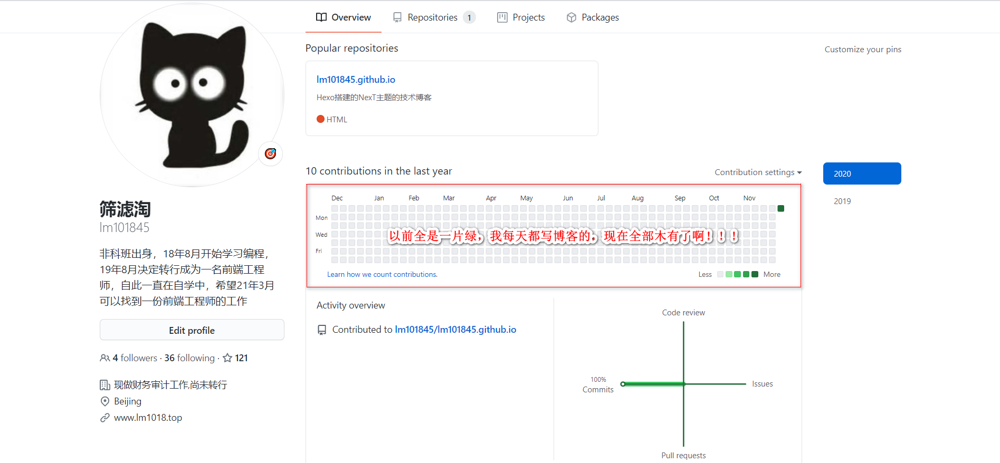

这个是个硬伤啊，这个问题必须要解决掉啊。

但是我也要开始做项目了，这个问题不要把自己心态搞崩了，慢慢去解决吧。

我都有5,6天没有学习了啊。

哈哈哈哈哈哈哈！！！我又整理了一下思路，发现终于可以成功显示了！！！！！！！！我先下载了`hexo-asset-image`插件，网上找了一下说是这个插件对于新版本Hexo有Bug，于是复制了一下网上的代码`index.js`，把这个插件里面的`index.js`文件给替换了，然后就可以了。

奇怪的是，我之前也是这样做的，但是就是图片死活显示不出来，应该是我又一次下载了Hexo的缘故吧，没有完全把`config.yml`文件给替换了。

总之开心啊，明天周一，我是真的要开始进入到学习状态了啊！明天就是11月最后一天了，2020年也就只剩下1个月了啊！！！

7.现在是2020年11月30日，博客还有一些小瑕疵如下：

* 搜索功能用不了，应该是要安装插件没有安装

* 点击文章的小节发现不跳转，应该也是没有设置好或者没装插件

* 给自己的博客弄个网站地图

8.现在是2020年12月2日，搜索功能弄好了，现在的问题主要有

* 文章目录点击发现不跳转,死活弄不好。看到一个报错信息：`Uncaught TypeError: Cannot read property 'getBoundingClientRect' of null
  ​    at HTMLAnchorElement.<anonymous> (utils.js:239)`，我根据这个找到了next主题下的`utils.js`这个文件，看了一下第239行。

  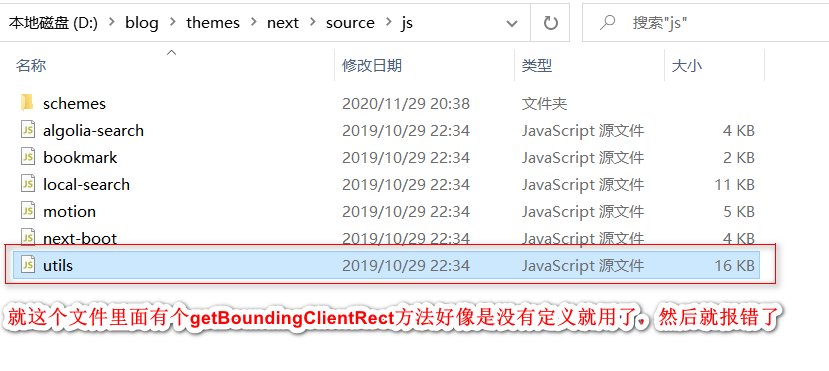

  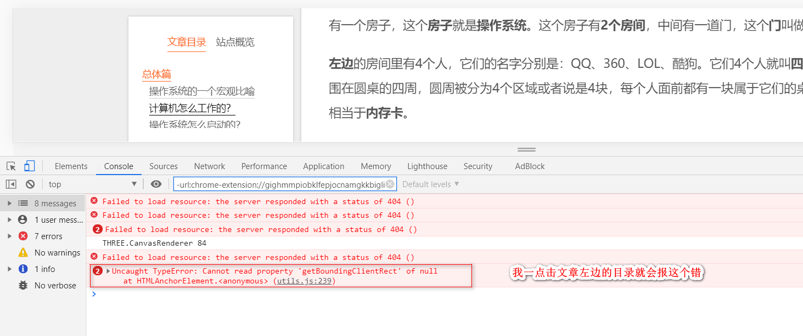

  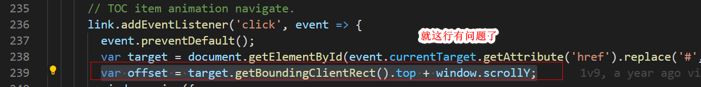

  我在GitHub上输入`getBoundingClientRect`发现一个包，我用npm安装了一下这个包，发现还是不行。

  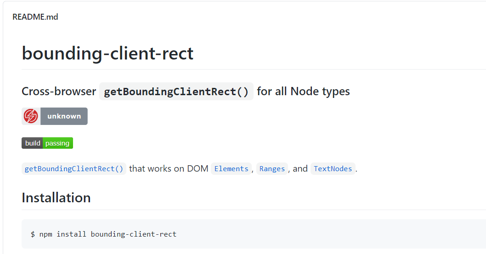

  后来我又在GitHub上搜了最新版的NexT主题，找到了`utils.js`，把它复制下来替换掉原来的，发现变得更糟糕了，网页都不显示了，哈哈，我还是再改回来吧。

  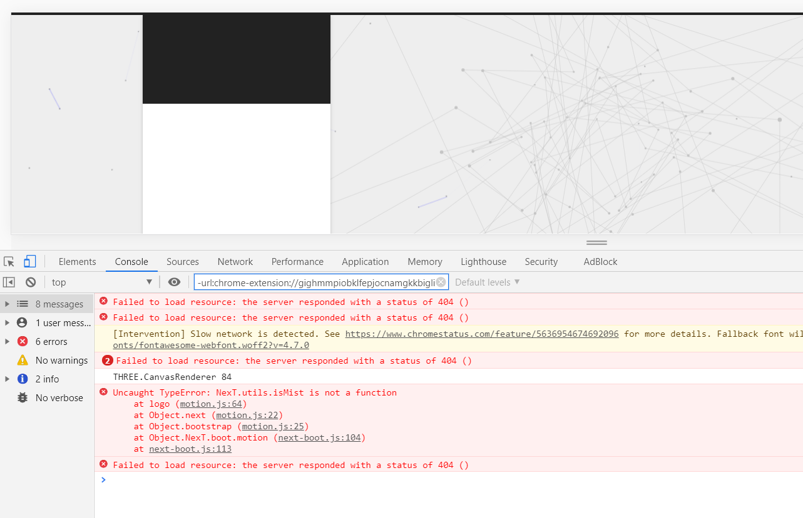

* 我冒出来个想法：要不然我就下载一下最新版的NexT主题吧，之前就是图方便直接把以前博客里的next文件夹放进去了。

  登陆https://www.diffchecker.com/diff这个网站来比较NexT主题前后的`config.yml`设置。照着旧的重新填写`config.yml`。

  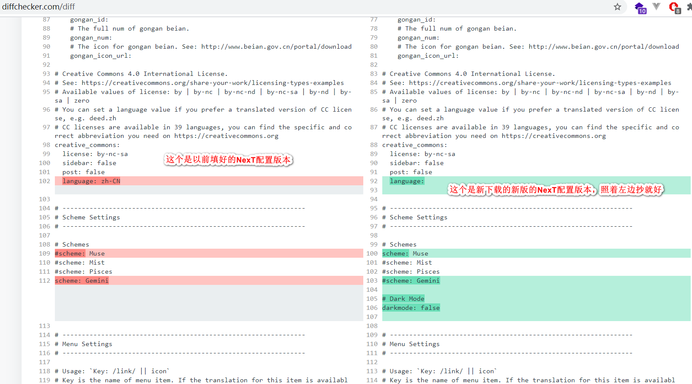

* 网站文章不显示前120字，显示的是整个页面，死活弄不好

  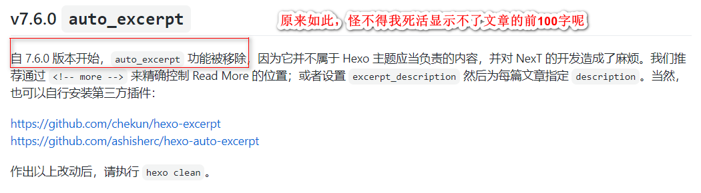

  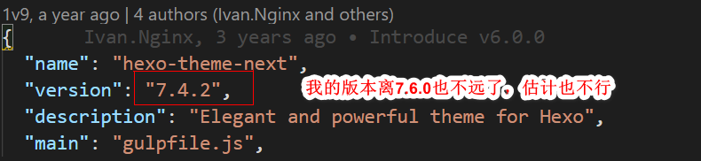

  那我就下载第三方插件吧。

  哈哈，安装插件后就可以了！！！(我选择的是这个`https://github.com/ashisherc/hexo-auto-excerpt`)

  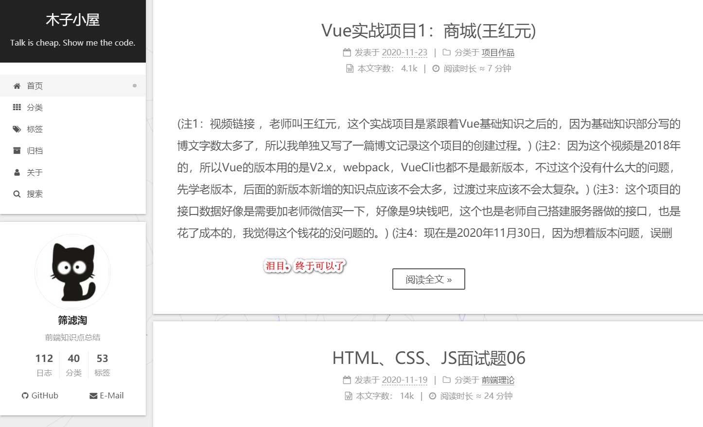

* 我重新下载了最新版的NexT主题后，配置也按照旧主题抄了一下，其他问题都没有了，点击文章目录也跳转了，就是尼玛图片又显示不出来了，淦。

* 经过自己不懈的努力，现在是2020年12月2日晚上7点40，我终于把所有的问题都解决了！！图片正常显示了，目录也可以正常点击了！！！

* 希望以后我可以不再写这篇博文了。

# Hexo博客部署到Gitee码云

[Hexo博客部署到Gitee码云](https://blog.csdn.net/mqdxiaoxiao/article/details/95781368)

不行啊，这个码云Gitee仓库还有大小限制呢，还不能超过500MB呢？？？这个也太坑了吧！！！！

那我还用个屁啊！！！！

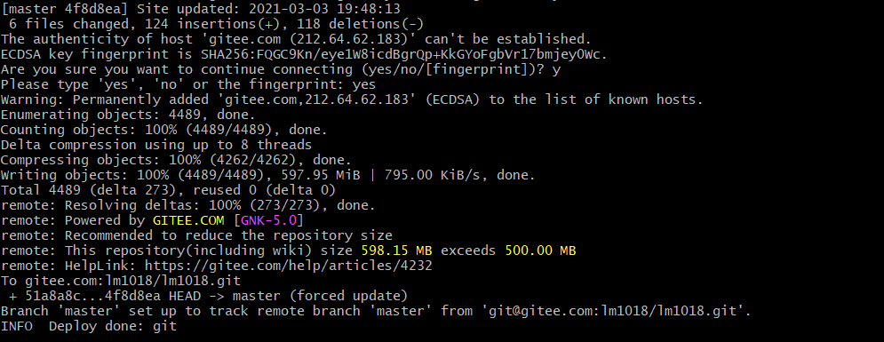