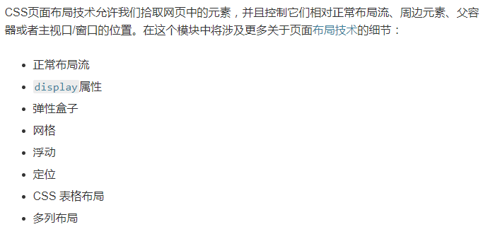

(注1：现在是2020年12月08日，我觉得有必要另开一篇博文汇总一下我以前写过的那些"项目"以及接下来3个多月需要做的项目，我的理想目标是做8个项目，但是我明白这无异于痴人说梦，3个多月做不了8个项目，尽量能做多少做多少吧。不过没关系，我可以一直做，一直做，总有一天自己可以做到8个项目的。)

(注2：不过也不要沉迷于做了多少项目，主要是想通过做项目来检验自己一年以来的理论学习知识水平，以此更好的进行查漏补缺。)

(注3：现在是2021年1月25日，是时候开始重新梳理一下自己做过的项目了。)

# 原生静态页面

> 这些页面我会重新再做一遍，然后再放到GitHub上，并且把有关博文给补充完善一下的。

| 页面名称 | 博文地址                                                     | github地址                                         | 技术栈        |
| -------- | ------------------------------------------------------------ | -------------------------------------------------- | ------------- |
| 云道页面 | [云道页面](https://lm1018.top/2020/03/15/mian-shi-zuo-pin-jing-tai-ye-mian-01-yun-dao-ye-mian/) | [项目地址](https://github.com/lm101845/staticpage) | 原生HTML、CSS |
|          |                                                              |                                                    |               |
|          |                                                              |                                                    |               |

# 使用框架的静态页面

## Bootstrap布局

* 撩课学院(√)

## Flex布局

* 携程旅游移动端(√)

# 通过项目暴露出的知识漏洞

## CSS布局

[介绍 CSS 布局](https://developer.mozilla.org/zh-CN/docs/Learn/CSS/CSS_layout/Introduction)

* 我还有很多CSS布局没有学，需要单独花时间去学一下，顺便巩固一下自己不足的CSS知识。还有一些CSS布局没有学，主要有：`rem布局`、`响应式布局`、`流式布局`。

# 查漏补缺

## CSS布局之rem、grid

## 听故事学Git

## 王红元小程序

## TypeScript

## Vue3.0(看情况)

## React入门(看情况)

## Node.js(看情况)

## 数据交互

### axios

[尚硅谷_axios核心技术](https://www.bilibili.com/video/BV1NJ41197u6?from=search&seid=10630776414375333340)

## ajax

## 轮播图组件

[vue组件开发swiper老司机带你上车](https://www.bilibili.com/video/BV1jE411e7GC?from=search&seid=5696927823665358575)

# 需要再做的项目

## 王红元商城项目再做一遍

## 黄弈：Vue项目之饿了吗

## 黄弈：Vue项目之网易云音乐