(注1：今天是2020年8月4日，去年的11月初我摸索着利用hexo搭建了自己的个人博客，转眼间10个月就这么过去了，我也写了一些博文在上面。不过随着时间的推移，我也慢慢发现了一些问题：第一个问题是hexo博客是静态网站，每次要更新博客都要`hexo clean`，`hexo  g`，`hexo  d`来这么三下，感觉有点麻烦。第二个问题是typora写博文写到一定字数后会感觉很卡，不知道自己搭建了网站，在自己的网站动态的写博客会不会好一些呢？第三个也是最重要的一点是，我突然很想找一个地方，把自己以各种方式(文字、视频等)记录的生活轨迹统一的留存下来。以往的生活轨迹散落于纸质的日记本[我已经将其一大半转换成了电子版存放在了简书里面了]、简书、QQ里面的图片、电脑里面从19年12月开始每月一篇的视频日记，等等等等，这些不同的介质当中，如果有了自己的个人网站，应该就可以汇总起来吧！自己还可以重新分个类，看书时记录的笔记，也可以单独分成一类在网站里，除此以外，自己的一些重要资料，也是可以放在自己的网站里的吧[当然要注意网络安全，防止黑客渗透之类的，而且我也不太清楚网站的容量是否足够呢？？现在这些还不得而知，只能一步步慢慢摸索了])

(注2：我现在的学习进度是今天终于把jQuery和PHP基础学完了，刚想接下去学AJAX和Bootstrap，突然冒出了个要搭建个人网站的想法，所以今天就没有学新知识了，搜了一下建站的基础步骤，在腾讯云上免费领取了个有效期15天的云服务器，准备就先利用这个练练手，搭建一个个人网站，等差不多了再买个1年99块钱的云服务器。)

(注3：我知道自己当前的主要任务还是学习前端，前端还有太多东西没学，还打算明年3月份转行呢，所以肯定不能在这上面花太多的时间。不过，我想搭建个人网站的另一个原因还是想再熟悉一下后端，想看看课本外的实际生活中后端到底是怎么样的，实际生活中的网站数据库,Linux操作系统到底是运行的，黑客到底能不能把我这个新搭建的网站给黑了)

(注4：去年搭建博客的时候只是在搭建后大体记录了一下过程，比较简略，而现在搭建网站，我将详细记录自己搭建网站的每一个步骤，遇到的每一个问题以及如何解决的。我现在的工作比较轻松，基本上就没什么事情做，之前都是上班的时候复习前端的，那么这段时间上班的时候就主要搜集一下搭建个人网站所需要的步骤吧。)

(注5：当然了，一定要分清楚主次啊，学前端才是最重要的，搭建网站是丰富一下业余生活啊，顺便再详细了解一下后端啊，这个是次要的啊！！我必须要好好把前端学好，然后找一份工作啊！！！这个才是最重要的啊！！)

# 云服务器概述

[云服务器概述](<https://cloud.tencent.com/document/product/213/495>)

## 如何使用云服务器？

腾讯云提供如下方式进行云服务器的配置和管理：

* **控制台**：腾讯云提供的 Web 服务界面，用于配置和管理云服务器。
* **API**：腾讯云也提供了 API 接口方便您管理云服务器 CVM。关于 API 说明，请参考 [API 概览](https://cloud.tencent.com/document/api/213/15689)。
* **SDK**：您可以使用 [SDK 编程](https://cloud.tencent.com/document/sdk) 或使用腾讯云 [命令行工具 TCCLI](https://cloud.tencent.com/document/product/440) 调用 CVM API。

## 相关概念

使用腾讯云服务器 CVM 之前，您还需要了解以下概念：

* **实例**：云端的虚拟计算资源，包括 CPU、内存、操作系统、网络、磁盘等最基础的计算组件。
* **实例类型**：腾讯云提供的云服务器的各种不同 CPU、内存、存储和网络配置。可以参考 [实例规格](https://cloud.tencent.com/document/product/213/11518) 了解更多。
* **镜像**：指云服务器 CVM 运行的预制模版，包括预配置的操作系统及预装软件。腾讯云 CVM 提供 Windows，Linux 等多种预制镜像。
* **本地盘**：与实例处于同一台物理服务器上的，可被实例用作持久存储的设备。
* **云硬盘**：提供的分布式持久块存储设备，可以用作实例的系统盘或可扩展数据盘使用。
* **私有网络**：腾讯云提供的虚拟的隔离的网络空间，与其他资源逻辑隔离。
* **IP地址**：腾讯云提供 [内网 IP ](https://cloud.tencent.com/doc/product/213/5225)和 [公网 IP](https://cloud.tencent.com/document/product/213/5224)。简单理解，内网 IP 提供局域网（LAN）服务，云服务器之间互相访问。公网 IP 在用户在云服务器实例上需要访问 Internet 服务时使用。
* **弹性IP**：专为动态网络设计的静态公网 IP，满足快速排障需求。
* **安全组**：安全组可以理解为是一种虚拟防火墙，具备状态检测和数据包过滤功能，用于一台或者多台云服务器网络访问控制，安全组是重要的网络安全隔离手段。
* **登录方式**：安全性高的 [SSH 密钥对](https://cloud.tencent.com/doc/product/213/6092) 和普通密码的 [登录密码](https://cloud.tencent.com/doc/product/213/6093)。
* **地域和可用区**：实例和其他资源的启动位置。
* **腾讯云控制台**：基于 Web 的用户界面。

# 搭建前自己的一些设想

1.自己的个人网站不只是像hexo那样只写技术博客，记录前端知识点了。它的作用会被扩大，我的设想是**记录自己的一生**，自己从小到大的日记全部电子化，从2019年12月起自己还每个月写一篇"视频日记"(就是用手机对着自己摄像，大概讲一下自己这个月都大体干了什么之类的，也不算是Vlog吧，我觉得积累几年后再回头看看应该会很有意思吧，可以见证一下岁月的流逝。)

2.自己极为重要的资料加密存放于网站里，比如自己每年的支付宝流水记录，每个月的工资之类的Excel表，还有以前的照片什么的。（容量问题以后再说吧）

3.自己以后要养成定时备份资料的习惯了，我还没有系统备份过电脑上的重要资料，零零散散的放了一部分在网盘上，在自己的移动硬盘上，如果有可能，我希望把自己比较常用的资料都放在自己的个人网站上（到时候再看看可行不可行，网站容量啊，黑客渗透啊什么的）

4.自己以后看其他书记的读书笔记啊什么的，也单独分个类放到这个网站里面。

5.这个网站我希望不要只运行个1,2年，我要当它是我的孩子那样，只要我活在这个地球上，它就不会消亡，我会持续不断的在里面记录着生活，感想，遭遇，等等，一直到我死。也许以后，还可以给我的后代或者别的人看看，看看活在21世纪初的人，一个生活在社会偏底层的人是怎样的一个生活状态，他的一生是如何度过的。

6.它不是什么商业网站，也不想着怎么怎么样挣钱，就只是单单的记录我这个平凡人物的一生，它就是另一个部分的数字化的我，虽然不是完全的(我无法在一个网站里只通过文字或视频或其他媒介就能展示我的全部)，

# 云服务器可以用来做什么

* 搭建个人博客
* 搭建个人简历网站
* 搭建个人网盘
* 搭建个人云笔记
* 搭建在线编程环境
* 搭建Linux学习环境

# 关键字

* 域名：(我之前搭建博客的时候就话40几块钱买过2年的，lm1018.top，就用这个吧，到时候把这个域名和我的博客解绑，作为我的网站域名)
* 网站备案（试了一下备案，显示注册未满48小时还不能备案）
* Linux登陆终端：登陆后用什么指令？可以做什么？
* WordPress（网站用什么"系统"？用WordPress还是其他的？）
* PHP（我刚刚才学完PHP基础，当然水平肯定不够，如果在建站的过程中能够用上PHP来巩固一下所学那自然是很好的事情）
* 网站装饰（下载插件吗？希望自己的网站可以弄得很漂亮啊，主要是要简洁，有个性）
* 网站SEO（我觉得如果不被人认出来，写的日记被别人看到也无所谓的，我简书上写的日记就是公开的）
* 网站安全（黑客攻击？网络爬虫？写日记的时候注意保护一下隐私啊，别被人认出来）

# 网站建设步骤

网站建设的整个流程：

  一，注册域名，购买云服务器。

  二，配置环境，进行环境部署。

  三，建设我们的网站。

  四，网站的美化。

  五，上线网站，供人访问。

# 搭建节点记录

1.我领取了腾讯云100元代金券，满199元使用。我现在纠结是买一年99元的还是买3年349元的（用100元代金券，最后实际支付249元——后来发现促销订单用不了代金券，那我就先买一年的吧）

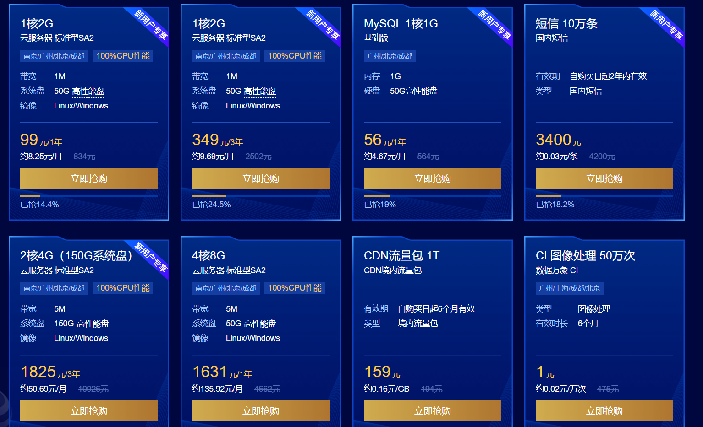

2.云服务器1核2G，带宽1M的对于个人建站够用吗？

3.云服务器用什么操作系统好？（我知道服务器肯定用Linux系统好，更安全，不容易被黑）

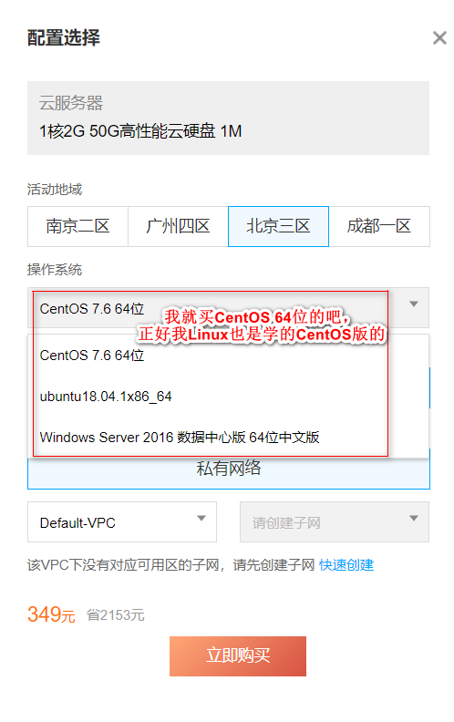

4.我去，促销订单还不能用代金券的，那我还是买一年的吧。

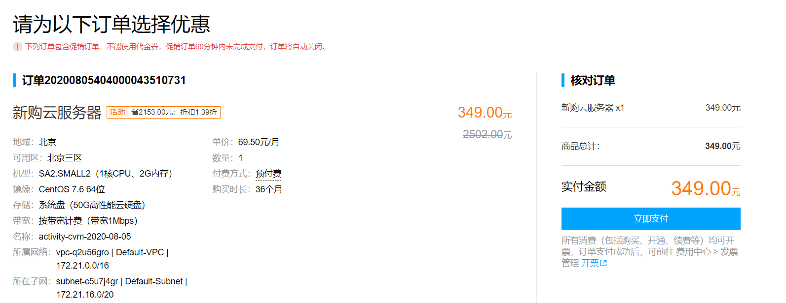

5.云服务器到期了以后里面的东西就会被删除吗？可以将数据备份到自己的电脑上吧，等以后自己再租一个云服务器的时候，还能部署得上吧？

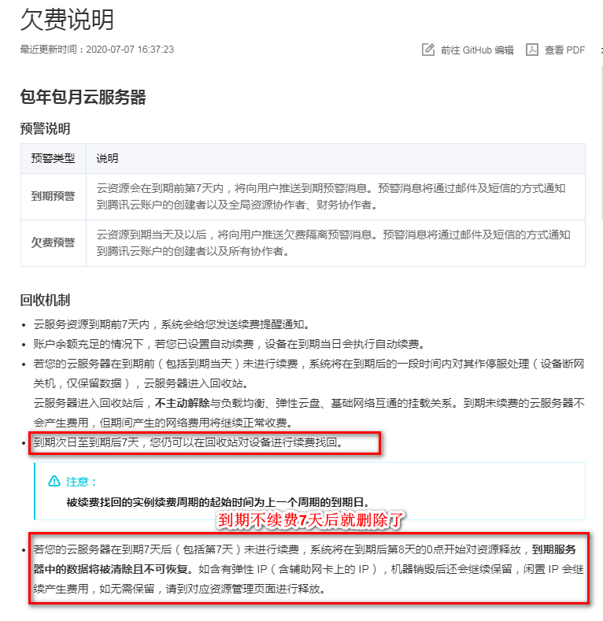

6.我最终下单买了这个

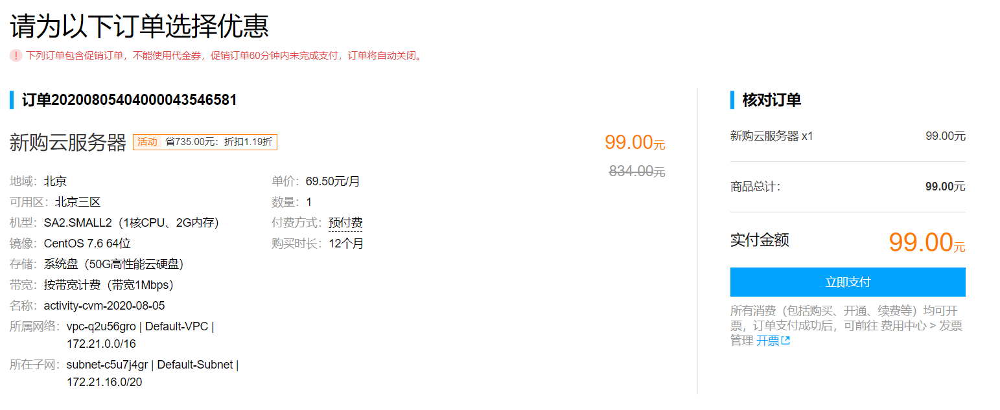

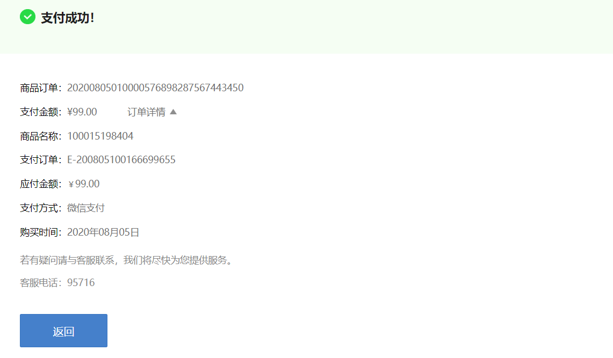

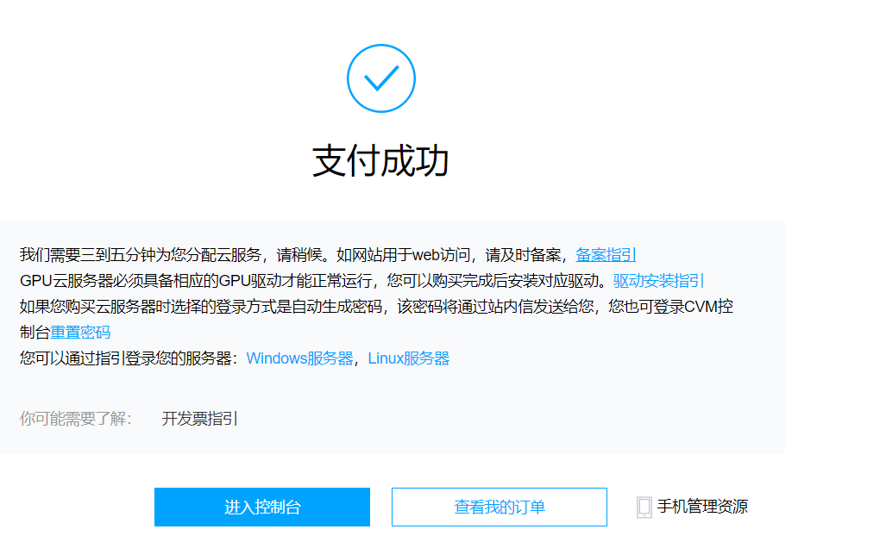

7.我显示根据腾讯云官网上的教程进行Linux系统配置，后来下载wei.php文件失败，于是又重装系统，选择了宝塔面板进行搭建。

[一键建站系列教程（宝塔面板+wordpress 我就是根据这个搭建WordPress的）](https://zhuanlan.zhihu.com/p/52846071)

# 服务器备案记录

我实名认证后要等48小时后才可以备案，到时候记录一下备案的过程，看到底复不复杂，我觉得应该不复杂，一些人不想备案不买国内的服务器估计是不想被国家监管吧，我也不喜欢被监管的感觉，总觉得背后有个人在盯着你，让人不自在。

[我的网站需要备案吗](<https://zhuanlan.zhihu.com/p/64303642>)

1.我用小程序申请了服务器备案(需要时间)

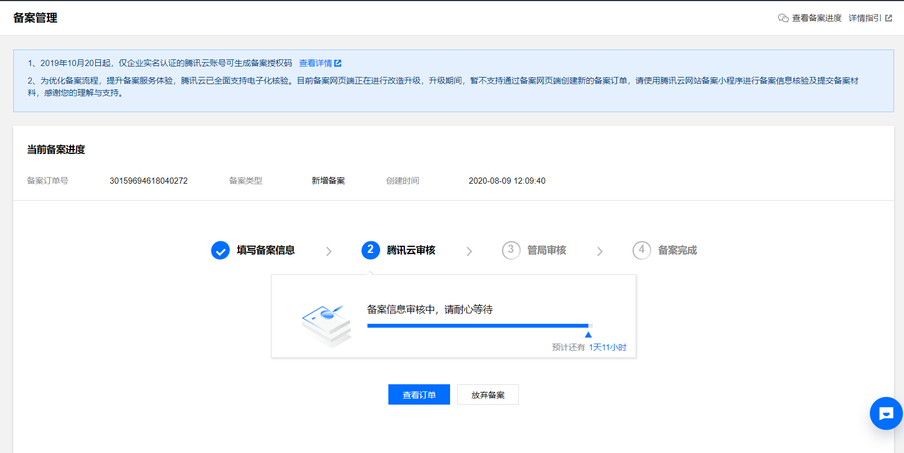

2.我还申请了阿里云域名转移（需要时间）

> 现在是2020年8月15日，经过了一周的等待，域名终于转移成功了，接下来我要开始域名解析，和我的服务器进行绑定了。

3.网站备案的时候客服给我打电话，说了一下我备案填写资料时出现的一些错误，最主要的是我的域名要先转入并且实名认证后才能进行网站备案，而域名认证大概要5-7个工作日，所以这个要等一会了，等到大概下周二左右就可以域名转移成功了，然后我再进行网站备案就可以了。

# 一些疑问

1.租云服务器和自己买一个实体服务器的优劣。（我觉得等以后，应该有必要自己买一个服务器）

2.腾讯云IP地址一个公网一个内网这2个主要的区别是什么？

3.我域名已经在阿里云备案了，可以用腾讯云的国内服务器吗？——可以，但要转一下域名备案

4.WordPress支持.top域名吗？我买的就是便宜的.top域名。[回答](<https://cloud.tencent.com/developer/ask/228142>)

5.腾讯云服务器有个创建SSH密钥，是什么时候用的上？

回答：腾讯云服务器内置创建 SSH 密钥功能，创建并使用之后就是有密钥才能使用 SSH 连接服务器，相对于几位数的登陆密码来说，2048 位密钥显然更安全。

系统提示不会保存私钥，要求用户在 10 分钟之内自行下载私钥，要保存在本地电脑和邮箱里面备用。

[腾讯云服务器创建 SSH 密钥及如何使用 提高 SSH 连接安全性](https://www.vpsss.net/6433.html)

[腾讯云服务器如何使用SSH密匙对登录？](<https://cloud.tencent.com/developer/article/1454211>)

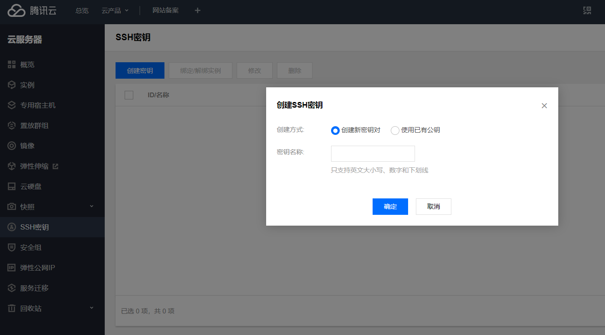

6.当初学Linux的时候下载了一个SecureCRT软件，这个软件可以用来远程连接服务器，现在如何利用这个软件来连接我的云服务器呢？(云服务器一直都是开着的)

[本地SecureCRT软件SSH连接腾讯云服务器（linux系统）](<https://blog.csdn.net/walent_v/article/details/72357623>)

[使用远程登录软件登录 Linux 实例](<https://cloud.tencent.com/document/product/213/35699#.E4.BD.BF.E7.94.A8.E5.AF.86.E9.92.A5.E7.99.BB.E5.BD.95>)

7.腾讯云服务器一会没去动就自动断开，这个问题应该如何解决

8.weiPHP我在网上下载的5.0版本先到自己的电脑上，然后复制文件到服务器里，输入公网网址显示了界面，可是点击同意安装协议后它不跳转页面，我清理了缓存，取消了广告拦截，后来又换了个浏览器，还是不行。那我试着重启一下电脑看看吧，还是不行。

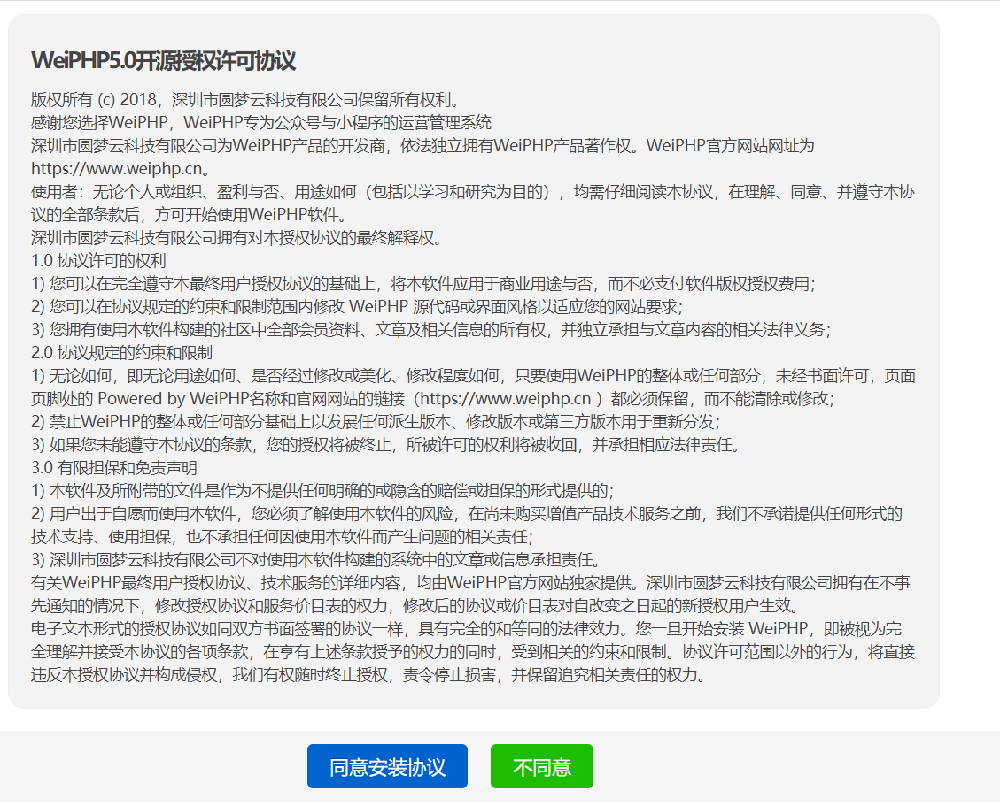

9.？？？？域名转出居然要钱？？？？？？？？？那我还转个毛线啊，直接再买一个不好吗？我买一个也就二三十块钱。

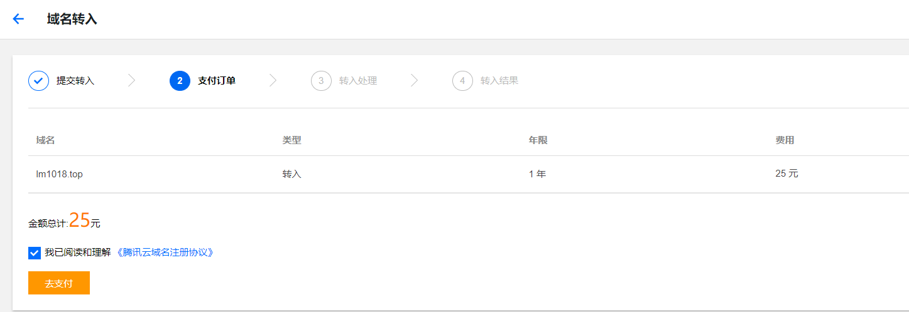

哦，这25块钱应该不是转出的费用，应该是再续费一年的费用吧。

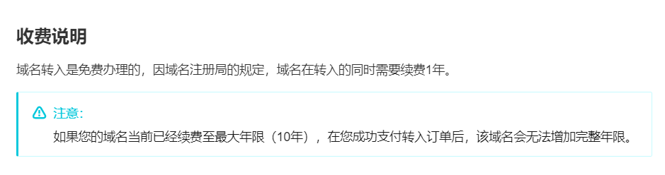

但是这个商品清单叫域名新购，不知道是啥意思。

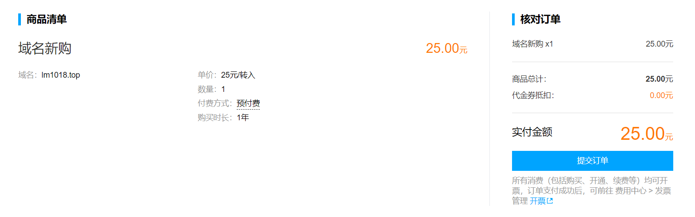

我又仔细看了一下，应该是没有什么问题的，之前是38块买了2年的，今天再付25块再买一年，我这个域名就是3年的了。

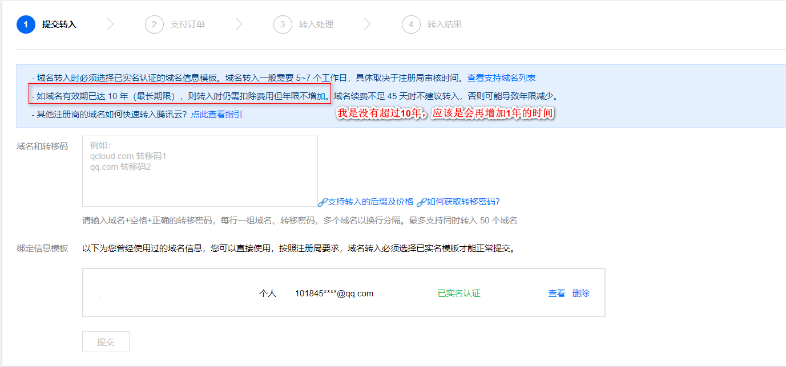

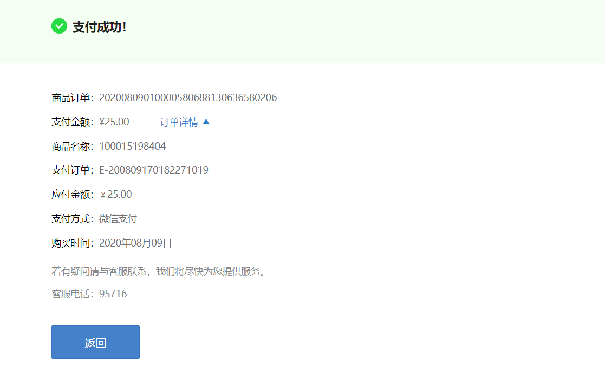

10.如何把自己hexo博客上的内容迁移到自己的网站上来呢？？

[Blog从Hexo迁移至Wordpress](https://blog.csdn.net/Giotoolee/article/details/102851633)

[将文章从简书迁移到 Hexo](https://blog.csdn.net/xiasuhuei321/article/details/80503592?utm_medium=distribute.pc_relevant_right.none-task-blog-BlogCommendFromMachineLearnPai2-4.nonecase&depth_1-utm_source=distribute.pc_relevant_right.none-task-blog-BlogCommendFromMachineLearnPai2-4.nonecase)

11.我看了一下，新手刚买云服务器刚开始是比较优惠的，我这个1核2G的一年是99元，如果以后要续费，那就贵很多了，那如果到期了我是续费呢？还是重新再买呢？还是到时候已经对云服务器不感兴趣了，不弄了呢？这个也只能到期后看我自己当时的状态了吧。

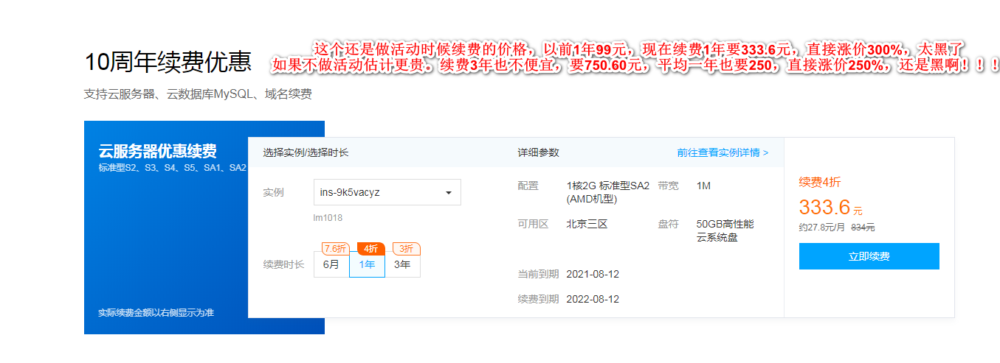

12.WordPres插件安装多了以后会不会卡？

[WordPress折腾笔记（一）：必备插件安装指南](https://www.littlemodesty.com/website-building/wordpress/wordpress-plugins-guide/)

# 腾讯云服务器的安全性及数据备份

1.腾讯云硬盘和快照（相当于备份）是要钱的。

[被腾讯云毁掉的公司，后面还会有多少家？](<https://zhuanlan.zhihu.com/p/41460879>)

# 如何登陆并配置Linux云服务器

[快速配置 Linux 云服务器:我看的就是这个！！！对着配置环境，没有问题](https://cloud.tencent.com/developer/article/1530621)

[从零开始搭建腾讯云服务器 (一)](<https://www.jianshu.com/p/94dc2231fcc2>)

1.登陆完服务器后一脸懵逼，也不知道敲什么命令配置服务器。（不过Linux命令窗口我是不陌生的）

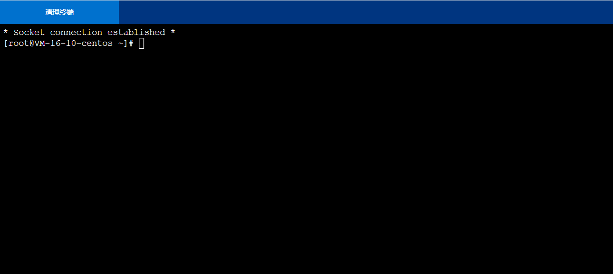

# 使用云服务器

当您登录云服务器后，即可在云服务器上进行您所需要的操作。常用的任务包括：

* [将您本地的文件上传到云服务器上](https://cloud.tencent.com/document/product/213/39138)
* [在云服务器上搭建网站](https://cloud.tencent.com/document/product/213/39130)

# 如何手动搭建 WordPress 个人站点（Linux）

[WordPress一站通](<https://wpshushu.com/#learn>)

[一键建站系列教程（宝塔面板+wordpress 我就是根据这个搭建WordPress的）](https://zhuanlan.zhihu.com/p/52846071)

## WordPress 简介

WordPress是使用PHP语言开发的博客平台，用户可以在支持PHP和MySQL数据库的服务器上架设属于自己的网站。也可以把 WordPress当作一个内容管理系统（CMS）来使用。

WordPress是一款个人博客系统，并逐步演化成一款内容管理系统软件，它是使用PHP语言和MySQL数据库开发的,用户可以在支持 PHP 和 MySQL数据库的服务器上使用自己的博客。

WordPress有许多第三方开发的免费模板，安装方式简单易用。不过要做一个自己的模板，则需要你有一定的专业知识。比如你至少要懂的标准通用标记语言下的一个应用HTML代码、CSS、PHP等相关知识。

WordPress官方支持中文版，同时有爱好者开发的第三方中文语言包，如wopus中文语言包。WordPress拥有成千上万个各式插件和不计其数的主题模板样式。

## WordPress装饰

1.在进度第13条之后自己开始进行WordPress装饰的工作，先找一个链接照着做一下。

[Wordpress安装后优化](https://zhuanlan.zhihu.com/p/129863153)

2.我应该选哪个WordPress主题呢？我发现张鑫旭的博客用的也是WordPress，我现在也想用他的这个主题，怎么查看呢？到时候我来搜一下。

> 如何查看别人使用的是哪个Wordpress主题:
>
> 1，网页中点击鼠标右键查看源代码。
> 2，然后在源代码页面上面接ctrl+f找wp-content/themes/
> 会看到wp-content/themes/后面的就是主题的名称。

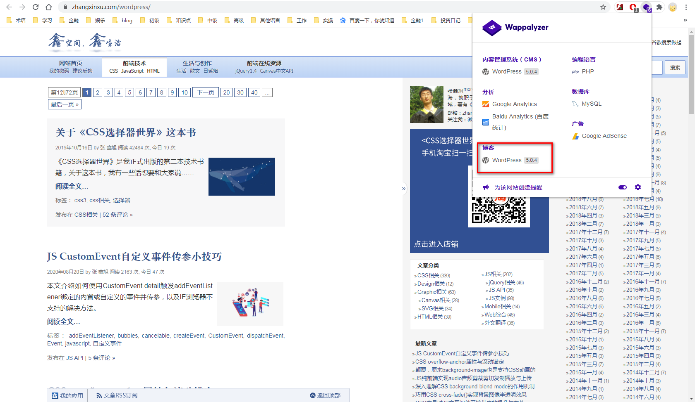

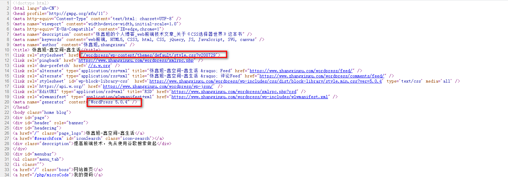

3.如何设置WordPress固定链接

[WordPress固定链接设置的几种方法](http://www.thefox.cn/set-permalink.shtml)

> wordpress[固定链接](http://www.thefox.cn/tag/固定链接)设置技巧：
>
> 1、不要让日期出现在固定链接里面
>
> 这基于两个方面的考虑。一是如果数字出现在固定链接里面，等于提醒搜索引擎，这是很旧的内容了，没必要再爬一遍了。另外一个原因是，假如你要修改文章的日期重新发布的话，链接地址就变了，也就是意味着你的反向链接，PR 等等都没有了。
>
> 2、不要让分类的链接出现在固定链接里面
>
> 这一点是很多人都会忽略的地方。让分类出现在固定链接里面有两个缺陷：一是一篇文章如果选择了多个分类的话，则会出现多个链接地址，这很容易造成因为重复内容而被搜索引擎惩罚；二是有可能会造成关键词堆砌而被搜索引擎惩罚。
>
> 3、链接不要过深
>
> 这一点经常看到。很多wordpress 用户的固定链接是年/月/日/分类名/文章名。这种过于深的固定链接对搜索引擎是非常不友好的。
>
> 4、不要让中文字符出现在固定链接里面
>
> 虽然现在的搜索引擎已经能识别URL地址里面的中文字符，但无论是从美观上，还是从wordpress 优化的角度来看，都是非常差的。
>
> wordpress固定链接设置的一些参数：
>
> %year%：基于文章发布的年份，比如2018；
> %monthnum%：基于文章发布的月份，比如01；
> %day%：基于文章发布当日，比如06；
> %hour%：基于文章发布小时数，比如23；
> %minute%：基于文章发布分钟数，比如43；
> %second%：基于文章发布秒数，比如33；
> %postname%：基于文章的postname，其值为撰写时指定的缩略名，不指定缩略名时是文章标题；
> %post_id%：基于文章post_id，比如48；
> %category%：基于文章分类，子分类会处理成“分类/子分类”这种形式；
> %author%：基于文章作者名。
> 将上述参数进行组合，即可得到wordpress的固定链接形式。

# 进度

1.我现在可以用SecureCRT 8.5远程连接服务器了，在网页上连接服务器，一段时间不动的话它就自动断开连接

2.我现在可以用WinSCP进行自己的电脑和服务器的文件传输了，图形界面传输更加方便

3.我给服务器添加了SSH登陆方式，不用密码登陆了，更加安全

4.我因为wei.php装不成功，于是我就重装了一下系统，把所有的东西都删了，然后装宝塔面板了。宝塔的网址是：[宝塔](<https://www.bt.cn/>)

(装宝塔之前要先设置一下进出端口，有一个安装教程：[教程](<https://www.bt.cn/bbs/thread-19376-1-1.html>))

宝塔下载好了，输入网址也能使用了，比wei.php好多了。

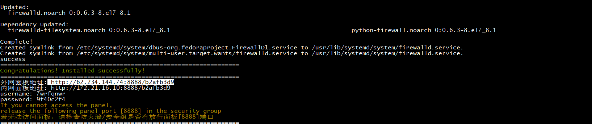

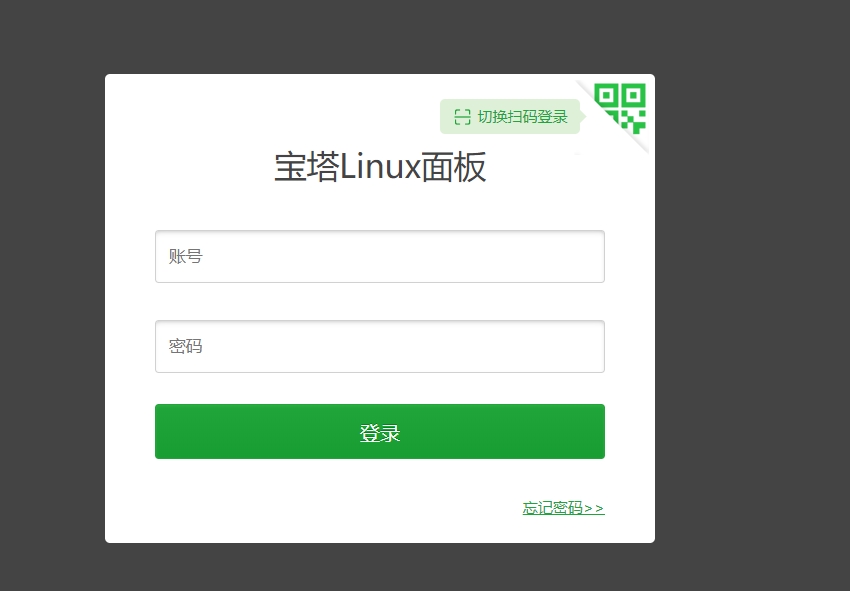

5.宝塔配置步骤

[一键建站系列教程（宝塔面板+wordpress 我就是根据这个搭建WordPress的）](https://zhuanlan.zhihu.com/p/52846071)

[如何在宝塔安装部署WordPress？](https://zhuanlan.zhihu.com/p/112299365)

6.我发现WordPrsss推荐安装PHP7.4及以上版本，我安装的是PHP5.6版本的，如何进行版本升级安装啊？

[宝塔面板php版本怎么升级](https://www.west.cn/docs/62030.html)

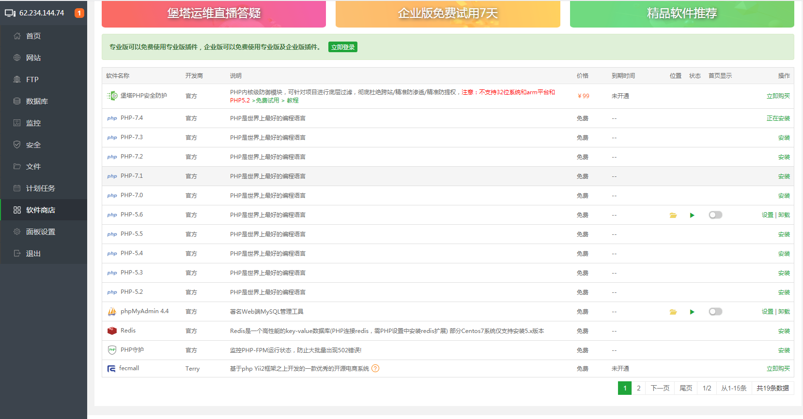

7.我看宝塔页面显示SSL证书未部署，到时候我来弄一下SSL。

8.安装完WordPress后如何进行网站的美化？

[Wordpress安装后优化](https://zhuanlan.zhihu.com/p/129863153)

[有哪些优质的WordPress主题？](https://www.zhihu.com/question/65054664/answer/459462515)

[wordpress新人搭建网站， 有哪些必备插件推荐安装?](https://www.zhihu.com/question/361191216/answer/989181663)

[把wordpress改得最不像blog的网站有哪些？](https://www.zhihu.com/question/30763090)

9.现在是2020年8月23日，域名转出花了大概一周多的时间才终于成功转出了，前几天开始了第二次备案，进度是腾讯云已经审核完成了，现在是轮到管局审核了，今天收到了一条工信部ICP备案的核验链接，点击网页进去进行了核验，上下的就是等了。

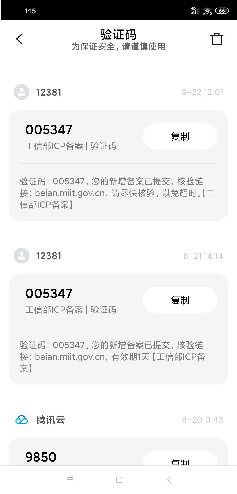

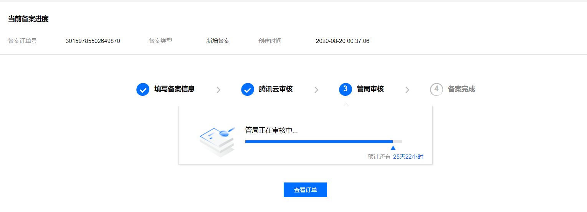

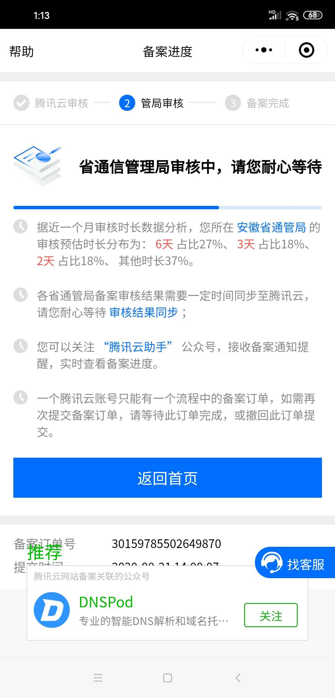

我看了一下过去一个月管局审核时长的时间占比，我大概有63%的概论能够在6天内审核完成。

从我8月4号租了一年云服务器开始到现在，不知不觉间19天就这么过去了，环境用宝塔云大体配置好了，网站备案也将接近尾声了，我现在要做的就是要开始好好的设计一下我的网站了。

我今天搜了一下[WordPress教程](<https://www.bilibili.com/video/BV1St411s7VL?from=search&seid=12466557073089506891>)，还没开始看，看了评论说介绍的极其详细，决定从明天开始在学习间隙把这门教程看完，并且单写一篇博文，记一下笔记。

总之，慢慢的感觉自己搭建网站开始走向正轨了。

10.现在是2020年8月26日，我的备案终于审核完成了，接下来要做的就是要开始学着部署自己的网站了。

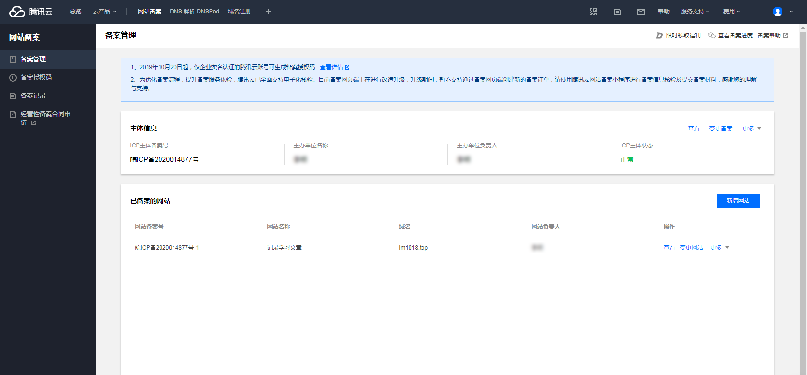

短信提示如下：

【腾讯云】尊敬的用户，恭喜您（账号ID：100015198404 ，昵称：.）的备案申请已通过管局审核（备案订单号：30159785502649870）。请您于备案完成的30天内，登录全国公安机关互联网站安全管理服务平台，办理公安备案，流程帮助：https://url.cn/5rOH0I4 。腾讯云为您准备了备案大礼包，领取地址：http://url.cn/5mGYGNp 。

我觉得还是再弄个公安备案吧，还是听话一点吧。

[个人网站域名备案之后,需不需要到公安局备案?](https://www.zhihu.com/question/22891465)

[公安备案流程](https://cloud.tencent.com/document/product/243/19142)

11.现在是2020年8月28日，收到了公安备案发来的短信，备案失败，短信显示如下：

【公安网站服务平台】尊敬的用户:您开办的网站(记录学习文章:lm1018.top)审核未通过，原因：1. 主域名不通过，无法访问  2. 2.网站内容具有舆论属性或有APP，均须提交安全评估报告，个人网站及APP须由第三方有资质的评估机构出具评估报告  3.非京ICP备案号，不予审核 ，请尽快登录www.beian.gov.cn网站，在草稿中修改并重新提交网站备案申请，如有疑问可在工作日（上午8:30-11:30、下午14:00-17:00）联系网警，联系电话：81380026，谢谢您的配合。

我现在暂时没有时间来处理这个了，到时候我再学习大体部署网站后再来解决这个备案的问题啊。

关键是有一条：非京ICP备案号，不予审核，我是不是备案机构弄错了啊。

这个只能到时候再看了。

12.现在是2020年9月1日，上班的时候闲来无事又弄了一下网站，我的域名解析也是正常的，也备案了，也安装了WordPress并且一键部署了，不知道怎么了输入域名还是不出现我的网站，依旧显示无法访问。然后我就提交工单给腾讯云客服，向他们反映了这个事情，一边反映一边自己上网搜，看了[一篇文章](<https://www.vpsss.net/13540.html>),然后也不知道怎么搞的，输入域名就可以显示如下的WordPress安装界面了。

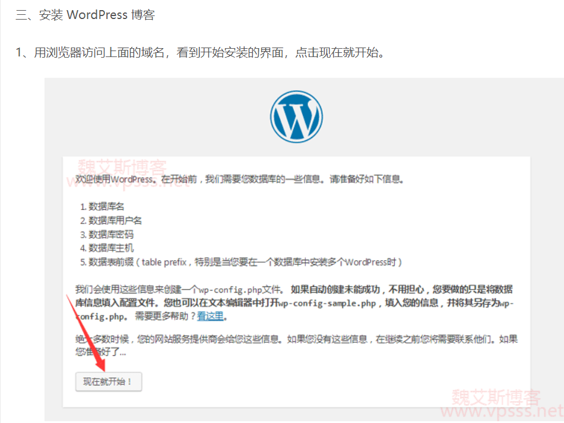

然后我就接着往下面操作，简略的WordPress博客就这样被我创建好了！我心中感到十分的高兴啊！之前有几次输入域名无法正常显示网站，不过现在试了很多次以后可以正常显示网站了！

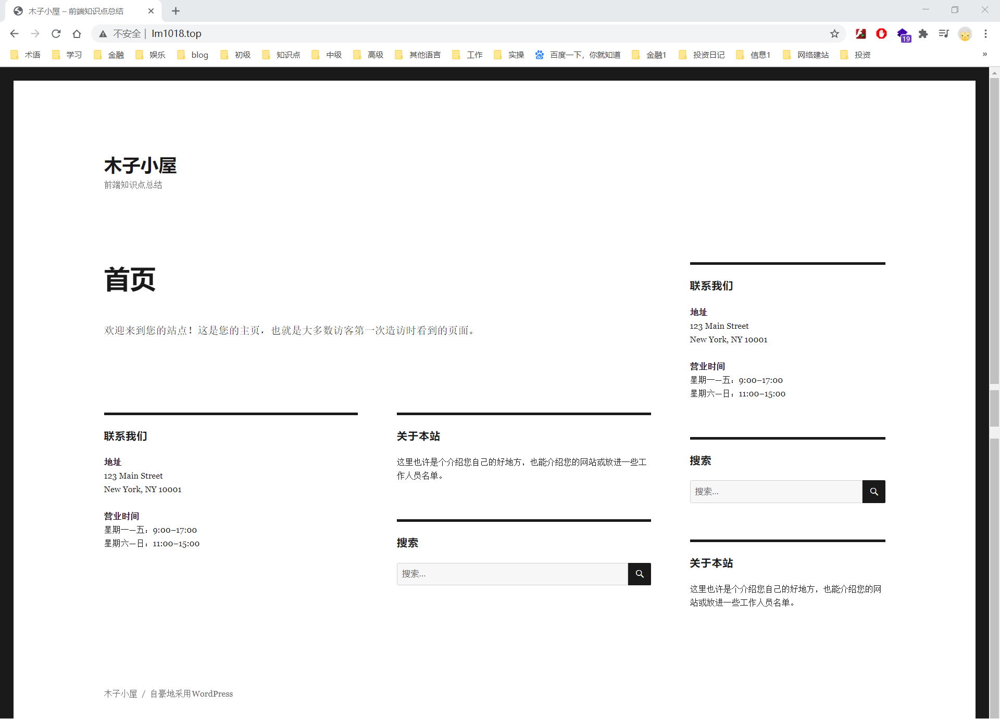

我终于弄出来了一个自己的网站了！！！

有点开心。

就好像去年11月份的时候搞Hexo博客终于弄出来一样，还是很有成就感的。

当然，里面还有一大堆细节，一大堆插件，一大推装饰，服务器的其他用法等等问题，还需要自己进行更加深入的了解才行。

比如，我现在要解决的一个问题就是：如何将自己的Hexo上的博文搬运到自己的网站上来。

13.现在开始进行WordPress装饰，详情看"WordPress装饰这一小节"。

14.申请一个免费的SSL证书，不然输入域名浏览器总是显示不安全。

> 我申请完免费SSL证书后打开强制HTTPS按钮后输入网址就会显示链接是安全的了。

[部署SSL后，为何网站还是显示不安全？](https://cloud.tencent.com/developer/article/1411026)

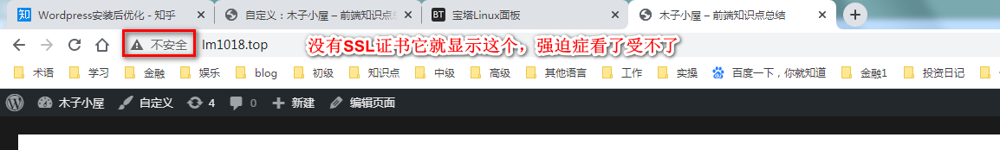

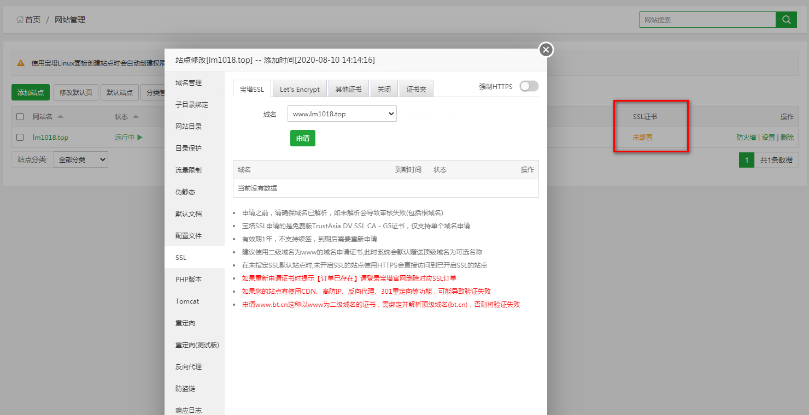

> 申请SSL证书记得要先去宝塔云面板实名认证一下。

15.我发现我的WordPress不是最新版本，但是升级总是失败。

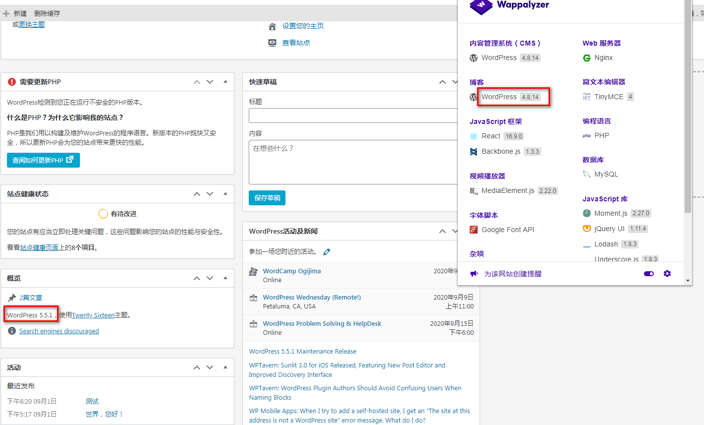

我现在有点迷惑，我这个算是更新到5.5.1了吗？还是这个Wappdlyzer插件没有及时更新啊。

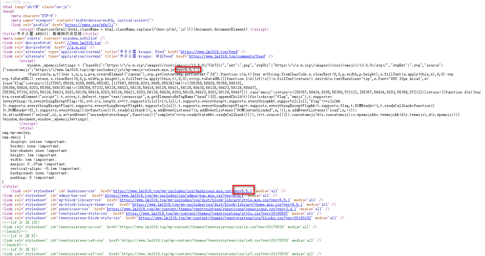

看这个，应该是升级成功了。

这下对了

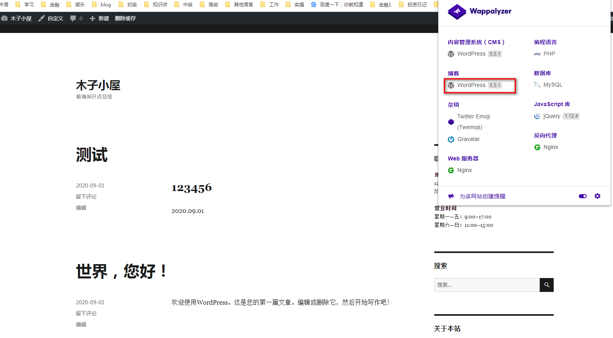

16.我发现WordPress前端框架用的是AMP(这是个什么东西我都不知道，等会查一下)，还用了jQuery库，我产生了一下想法，能不能用Vue.js做前端框架，Node.js做后端框架，并且完全不用jQuery，来自己实现一个博客系统呢？

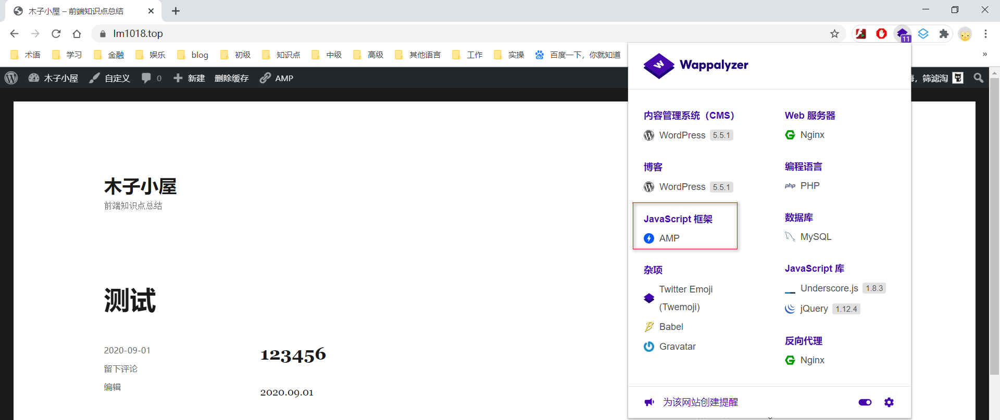

就像Vue的官网，就是用的Vue.js前端框架。

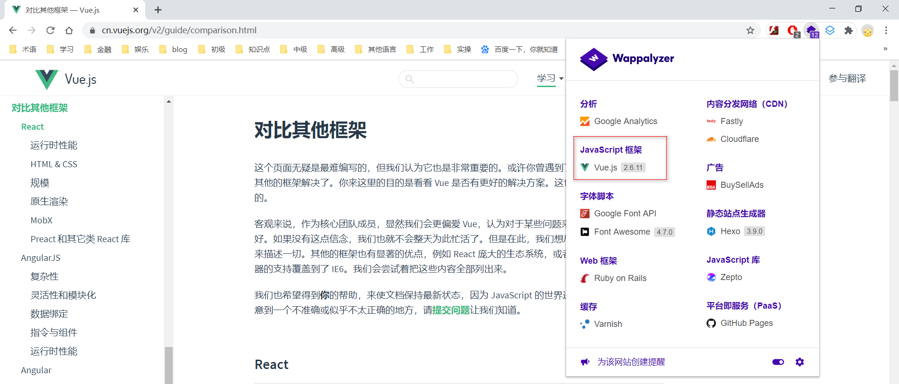

[如何用wordpress做纯后端 前端页面用vue的一个博客框架，二者一起使用冲突吗?](https://www.zhihu.com/question/56772704)

[VueWPress源码](https://github.com/crlang/VueWPress)

[Vue+node.js实现一个简洁的个人博客系统](https://www.cnblogs.com/wjgoblin/p/11143079.html)

网上大体搜了一下，这个是可行的，内心有点激动，我决定把这个当作我的一个项目作品，决定另外写一篇博文。

